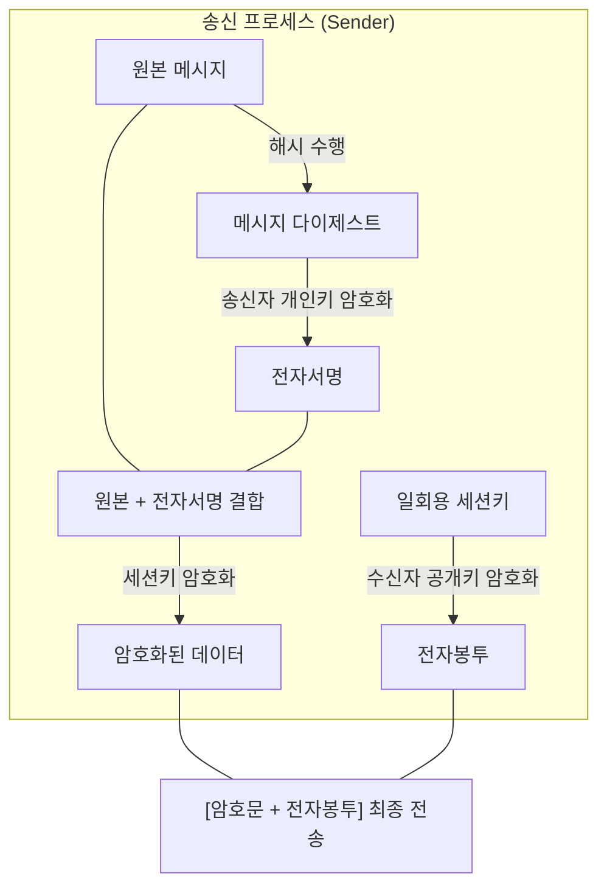

# 인증·무결성·기밀성 통합 모델: 전자서명과 전자봉투의 결합

## I. 통합 보안 서비스의 개요

- **개념**: 전자서명의 인증·무결성·부인방지 기능과 전자봉투의 기밀성 기능을 결합하여 전송 전 구간의 보안성을 확보하는 메커니즘
- **필요성**: 전자봉투만 사용할 경우 발생할 수 있는 '송신자 사칭' 및 '메시지 재전송 공격' 등을 방어하기 위함

---

## II. 전자서명과 전자봉투의 결합 프로세스

### 가. 송신측 처리 과정 (Sign-then-Encrypt)

**상세 단계**:
- **전자서명 생성**: 원본 메시지를 해시한 후 송신자의 개인키로 암호화하여 서명값 생성
- **메시지 결합**: 원본 메시지에 전자서명을 첨부함
- **데이터 암호화**: 결합된 데이터를 일회용 **대칭키**(세션키)로 암호화함
- **전자봉투 생성**: 사용된 세션키를 수신자의 공개키로 암호화하여 전자봉투 생성
- **최종 전송**: [암호화된 데이터 + 전자봉투]를 수신자에게 전달

### 나. 보안 기능별 매핑

| 보안 요구사항 | 구현 기술 | 상세 메커니즘 |
|:---:|:---:|-----------|
| **기밀성** (C) | 전자봉투 | 수신자의 공개키로 암호화된 세션키를 통해서만 복호화 가능 |
| **무결성** (I) | 해시 함수 | 메시지가 1비트라도 변하면 해시 결과값이 달라짐 |
| **인증** (A) | 전자서명 | 송신자의 공개키로 서명이 복호화되면 송신자 신원 확인 |
| **부인방지** (N) | 비대칭키 | 송신자만 보유한 개인키로 서명했으므로 전송 사실 부인 불가 |

---

## III. 실무 적용 시 고려사항: 성능과 보안의 트레이드오프

| 고려 항목 | 상세 내용 및 대응 전략 |
|:---:|-------------------|
| **연산 부하** | 비대칭키 연산이 2회(서명, 봉투) 발생하므로 고성능 가속기(HSM) 도입 검토 |
| **인증서 유효성** | 서명 검증 전 반드시 CRL 또는 OCSP를 통해 인증서 실효 여부 선행 확인 |
| **표준 프로토콜** | 메커니즘을 표준화한 **S / MIME**, **PGP**, 전자세금계산서 체계 활용 |
