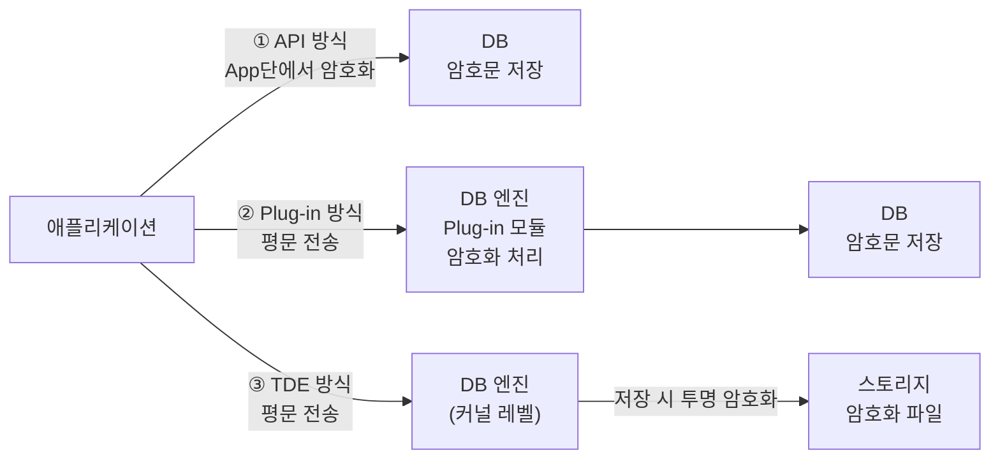

# DB 암호화 기술 (API, Plug-in, TDE)

## I. 데이터 자산 보호의 최후 보루, DB 암호화의 개요

**정의:** 데이터베이스 내의 중요한 필드(주민번호, 비밀번호 등)를 암호화 알고리즘을 사용하여 비인가자가 읽을 수 없는 형태로 저장하는 기술

**필요성:** 개인정보 보호법 준수(컴플라이언스), 관리자 권한 오남용 방지, 데이터 유출 시 피해 최소화

---

## II. DB 암호화의 3대 핵심 구현 기술

### 가. 암호화 아키텍처 및 유형별 비교

> **핵심:** 암호화 수행 주체가 **애플리케이션(API)**인지, **DB 서버(Plug-in)**인지, 혹은 **스토리지 계층(TDE)**인지에 따라 구분됨

---

### 나. 방식별 상세 비교 및 특징

| 구분 | API 방식 | Plug-in 방식 | TDE (Transparent Data Encryption) |
|------|---------|------------|----------------------------------|
| 수행 주체 | 애플리케이션 서버 | DB 서버 (별도 모듈) | DB 서버 (커널/엔진 레벨) |
| 암호화 위치 | App단에서 암호화 후 전송 | DB 엔진 내에서 처리 | 데이터 파일 저장 시 처리 |
| App 수정 | 수정 필요 (API 호출) | 수정 거의 없음 (View/Trigger) | 수정 불필요 |
| 성능 영향 | DB 서버 부하 낮음 | DB 서버 부하 발생 가능 | 엔진 내 최적화로 부하 적음 |
| 인덱스 활용 | 일치 검색만 가능 | 제약적 활용 | 모든 인덱스 활용 가능 |

---

## III. DB 암호화 방식 선정 시 고려사항

기술사는 실무 환경에 따라 최적의 조합(Hybrid)을 제안할 수 있어야 하며, 다음과 같은 기준으로 비교 선택합니다.

| 선택 기준 | 최적 방식 | 이유 |
|----------|---------|------|
| Legacy 시스템 유지 | TDE / Plug-in | 소스코드 수정 비용 및 리스크 최소화 필요 |
| 강력한 보안성 (End-to-End) | API | 데이터가 네트워크를 타고 가기 전부터 암호화됨 |
| 성능 최우선 (대용량) | TDE | 하드웨어 가속(AES-NI) 및 인덱스 활용 최적화 |
