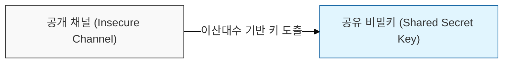
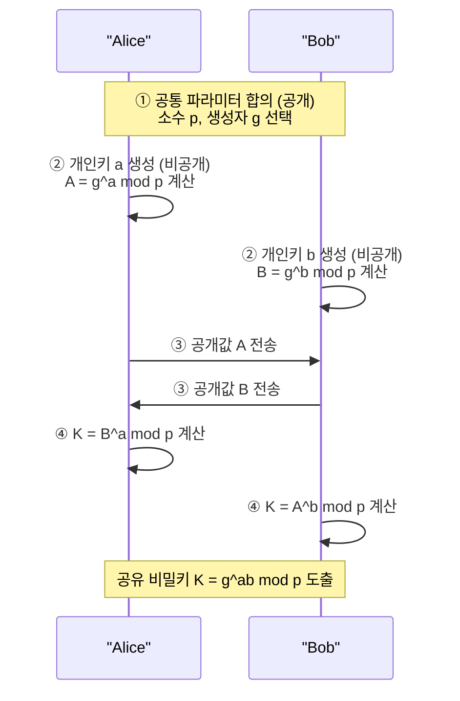
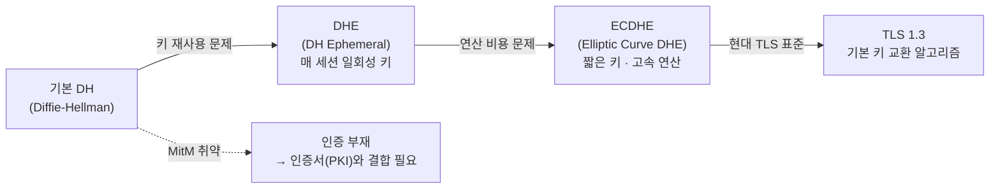

# 키 분배 문제의 해결사, Diffie-Hellman

## I. 키 분배 문제의 해결사, Diffie-Hellman의 개요

**정의**: 이산대수 문제(Discrete Logarithm Problem)의 계산적 어려움을 기반으로, 통신 주체가 개인키를 공유하지 않고도 공개 채널을 통해 공통의 비밀키를 도출하는 암호 알고리즘  

**핵심 특징**:  
( **키 분배 문제 해결** ) 사전에 키를 공유할 필요 없이 안전하게 세션키 도출 가능  
( **최초의 공개키 기반** ) 1976년 발표된 최초의 공개키 암호 알고리즘으로 현대 암호학의 기점  
( **이산대수 기반** ) 유한체 상의 거듭제곱 연산의 역연산이 어렵다는 수학적 원리 활용  

---

## II. 디피-헬먼의 메커니즘 및 수학적 원리

### 가. 키 교환 프로세스 (Alice & Bob)

**단계별 설명:**

1. **공통 파라미터 합의:** 큰 소수 `p`와 생성자 `g`를 공개적으로 선택
2. **개인키 생성:** Alice는 `a`, Bob은 `b`라는 임의의 개인키를 생성 (비공개)
3. **공개값 계산 및 교환:**
   - Alice: `A = g^a mod p` 를 계산하여 Bob에게 전송
   - Bob: `B = g^b mod p` 를 계산하여 Alice에게 전송
4. **공유 비밀키 도출:**
   - Alice: `K = B^a mod p = (g^b)^a mod p`
   - Bob: `K = A^b mod p = (g^a)^b mod p`
   - 결과적으로 양측은 동일한 `K = g^ab mod p`를 보유

---

### 나. 보안적 특징

| 항목 | 내용 |
|-----|------|
| 수학적 기반 | 이산대수 문제 — `g^x mod p = Y`에서 `Y`를 알아도 `x`를 구하기는 계산적으로 불가 |
| 전방향 안전성 (PFS) | 임시 키(Ephemeral) 방식 사용 시, 향후 서버 개인키가 유출되어도 과거 통신 해독 불가 |
| 취약점 | **중간자 공격(MitM)**에 취약 — 인증 기능이 없으므로 상대방 신원 확인 불가 |

---

## III. 발전된 디피-헬먼 모델

| 모델 | 특징 | 보안 강도 | 현황 |
|-----|------|---------|------|
| DH | 고정 키 사용, 구현 단순 | 낮음 (키 재사용) | 레거시 |
| DHE | 매 세션 임시 키 생성 → PFS 보장 | 높음 | 권장 |
| ECDHE | 타원곡선(ECC) 적용 → 짧은 키로 동일 보안 강도, 연산 속도 개선 | 매우 높음 | **현대 TLS 표준** |

> **핵심:** ECDHE는 짧은 키 길이(256-bit ≈ RSA 3072-bit)로 높은 보안 강도와 PFS를 동시에 제공하여 TLS 1.3의 기본 키 교환 방식으로 채택됨
