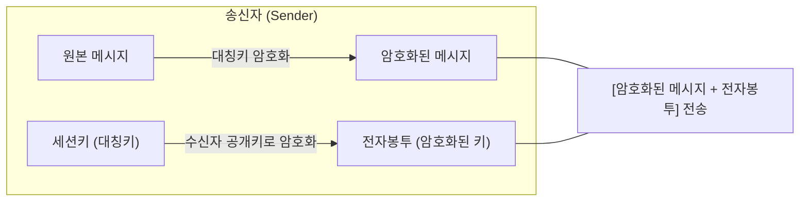

# 암호화 키 전송의 안전성 확보, 전자봉투

## I. 기밀성과 키 관리 효율성의 조화, 전자봉투의 정의

- 대량의 데이터를 빠르게 처리하기 위한 대칭키와, 그 키를 안전하게 분배하기 위한 **비대칭키**(공개키)의 장점을 결합한 하이브리드 암호 시스템의 핵심 메커니즘
- 암호화된 메시지와 암호화된 대칭키를 하나의 패키지로 묶어 전송하는 모습이 봉투에 편지를 넣는 것과 유사하여 명명됨

---

## II. 전자봉투의 생성 및 복호화 메커니즘

### 가. 전자봉투 생성 및 전송 단계 (송신측)

**상세 단계**:
- **비밀키 생성**: 데이터를 암호화할 일회용 대칭키(세션키)를 임의로 생성함
- **메시지 암호화**: 생성된 세션키로 원본 메시지를 암호화함 (`C = E_Symmetric(Msg)`)
- **전자봉투 생성**: 수신자의 **공개키**(Public Key)를 사용하여 세션키 자체를 암호화함 (`Envelope = E_Public(Key)`)
- **전송**: 암호화된 메시지와 전자봉투를 함께 송신함

### 나. 전자봉투 복호화 단계 (수신측)

- **세션키 복구**: 자신의 **개인키**(Private Key)를 사용하여 전송받은 전자봉투를 복호화하고 세션키를 획득함
- **메시지 복구**: 획득한 세션키로 암호화된 메시지를 복호화하여 원본을 확인함

---

## III. 전자봉투의 특징 및 주요 보안 속성

| 구분 | 주요 특징 | 보안 속성 및 기대 효과 |
|:---:|----------|----------------------|
| **효율성** | 대용량 데이터 전송에 적합 | 대칭키 알고리즘(AES 등) 활용으로 연산 속도 보장 |
| **안전성** | 키 탈취 위협 방지 | 수신자의 개인키가 있어야만 세션키 복구 가능 (**기밀성**) |
| **일회성** | 세션마다 새로운 키 생성 | 키가 노출되더라도 해당 세션의 데이터만 영향 받음 |
| **활용 분야** | 전자메일, 금융 결제 등 | S / MIME, PGP, SSL / TLS 등의 표준 프로콜에서 활용 |
