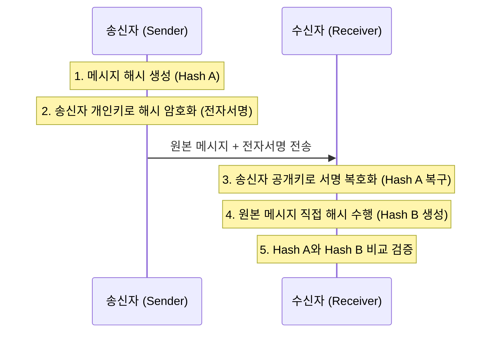

# 무결성과 부인방지의 핵심, 전자서명 (Digital Signature)

## I. 전자적 인감증명, 전자서명의 정의

- 송신자가 전자문서의 해시(Hash) 값을 자신의 **개인키**(Private Key)로 암호화하여 문서에 첨부하는 기술
- 전자문서의 **무결성**(Integrity), **인증**(Authentication), **부인방지**(Non-repudiation)를 보장함

---

## II. 전자서명의 메커니즘 및 주요 기술

### 가. 전자서명 생성 및 검증 프로세스

**상세 단계**:
- **서명 생성**: 원본 메시지를 해시 함수로 축약한 후, 송신자의 개인키로 암호화하여 서명 생성
- **전송**: 원본 메시지와 전자서명을 함께 수신자에게 전송
- **서명 검증**: 수신자는 송신자의 공개키로 서명을 복호화하여 해시값 A를 얻고, 원본 메시지를 직접 해시하여 해시값 B를 얻음
- **비교**: 해시값 A와 B가 일치하면 서명이 유효하며 문서가 변조되지 않았음을 확인

### 나. 전자서명의 5대 보안 기능

| 보안 기능 | 상세 설명 | 구현 방법 |
|:---:|----------|----------|
| **인증** | 서명자가 누구인지 확인 | 송신자 공개키로 복호화 성공 시 인증 |
| **무결성** | 문서의 위·변조 여부 확인 | 해시값 비교를 통해 변조 감지 |
| **부인방지** | 서명 사실을 나중에 부인하지 못함 | 송신자만 보유한 개인키 사용 증거 |
| **재사용 방지** | 서명을 다른 문서에 재사용 불가 | 문서마다 고유한 해시값 생성 |
| **변경 불가** | 서명 후 문서 변경 시 서명 무효화 | 해시 알고리즘의 충돌 저항성 활용 |

---

## III. 전자서명법 개정 및 최근 기술 동향

| 구분 | 공인인증 체계 (과거) | 간편인증 / 분산ID (현재) |
|:---:|-------------------|-----------------------|
| **법적 지위** | 공인인증서의 독점적 지위 | 모든 전자서명에 동등한 법적 효력 부여 |
| **인증 기술** | PKI 기반 하드코딩 방식 | FIDO (생체), 클라우드 인증, DID (블록체인) |
| **사용자 경험** | Active-X, 복잡한 비밀번호 | 지문, 안면인식, 간편 비밀번호 (PIN) |
| **보안 트렌드** | 중앙 집중형 CA 관리 | 양자 내성 서명 (PQC), 분산 신뢰 모델 |
