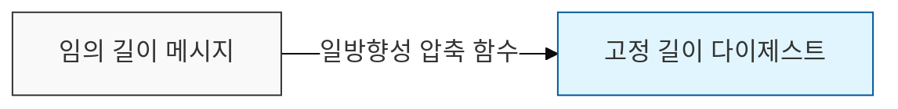

# 데이터의 지문, 해시 함수 (Hash Function)

## I. 데이터 무결성의 파수꾼, 해시 함수의 개요

**정의**: 임의의 길이를 갖는 메시지를 입력받아 고정된 길이의 비트열(해시값)로 변환하는 일방향성 함수

**특징**:  
 (일방향성) 입력값으로 해시값을 계산하기는 쉬우나 해시값으로 입력값을 복원하는 것은 불가능함  
 (쇄도 효과) 입력값이 미세하게 변경되어도 출력되는 해시값은 완전히 다른 형태로 변함  
 (압축성) 어떤 길이의 입력이 들어와도 정해진 고정된 길이의 해시값을 생성함  

---

## II. 해시 함수의 주요 보안 특성 및 알고리즘

### 가. 해시 함수의 3대 보안 특성

| 보안 특성 | 상세 설명 | 비고 |
|:---:|----------|----------|
| 1. **제1 역상 저항성** | 주어진 해시값 `h`에 대해 `H(x) = h`를 만족하는 입력값 `x`를 찾기 어려움 | 일방향성 보장 |
| 2. **제2 역상 저항성** | 주어진 입력 `x`에 대해 `H(x) = H(x')`를 만족하는 다른 입력 `x'`를 찾기 어려움 | 기존 문서 변조 방지 |
| 3. **충돌 저항성** | `H(x) = H(x')`를 만족하는 임의의 서로 다른 두 입력 `x, x'`를 찾기 어려움 | 서명 무결성 보장 |

### 나. 주요 해시 알고리즘 비교

| 알고리즘 | 해시 길이 (Bit) | 특징 및 보안 수준 |
|:---:|:---:|-----------------|
| **MD5** | 128 | 충돌 저항성 결함 발견으로 사용 중단 권고 |
| **SHA-1** | 160 | 위변조 취약점 발견으로 폐기 권고 |
| **SHA-2** | 224 / 256 / 384 / 512 | 현재 가장 널리 사용되는 표준 (**SHA-256** 등) |
| **SHA-3** | 224 / 256 / 384 / 512 | Keccak 알고리즘 기반, SHA-2 대비 구조적 강인성 확보 |

---

## III. 해시 함수의 활용 및 보안 위협 대응

### 가. 주요 활용 분야
- **무결성 검증**: 소프트웨어 배포 시 원본 파일의 변조 여부 확인
- **비밀번호 저장**: 평문 대신 해시값을 저장하여 유출 시 피해 최소화 (**Salt** 병행 필수)
- **전자서명**: 메시지 전체를 암호화하는 대신 해시값을 서명하여 연산 효율 증대

### 나. 공격 기법 및 대응 방안
- **레인보우 테이블**(Rainbow Table): 미리 계산된 해시값 테이블을 이용한 공격 → **솔팅**(Salting) 및 **키 스트레칭**(Key Stretching)으로 대응
- **생일 공격**(Birthday Attack): 해시 충돌을 이용한 공격 → 충분히 긴 해시 길이(256bit 이상) 사용
