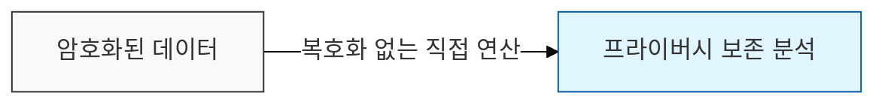

# 동형 암호 (Homomorphic Encryption)

## I. 암호화된 데이터의 직접 연산, 동형 암호의 개요

**정의**: 평문 `m`에 대한 암호문 `Enc(m)` 상태에서 연산을 수행한 결과가, 평문을 연산한 후 암호화한 결과와 동일하게 유지되는 암호 체계

**핵심 가치**:  
 (프라이버시 보존) 데이터를 평문으로 복호화하지 않고도 암호화된 상태 그대로 연산이 가능함  
 (데이터 활용성 극대화) 민감 정보를 보호하면서 클라우드 등 외부 자원을 활용한 데이터 분석이 가능함  
 (수학적 안전성) 격자 기반 암호 등을 활용하여 양자 내성 보안성을 동시에 확보할 수 있음  

---

## II. 동형 암호의 발전 단계 및 주요 기술 요소

### 가. 연산 가용 범위에 따른 발전 단계

| 구분 | 단계 | 특징 및 한계 |
|------|-----|-------------|
| 부분 동형 (PHE) | 1세대 | 덧셈 또는 곱셈 중 한 가지만 가능 (RSA, ElGamal) |
| 제한적 동형 (SHE) | 2세대 | 덧셈과 곱셈 모두 가능하나, 연산 횟수에 제한이 있음 |
| 완전 동형 (FHE) | 3세대 | 횟수 제한 없이 모든 논리/산술 연산 가능 (Gentry, 2009) |

---

### 나. 완전 동형 암호(FHE)의 핵심 기술

| 핵심 기술 | 상세 설명 | 비고 |
|----------|---------|------|
| Lattice 기반 암호 | 격자 구조의 수학적 난해성(LWE 등)을 이용한 암호화 | 양자 내성(PQC) 확보 |
| 부트스트래핑 (Bootstrapping) | 연산 과정에서 누적된 **노이즈**(Noise)를 제거하여 연산 지속 | FHE 구현의 핵심 기술 |
| Packing | 여러 개의 데이터를 하나의 암호문에 넣어 병렬 처리 | 연산 효율성 증대 기술 |

---

## III. 동형 암호와 차분 프라이버시(DP) 비교

| 비교 항목 | 동형 암호 (Homomorphic Encryption) | 차분 프라이버시 (Differential Privacy) |
|----------|----------------------------------|-------------------------------------|
| 보안 메커니즘 | 수학적 암호화 (접근 통제) | 수학적 노이즈 주입 (정보 가공) |
| 데이터 형태 | 암호문 (결과값도 암호화) | 통계값 (결과값은 평문이나 오차 포함) |
| 연산 정확도 | 100% 정확 (복호화 시 평문과 동일) | 근사치 (노이즈로 인한 오차 발생) |
| 주요 한계 | 높은 연산 부하 (CPU/메모리 소모) | 정보 유용성 손실 (Privacy Budget 관리) |
