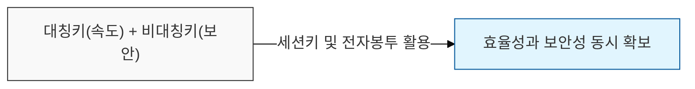
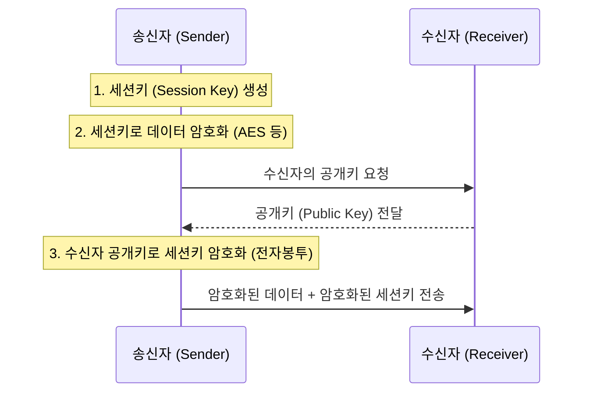

# 암호화의 효율과 보안의 조화, 하이브리드 암호 체계

## I. 하이브리드 암호 체계의 정의

**정의**: 대칭키 암호를 사용하여 대량의 데이터를 암호화하고, 그 과정에서 사용된 대칭키를 비대칭키(공개키) 암호로 보호하여 전달하는 통합 암호 방식

**특징**:  
 (키 분배 문제 해결) 비대칭키 암호 방식을 통해 대칭키 암호의 주요 단점인 키 분배 문제를 해결함  
 (연산 효율성 확보) 대량의 데이터는 대칭키로 암호화하여 비대칭키의 속도 저하 문제를 극복함  
 (보안성 강화) 데이터 암호화와 키 교환 방식을 결합하여 전체적인 보안성과 효율성을 동시에 달성함  

---

## II. 하이브리드 암호 체계의 메커니즘 및 구성

### 가. 하이브리드 암호화 프로세스 (Encryption)

**상세 단계**:
- **세션키 생성**: 송신자는 데이터를 암호화할 일회성 대칭키(세션키)를 생성함
- **데이터 암호화**: 생성된 세션키를 사용하여 평문을 암호문으로 변환 (AES 등 사용)
- **세션키 암호화**: 수신자의 **공개키**(Public Key)를 사용하여 세션키 자체를 암호화함 (전자봉투 생성)
- **전송**: 암호화된 데이터와 암호화된 세션키를 수신자에게 전송

### 나. 하이브리드 복호화 프로세스 (Decryption)

- **세션키 복호화**: 수신자는 자신의 **개인키**(Private Key)를 사용하여 암호화된 세션키를 복구
- **데이터 복호화**: 복구된 세션키를 사용하여 전송받은 암호문을 평문으로 변환

---

## III. 대칭키 / 비대칭키 암호 체계와 하이브리드 방식 비교

| 비교 항목 | 대칭키 암호 (Symmetric) | 비대칭키 암호 (Asymmetric) | 하이브리드 암호 (Hybrid) |
|----------|-----------------------|-------------------------|-----------------------|
| **주요 알고리즘** | AES, DES, ARIA | RSA, ECC, Diffie-Hellman | SSL / TLS, S / MIME, PGP |
| **키 관리 / 분배** | 어려움 (`N(N-1)/2`) | 용이 (`2N`) | 비대칭키로 키 분배 해결 |
| **처리 속도** | 매우 빠름 (고속) | 매우 느림 | 대칭키의 속도 유지 |
| **핵심 용도** | 대량 데이터 암호화 | 키 교환, 디지털 서명 | 웹 통신(HTTPS), 이메일 |
