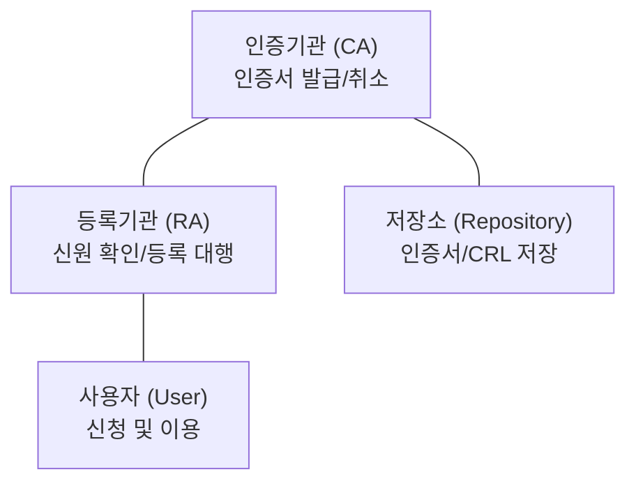

# 신뢰의 사슬, PKI (Public Key Infrastructure)

## I. 공개키의 신뢰 보증, PKI의 정의

- 공개키 암호 알고리즘을 안전하게 사용하기 위해 사용자 식별, 인증서 발급, 보관, 분배, 무효화 등을 수행하는 계층적 신뢰 구조
- 비대칭키의 '**공개키 배포**' 과정에서 발생할 수 있는 위변조(**Man-in-the-Middle**) 공격을 원천 차단하는 신뢰의 기반

---

## II. PKI의 구성 요소 및 메커니즘

### 가. PKI의 핵심 구성 요소 (Entity)

- **CA**(인증기관): 인증서 발급 및 취소, CRL 관리 등 신뢰의 최상위 기관
- **RA**(등록기관): 사용자의 신원 확인 및 등록 대행 (CA의 업무 부하 분산)
- **Repository**(저장소): 인증서와 CRL(취소 목록)을 저장하는 LDAP 등의 디렉터리
- **User**(사용자): 서비스를 이용하는 주체(송신자 / 수신자)

### 나. 인증서 발급 및 검증 프로세스

| 단계 | 주요 활동 내용 | 핵심 내용 |
|:---:|--------------|----------|
| 1. **등록** | 사용자 신원 확인 | RA를 통한 오프라인 / 온라인 대면 확인 |
| 2. **발급** | 인증서 생성 | CA가 사용자의 공개키와 정보를 담아 CA 개인키로 서명 |
| 3. **검증** | 신뢰성 확인 | 수신자가 CA 공개키로 인증서 내 서명 검증 |
| 4. **폐지** | 효력 상실 관리 | 만료 전 폐지 시 CRL 또는 OCSP에 등록 |

---

## III. PKI의 신뢰 모델 비교 및 동향

| 비교 항목 | 계층적 모델 (Hierarchical) | 네트워크 모델 (Mesh) |
|----------|-------------------------|-------------------|
| **구조** | Root CA 중심의 트리 구조 | CA 간 상호 인증 (Cross-Certification) |
| **신뢰 경로** | 상위에서 하위로 단방향 | 양방향 또는 복잡한 경로 |
| **장점** | 관리가 중앙 집중적이고 명확함 | 조직 간 통합 및 확장성이 높음 |
| **사례** | 국가 공인인증 체계, SSL / TLS | 기업 간 연합 보안 체계 |
