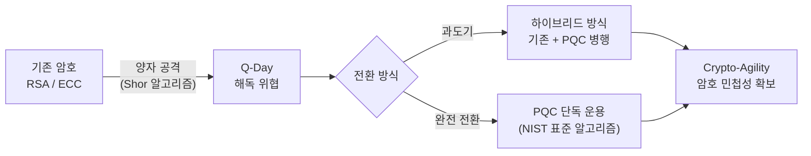

# 양자 내성 암호 (PQC, Post-Quantum Cryptography)

## I. 양자 컴퓨터의 위협과 양자 내성 암호의 개요

**정의**: 양자 컴퓨터의 강력한 연산 능력으로도 해결하기 어려운 복잡한 수학적 문제를 기반으로 설계된 차세대 암호 알고리즘

**필요성**:  
 (양자 위협 대응) 양자 컴퓨터의 강력한 연산 능력으로 인한 기존 암호 체계의 붕괴에 대비함  
 (암호 민첩성 확보) 새로운 보안 위협에 신속하게 대응할 수 있는 유연한 암호 체계 전환이 요구됨  
 (장기적 보안성) 미래의 Q-Day에 대비하여 공공, 금융, 국방 등 국가 핵심 인프라 보안을 선제적으로 강화함  

---

## II. PQC의 메커니즘 및 주요 알고리즘 유형

### 가. 양자 내성 암호의 기본 원리 및 전환 아키텍처

> **핵심:** 기존 암호와 양자 내성 암호를 병행 사용하는 "하이브리드(Hybrid)" 방식이 과도기적 대안으로 부상 중임

---

### 나. 주요 수학적 기반 알고리즘 유형

| 구분 | 주요 수학적 기반 및 특징 | 대표 알고리즘 |
|------|------------------------|:------------:|
| 격자 기반 (Lattice) | 격자 구조 내 최단 벡터 문제(SVP) 이용, 가장 효율적이며 널리 사용됨 | Kyber, Dilithium |
| 코드 기반 (Code) | 오류 수정 부호의 복호화 난해성 이용, 오랜 보안성 검증, 키 사이즈가 큼 | McEliece |
| 다변수 기반 (MV) | 다변수 이차 다항식의 해를 구하는 난해성 이용, 서명 속도 빠름 | Rainbow |
| 해시 기반 (Hash) | 일방향 해시 함수의 보안성 이용, 양자 저항성이 매우 강력함 | SPHINCS+ |

---

## III. PQC 도입 시 고려사항 및 향후 전망

- **NIST 표준화 대응:** NIST에서 선정한 표준 알고리즘(Kyber 등)을 중심으로 기존 IT 인프라와의 호환성 검증 필요
- **Crypto-Agility(암호 민첩성):** 새로운 암호 체계로 신속하게 전환할 수 있는 유연한 보안 아키텍처 수립 필수
- **K-PQC 추진:** 국내 환경에 적합한 자체 양자 내성 암호 알고리즘 개발 및 공공·금융권 선도적 적용 시급
