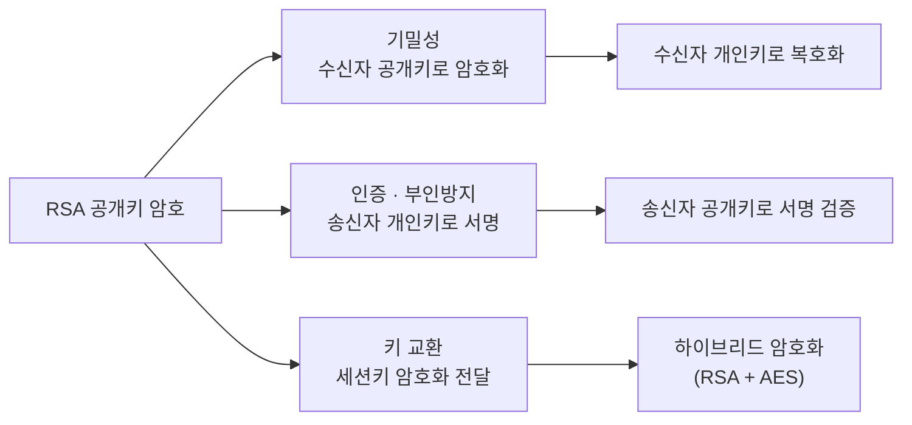
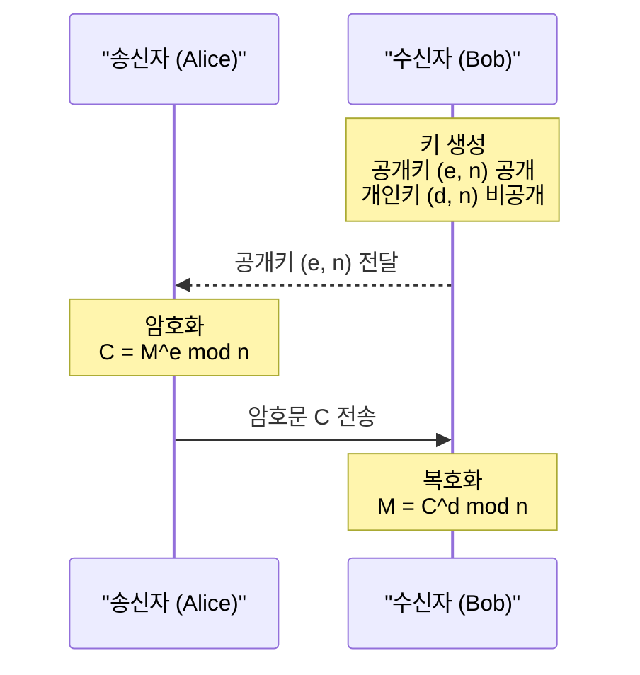
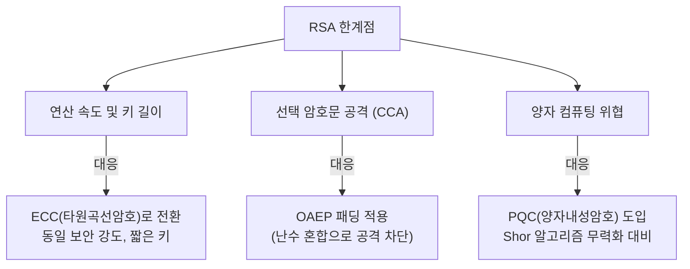

# 수론 기반의 신뢰 체계, RSA 암호화

## I. RSA의 정의 및 특징

**정의:** 소수(Prime Number)의 곱을 구하기는 쉽지만, 그 곱에서 원래의 소수들을 찾아내기는 어렵다는 점을 이용한 공개키 알고리즘

**특징:** 기밀성뿐만 아니라 전자서명을 통한 인증 및 부인방지를 제공하며, 데이터 크기에 따라 키 길이가 2048bit 이상 권장됨

---

## II. RSA의 수학적 알고리즘 및 동작 원리

### 가. 키 생성 및 암·복호화 메커니즘

**키 생성 절차:**

1. 두 개의 큰 소수 `p`, `q`를 선택하여 `n = p × q` 계산
2. 오일러 피 함수 계산: `φ(n) = (p-1)(q-1)`
3. `φ(n)`과 서로소인 공개키 값 `e` 선택
4. `e × d ≡ 1 (mod φ(n))`을 만족하는 개인키 값 `d` 계산
5. **공개키:** `(e, n)` / **개인키:** `(d, n)`

| 연산 | 수식 |
|-----|------|
| 암호화 | `C = M^e mod n` |
| 복호화 | `M = C^d mod n` |

---

### 나. RSA의 주요 보안 속성

| 항목 | 상세 내용 |
|-----|---------|
| 보안 근거 | 소인수분해 난제 — 수천 비트 이상의 `n`에서 `p`, `q`를 추출하는 것은 계산적으로 불가능 |
| 용도 1: 기밀성 | 수신자의 공개키로 암호화 → 수신자의 개인키로 복호화 |
| 용도 2: 인증 | 송신자의 개인키로 암호화(서명) → 송신자의 공개키로 검증 |
| 제약 사항 | 연산 속도가 대칭키보다 느려 주로 '세션키 암호화'나 '서명'에만 사용 |

---

## III. RSA의 한계점 및 대응 방안

| 한계점 | 대응 방안 |
|------|---------|
| 연산 속도 및 키 길이 | 동일 보안 강도 대비 연산 효율이 좋은 **ECC(타원곡선암호)**로 전환 |
| 선택 암호문 공격 (CCA) | 데이터에 난수를 섞는 패딩 기법인 **OAEP** 적용 |
| 양자 컴퓨팅 위협 | Shor의 알고리즘에 의해 무력화 가능 → **PQC(양자내성암호)** 도입 필요 |

> **핵심:** RSA는 공개키 인프라(PKI)의 근간을 이루는 알고리즘이지만, 양자 컴퓨팅 시대에 대비하여 PQC(NIST 표준 Kyber, Dilithium 등)로의 전환 계획이 필수적임
