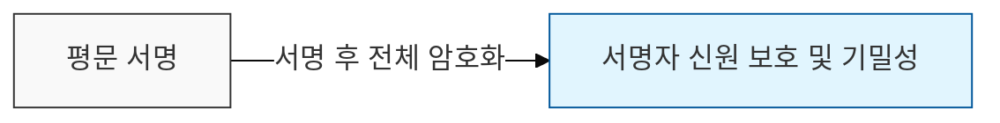
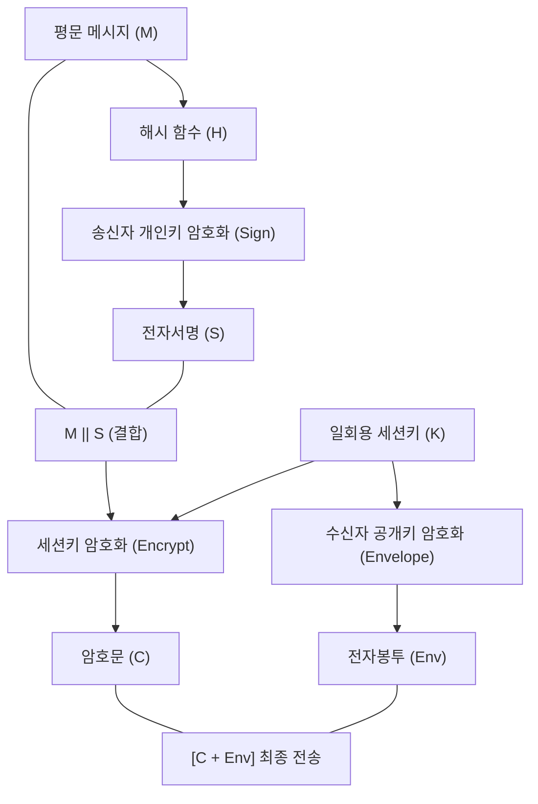

# 인증 후 기밀성 확보, Sign-then-Encrypt

## I. Sign-then-Encrypt의 정의

**정의**: 송신자가 평문 메시지에 대해 자신의 개인키로 전자서명을 생성하여 결합한 뒤, 수신자의 공개키(또는 세션키)로 전체를 암호화하여 전송하는 방식

**핵심 가치**:  
 (기밀성 및 무결성) 전체 메시지를 암호화하여 내용을 보호하고 서명을 통해 변조 여부를 확인함  
 (부인 방지 및 인증) 송신자 개인키를 사용한 서명을 포함하여 신원 확인과 부인 방지 기능을 제공함  
 (공격 대응력) 서명자 정보까지 암호화하여 제3자의 정보 획득을 차단하고 재전송 공격에 강함  

---

## II. Sign-then-Encrypt의 상세 메커니즘

### 가. 단계별 처리 프로세스

**상세 메커니즘**:
- **서명 단계**(Sign): 메시지를 해시(`H`)하고 송신자의 개인키(`Pr_A`)로 암호화하여 서명(`S`) 생성: `S = E(Pr_A, H(M))`
- **결합 단계**: 원본 메시지와 서명을 결합: `M' = M || S`
- **암호화 단계**(Encrypt): 결합된 메시지를 대칭키(세션키)로 암호화하고, 세션키를 수신자의 공개키(`Pu_B`)로 암호화(전자봉투): `C = E(K, M')`, `Env = E(Pu_B, K)`
- **전송**: `[C, Env]`를 수신자에게 전송

### 나. 보안적 장점 및 특징

| 구분 | 주요 내용 | 보안적 가치 |
|:---:|----------|------------|
| **인증 및 부인방지** | 송신자의 개인키 사용 | "누가 보냈는가"에 대한 확실한 증거 제공 |
| **무결성 보장** | 해시값 및 서명 포함 | 전송 중 1비트의 데이터 변조도 탐지 가능 |
| **기밀성 유지** | 전체 암호화 수행 | 제3자가 메시지 내용 및 서명 주체를 알 수 없음 |
| **공격 방어** | **Surreptitious Forwarding** 방어 | 타인이 서명만 가로채서 재전송하는 공격에 강함 |

---

## III. Encrypt-then-Sign 방식과의 비교

| 비교 항목 | Sign-then-Encrypt (권장) | Encrypt-then-Sign |
|----------|-----------------------|-------------------|
| **수행 순서** | 서명 후 전체 암호화 | 암호화 후 암호문에 서명 |
| **서명 대상** | 원본 메시지(평문)의 해시 | 암호문(Ciphertext)의 해시 |
| **기밀성 수준** | 높음 (서명자 신원도 암호화됨) | 보통 (서명자는 노출될 수 있음) |
| **표준 활용** | **S / MIME**, **PGP**, 애플리케이션 보안 | **IPSec**(네트워크 계층) 등 |
