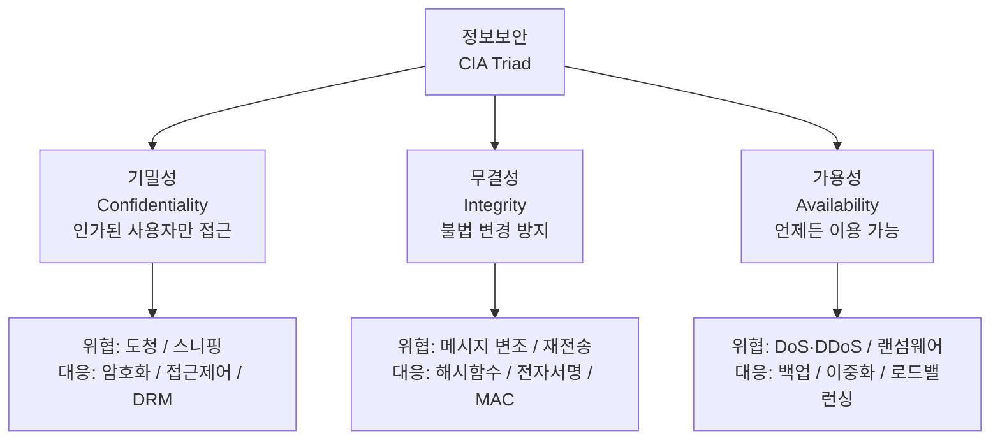
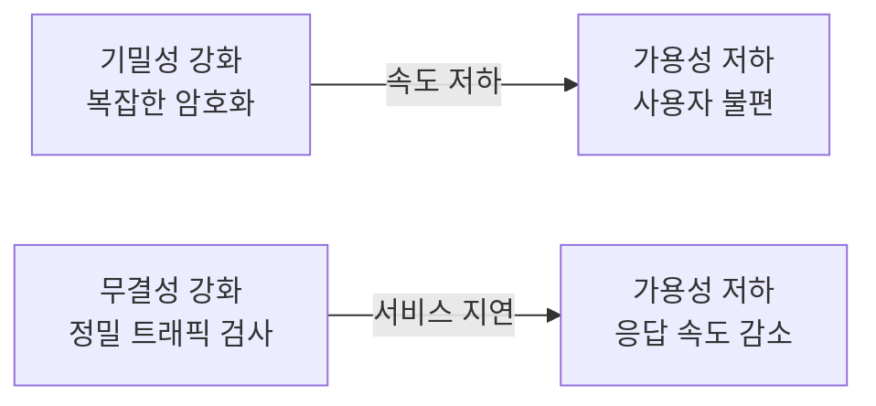

# 정보보안의 3대 요소 (CIA Triad)

## I. 정보보안의 정의 및 3대 요소의 개요

**정의:** 정보자산의 기밀성, 무결성, 가용성을 유지하기 위해 물리적·기술적·관리적 수단을 강구하는 상태

**목표:** 비인가된 접근을 차단하고(C), 데이터의 정확성을 유지하며(I), 필요할 때 언제든 서비스를 제공(A)함

---

## II. 기밀성, 무결성, 가용성(CIA)의 상세 비교

| 구분 | 기밀성 (Confidentiality) | 무결성 (Integrity) | 가용성 (Availability) |
|------|------------------------|------------------|----------------------|
| 정의 | 인가된 사용자만 정보에 접근 가능 | 정보가 불법적으로 변경되지 않음 | 필요할 때 정보 및 서비스 이용 가능 |
| 핵심 목표 | 비공개성 유지 | 정확성 및 완전성 보장 | 서비스 연속성 확보 |
| 보안 위협 | 도청, 사회공학, 스니핑 | 메시지 변조, 재전송 공격 | DoS/DDoS, 랜섬웨어, 물리적 파괴 |
| 대응 기술 | 암호화, 접근제어, DRM | 해시함수, 전자서명, MAC | 백업, 이중화(DR/BCP), 로드밸런싱 |

---

## III. CIA의 상충 관계 및 최적화 방안

### 가. 보안의 트레이드오프 (Trade-off)

### 나. 최적화 방안 (Security Balance)

- **위험 평가 기반 설계:** 자산의 가치에 따라 기밀성 우선(금융 데이터) 또는 가용성 우선(공정 제어 시스템)의 보안 등급을 차등 적용
- **다층 방어(Defense in Depth):** 특정 요소가 무너져도 다른 요소가 보완할 수 있도록 계층적 보안 아키텍처 설계
