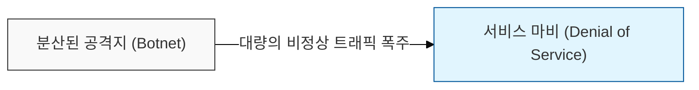
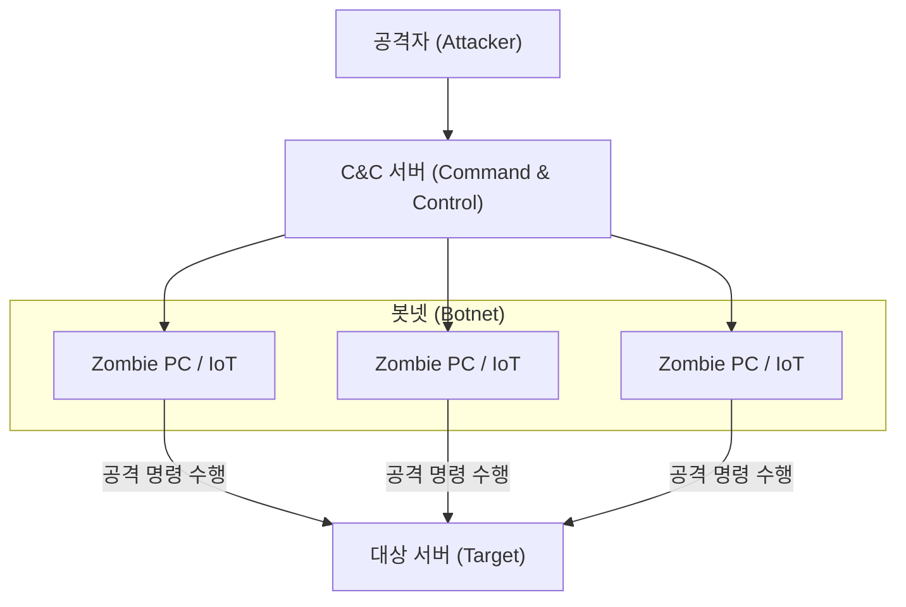

# 서비스 가용성을 위협하는 대규모 파상 공세, DDoS (Distributed Denial of Service)

## I. 가용성 파괴를 목적으로 하는 분산 공격, DDoS의 개요

**정의**: 수많은 분산된 공격 지점( **Botnet** )을 동원하여 타겟 시스템이나 네트워크의 자원을 고갈시켜 정상적인 서비스를 불가능하게 만드는 공격 기법  

**핵심 특징 및 보안 위협**:  
( **가용성 침해** ) 서비스 응답 지연 및 시스템 다운을 유도하여 정보보안의 3대 요소 중 가용성( **Availability** )을 정면으로 공격  
( **대규모 분산** ) 전 세계에 분산된 좀비 **PC**나 **IoT** 기기를 활용하므로 단일 공격지 차단 방식의 방어가 어려움  
( **공격 복합화** ) 단순 트래픽 폭주뿐만 아니라 애플리케이션 취약점 공격을 병행하는 멀티 벡터( **Multi-vector** ) 공격으로 진화  

---

## II. DDoS의 공격 유형 및 메커니즘

### 가. 봇넷(Botnet) 기반의 공격 구조

### 나. 공격 계층 및 방식에 따른 주요 분류

| 분류 | 공격 기법 | 상세 메커니즘 | 대응 포인트 |
|:---:|----------|--------------|-----------|
| **대역폭 고갈** | **UDP** / **ICMP Flood** | 대량의 패킷을 전송하여 네트워크 회선 대역폭 점유 | 회선 용량 증설, **ISP** 연계 차단 |
| **자원 고갈** | **TCP SYN Flood** | **3-way Handshake** 과정의 취약점을 이용해 서버 연결 세션 고갈 | **SYN Cookie**, 세션 임계치 관리 |
| **반사 / 증폭** | **DNS** / **NTP Reflection** | 취약한 서버를 경유하여 공격 트래픽 크기를 증폭시켜 전송 | **Anycast**, 요청 패킷 필터링 |
| **애플리케이션** | **HTTP GET Flood** | 정상적인 **HTTP** 요청을 대량 발생시켜 웹 서버 자원 고갈 | **WAF**, 임계치 기반 차단, **CAPTCHA** |
| **정교한 공격** | **Slowloris** | 연결을 아주 천천히 유지하여 서버의 스레드를 점진적으로 점유 | 타임아웃 설정 강화, 리버스 프록시 활용 |

---

## III. DDoS 대응 전략 및 방어 체계

### 가. 단계별 방어 전략 (Defense in Depth)

- **임계치 기반 차단 (Threshold-based):** 단위 시간당 발생하는 패킷 수나 세션 수를 모니터링하여 평상시 범위를 벗어나는 트래픽 자동 차단  
- **패킷 심층 분석 (DPI):** 정상적인 프로토콜 규격을 준수하는지 확인하고, 공격 패턴( **Signature** )이 포함된 패킷 선별 차단  
- **클린존 서비스 (Clean Zone):** **ISP** 인프라에서 공격 트래픽을 선제적으로 필터링하여 깨끗한 트래픽만 내부망으로 전입  

### 나. 인프라 및 클라우드 기반 대책

| 대책 영역 | 세부 방안 | 보안 효과 |
|----------|----------|----------|
| **Cloud Mitigation** | **AWS Shield**, **Cloudflare** 등 전용 서비스 활용 | 전 세계 분산 에지를 통한 대규모 트래픽 흡수 및 분산 처리 |
| **Anycast Routing** | 공격 트래픽을 지리적으로 가장 가까운 노드로 분산 유도 | 특정 서버에 집중되는 트래픽 부하 분산 |
| **BGP Flowspec** | 라우팅 경로 상에서 공격 트래픽 속성을 정의하여 즉시 차단 | 네트워크 코어 계층에서의 신속한 대응 가능 |

> **핵심**: 현대의 **DDoS** 방어는 단일 장비가 아닌 **ISP**, 클라우드 보안 서비스, 전용 방어 장비가 결합된 통합 대응 체계 구축이 필수적임
