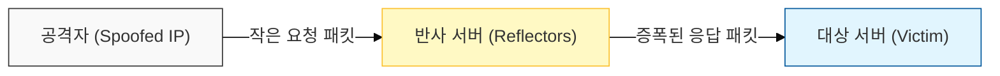
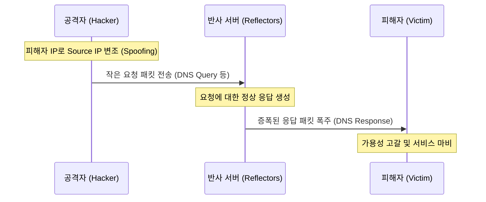

# 반사와 증폭을 이용한 가공할 공격, DRDoS (Distributed Reflective Denial of Service)

## I. 스푸핑과 증폭의 결합, DRDoS의 개요

**정의**: 공격자가 자신의 **IP**를 피해자의 **IP**로 위조( **Spoofing** )하여 다수의 반사 서버( **Reflector** )에 요청을 보내고, 서버들이 피해자에게 증폭된 응답을 집중시켜 마비시키는 공격 기법  

**핵심 특징 및 보안 위협**:  
( **반사 및 증폭** ) **UDP** 프로토콜의 특성을 악용하여 요청 대비 수십~수만 배 큰 응답 패킷을 유도하는 증폭( **Amplification** ) 공격 수행  
( **추적의 어려움** ) 공격자가 직접 패킷을 보내지 않고 정상적인 서비스를 제공하는 서버들을 경유하므로 공격의 진원지 파악이 극히 어려움  
( **비대칭성 공격** ) 공격자는 적은 자원(대역폭)으로도 반사 서버의 자원을 빌려 피해자에게 대규모 트래픽 타격 가능  

---

## II. DRDoS의 공격 메커니즘 및 주요 프로토콜

### 가. 반사 및 증폭 공격 프로세스

### 나. 주요 반사/증폭 프로토콜 및 증폭 계수

| 프로토콜 | 주요 서비스 | 증폭 계수 (최대) | 상세 메커니즘 |
|:---:|----------|:--------------:|--------------|
| **DNS** | 도메인 이름 해석 | 약 50배 | `ANY` 레코드 요청 시 대용량 응답 반환 |
| **NTP** | 시간 동기화 | 약 550배 | `monlist` 명령어를 통한 최근 접속 목록 요청 |
| **SNMP** | 네트워크 관리 | 약 6배00 | 대량의 장비 정보 일괄 요청 |
| **SSDP** | 플러그 앤 플레이 | 약 30배 | **UPnP** 기기 검색 및 정보 응답 |
| **Memcached** | 분산 메모리 캐시 | **약 50,000배** | **UDP** 포트 노출 시 대량의 캐시 데이터 응답 |

---

## III. DRDoS와 일반 DDoS 비교 및 대응 전략

### 가. DDoS vs. DRDoS 핵심 차이점

| 비교 항목 | 일반 DDoS (Botnet 기반) | DRDoS (Reflector 기반) |
|:---:|------------------------|-----------------------|
| **공격 근원지** | 감염된 좀비 **PC** ( **Botnet** ) | 정상적인 서비스를 제공하는 서버 ( **Reflector** ) |
| **핵심 기술** | 대량의 호스트 동원 | **IP Spoofing** 및 응답 증폭 |
| **좀비 확보** | 악성코드 감염 필요 | 필요 없음 (취약한 서버 탐색) |
| **은닉성** | 보통 (봇 IP 노출) | 매우 높음 (정상 서버 IP 노출) |

### 나. 기술적 및 관리적 대응 전략

- **Ingress/Egress Filtering (BCP38):** 네트워크 진입/진출 지점에서 소스 **IP**가 해당 네트워크 대역이 아닌 패킷을 원천 차단하여 스푸핑 방지  
- **DNS Sinkhole:** 공격 대상 도메인에 대한 **IP**를 가상의 사이트로 변경하여 공격 트래픽을 정화 시설로 유도  
- **임계치 기반 차단:** 특정 프로토콜( **UDP 53**, **123** 등)의 트래픽이 평상시보다 급증할 경우 자동 차단 및 모니터링  
- **반사 서버 관리:** 불필요한 **UDP** 서비스 폐쇄 및 최신 패치 적용(예: **NTP monlist** 기능 비활성화)  

> **핵심**: **DRDoS**는 정상 서버를 무기로 활용하므로, 전 세계적인 보안 설정 강화( **Anti-spoofing** )와 **ISP** 계층에서의 협력 방어 체계가 필수적임
