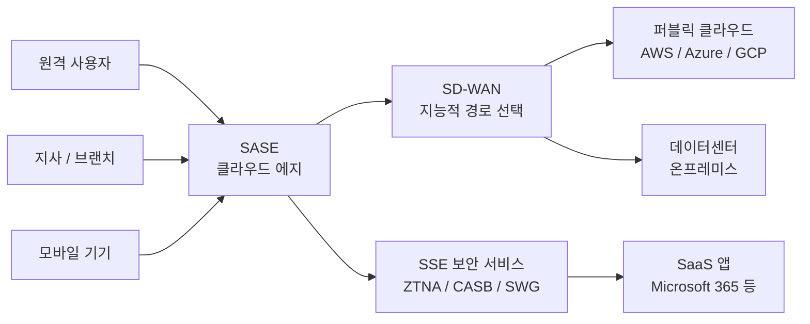

# SASE (Secure Access Service Edge)

## I. 네트워크와 보안의 클라우드 기반 융합, SASE의 개요

**정의:** SD-WAN 등의 네트워크 기능과 차세대 방화벽, CASB, ZTNA 등 보안 서비스를 단일 클라우드 플랫폼에서 제공하는 아키텍처

**등장 배경:** 클라우드 확산 및 원격 근무 증가에 따른 기존 데이터센터 중심(Hub-and-Spoke) 네트워크의 병목 현상 및 보안 경계 붕괴 해결

---

## II. SASE의 핵심 구성 요소 및 개념도

### 가. SASE의 구성 요소와 기술 요소

> **핵심:** 네트워크 경로를 최적화하는 네트워크 기술과 데이터 및 접근을 보호하는 보안 기술의 결합

---

### 나. 주요 구성 요소 상세

| 구분 | 주요 구성 기술 | 상세 설명 |
|------|-------------|---------|
| Network (SD-WAN) | 소프트웨어 정의 광대역망 | 애플리케이션 단위의 지능적 경로 선택 및 트래픽 가용성 확보 |
| Security (SSE) | ZTNA | 제로 트러스트 기반 접근 제어 |
| Security (SSE) | CASB | 클라우드 앱 가시성 및 통제 확보 |
| Security (SSE) | SWG | 안전한 웹 접속 보장 및 맬웨어 차단 |

---

## III. SASE와 기존 네트워크 보안 모델 비교

| 비교 항목 | 기존 모델 (Hub-and-Spoke) | SASE (Cloud Native) |
|----------|--------------------------|---------------------|
| 네트워크 구조 | 데이터센터 경유 (Backhauling) | 클라우드 에지(Edge) 직접 접속 |
| 보안 서비스 | 어플라이언스 기반 (Hardware) | 클라우드 서비스 기반 (SaaS) |
| 관리 편의성 | 개별 솔루션 각각 관리 (복잡) | 단일 정책 기반 통합 관리 (단순) |
| 성능/지연 | 병목 현상 발생 가능성 높음 | 분산된 에지 노드를 통한 저지연 |
