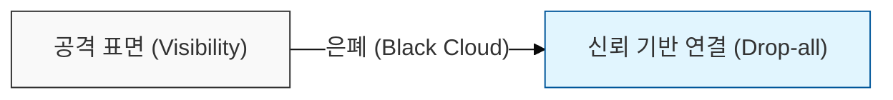
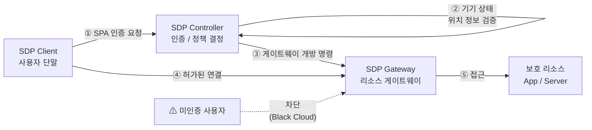

# SDP (Software Defined Perimeter)

## I. "**선 인증**, **후 접속**" 기반의 네트워크 보안, SDP의 개요

**정의**: 장치 인증 및 사용자 신뢰를 확인하기 전까지는 인프라를 외부로부터 은폐(Black Cloud)하는 소프트웨어 정의 보안 아키텍처  

**특징**:  
( **신뢰 기반** ) 제로 트러스트(Zero Trust) 구현의 핵심 기술로 선 인증 후 접속 메커니즘 적용  
( **은폐성** ) 미인증 사용자에게 리소스를 노출하지 않는 "**블랙 클라우드**"(Black Cloud) 구현  
( **공격 표면 최소화** ) 비인증 트래픽을 원천 차단하여 스캔 및 분산 서비스 거부 공격(DDoS) 방어  

---

## II. SDP의 구성 요소 및 동작 메커니즘

### 가. SDP의 논리적 구성도

> **핵심:** 제어 영역(Control Plane)에서 인증을 완료한 후 데이터 영역(Data Plane)의 통로를 개방하는 구조

---

### 나. 주요 구성 요소 및 보안 기술

| 구성 요소 | 주요 역할 | 핵심 보안 기술 |
|----------|----------|--------------|
| SDP Controller | 인증 및 정책 결정 | SPA (Single Packet Authorization): 단일 패킷으로 인증 시도 |
| SDP Gateway | 리소스 접근 게이트웨이 | Black Cloud: 미인증 사용자의 스캔 차단 (은폐) |
| SDP Client | 사용자 단말 소프트웨어 | 기기 상태(Posture) 및 위치 정보 전송 |

---

## III. SDP와 기존 VPN(Virtual Private Network) 비교

| 비교 항목 | VPN (기존) | SDP (차세대) |
|----------|-----------|-------------|
| 인증 방식 | 접속 후 인증 (ID/PW 중심) | 선 인증 후 접속 (장치/사용자 다각적 검증) |
| 가시성 | 네트워크 접속 시 모든 자원 노출 | 최소 권한 기반 허가된 자원만 노출 |
| 보안 모델 | 경계 보안 (신뢰 구역 존재) | 제로 트러스트 (아무도 신뢰하지 않음) |
| 연결 방식 | 네트워크 계층 (L3/L4) 연결 | 애플리케이션 계층 (L7) 중심의 세밀한 제어 |
