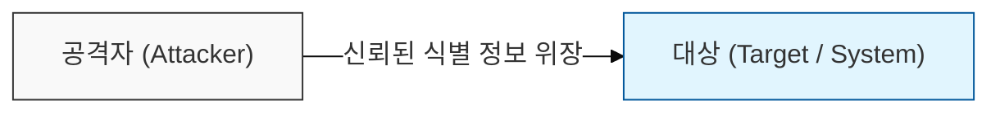
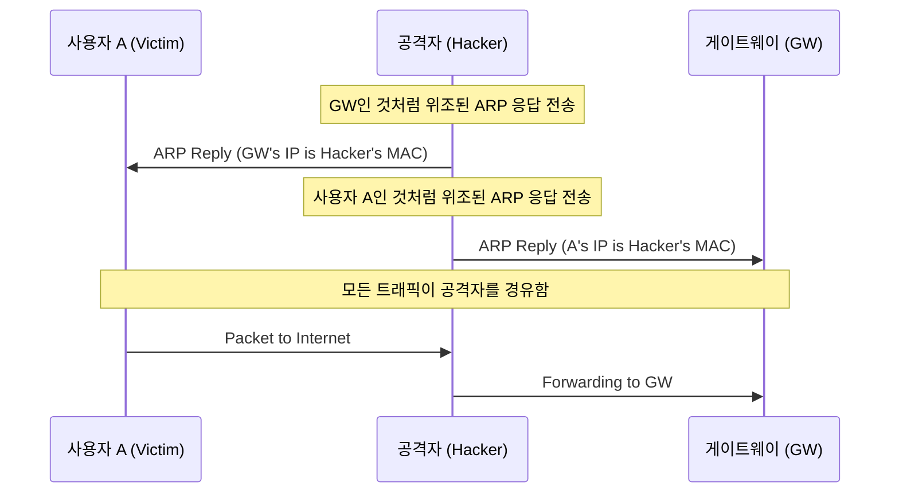

# 신뢰를 가로채는 신원 위장 공격, Spoofing

## I. 타인의 식별 정보를 도용하는 기만 공격, Spoofing의 개요

**정의**: 승인받은 사용자인 것처럼 속이기 위해 **IP** 주소, **MAC** 주소, **DNS** 이름 등 네트워크 식별 정보를 위조하여 시스템에 접근하거나 데이터를 가로채는 공격 기법  

**핵심 특징 및 보안 위협**:  
( **신뢰 관계 악용** ) 시스템 간의 신뢰 관계( **Trust Relationship** )를 이용해 인증 절차를 우회하거나 권한 탈취  
( **중간자 공격 기반** ) 데이터 패킷의 흐름을 공격자에게 유도하여 도청( **Sniffing** ) 및 변조를 수행하는 중간자 공격( **MITM** )의 핵심 수단  
( **다양한 계층 발생** ) 데이터 링크 계층( **ARP** )부터 네트워크 계층( **IP** ), 애플리케이션 계층( **DNS** / **Email** )까지 전 계층에서 발생  

---

## II. 계층별 Spoofing 공격 유형 및 메커니즘

### 가. ARP Spoofing의 동작 원리 (L2 계층)

### 나. 주요 Spoofing 유형별 상세 비교

| 유형 | 위조 대상 | 공격 목적 | 주요 메커니즘 |
|:---:|----------|----------|--------------|
| **IP Spoofing** | 소스 **IP** 주소 | 필터링 우회, **DDoS** 근원지 은닉 | **IP** 헤더 내 **Source IP** 변조 |
| **ARP Spoofing** | **MAC** 주소 | 로컬 네트워크 내 데이터 도청 ( **Sniffing** ) | 조작된 **ARP Reply** 패킷 지속 전송 |
| **DNS Spoofing** | **DNS** 질의 응답 | 파밍( **Pharming** ), 피싱 사이트 유도 | **DNS Cache** 오염 또는 가짜 응답 선점 |
| **Email Spoofing** | 발신자 주소 | 사회공학적 공격, 스팸/악성코드 배포 | **SMTP** 프로토콜의 발신자 정보 변조 |

---

## III. Spoofing 대응 전략 및 보안 대책

### 가. 기술적 방어 대책 (네트워크 보안)

- **Static ARP/MAC 설정:** 중요 서버와 게이트웨이 간의 **ARP** 테이블을 수동으로 고정하여 조작된 **ARP** 패킷 무시  
- **Ingress/Egress Filtering:** 네트워크 경계에서 소스 **IP**의 유효성을 검증하여 외부 유입/내부 유출 스푸핑 패킷 차단  
- **강력한 인증 도입:** **IP** 주소 기반의 단순 신뢰 관계를 지양하고, **SSL** / **TLS** 또는 **IPSec**과 같은 암호화 기반 인증 적용  

### 나. 인프라 및 프로토콜 보안 대책

| 대책 영역 | 세부 방안 | 보안 효과 |
|----------|----------|----------|
| **DNS 보안** | **DNSSEC** ( **DNS Security Extensions** ) 도입 | 디지털 서명을 통한 **DNS** 응답의 무결성 및 정당성 검증 |
| **이메일 보안** | **SPF** / **DKIM** / **DMARC** 설정 | 발신 도메인의 정당성을 확인하여 위조 메일 수신 차단 |
| **L2 보안** | **Port Security** / **DAI** ( **Dynamic ARP Inspection** ) | 스위치 포트 수준에서 유효하지 않은 **MAC** / **ARP** 차단 |

> **핵심**: **Spoofing**은 가용성뿐만 아니라 기밀성과 무결성을 모두 위협하므로, 식별 정보에 대한 **암호화 인증**과 **네트워크 계층별 필터링**을 병행해야 함
