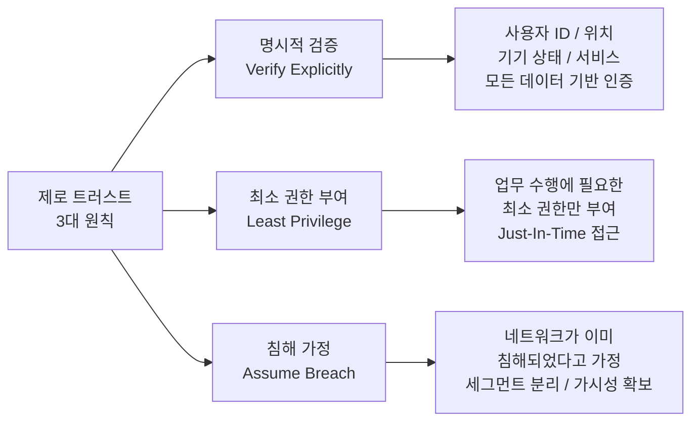

# 제로 트러스트 (Zero Trust)

## I. "**Never Trust**, **Always Verify**", 제로 트러스트의 개요

**정의**: 내부와 외부의 구분을 없애고, 자원에 접근하는 모든 요소(사용자, 기기, 네트워크)를 신뢰하지 않으며 상시 검증하는 보안 모델  

**등장 배경**:  
( **경계 붕괴** ) 클라우드 및 원격 근무 확산으로 기존 네트워크 경계 모호  
( **내부자 위협** ) 신뢰받는 내부 사용자에 의한 데이터 유출 및 오남용 증가  
( **APT 대응** ) 지능형 지속 위협에 따른 침투 탐지 및 수평 이동 차단 필요  

---

## II. 제로 트러스트의 3대 원칙 및 핵심 아키텍처

### 가. 제로 트러스트의 3대 기본 원칙

---

### 나. 제로 트러스트 핵심 아키텍처 및 구성 요소

| 핵심 구성 요소 | 주요 역할 및 기술 | 상세 설명 |
|--------------|----------------|---------|
| 제어 영역 (Control Plane) | Policy Engine / Admin | 신뢰 점수를 계산하고 리소스 접근 허용 여부를 최종 결정 |
| 데이터 영역 (Data Plane) | PEP (Enforcement Point) | 정책에 따라 실제 트래픽 통로를 생성하거나 차단 (Gatekeeper) |
| 보안 기술 | Micro-Segmentation | 네트워크를 잘게 나누어 공격자의 수평 이동(Lateral Movement) 차단 |

---

## III. 제로 트러스트 도입 시 고려사항 및 활성화 방안

- **단계적 전환:** 기존 경계 보안 모델과 병행하며 핵심 자산부터 점진적 적용 (NIST SP 800-207 참조)
- **신뢰성 지표 확보:** 단순 ID/PW가 아닌 생체 인증, 기기 무결성, 접속 위치 등 다각적 컨텍스트 수집 체계 구축
