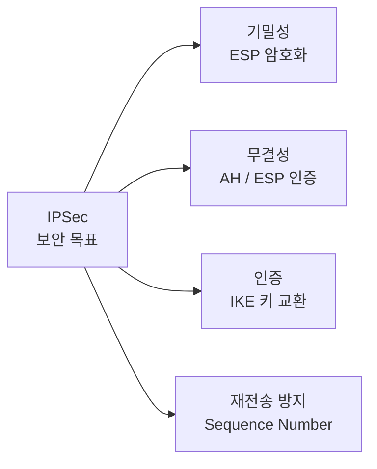
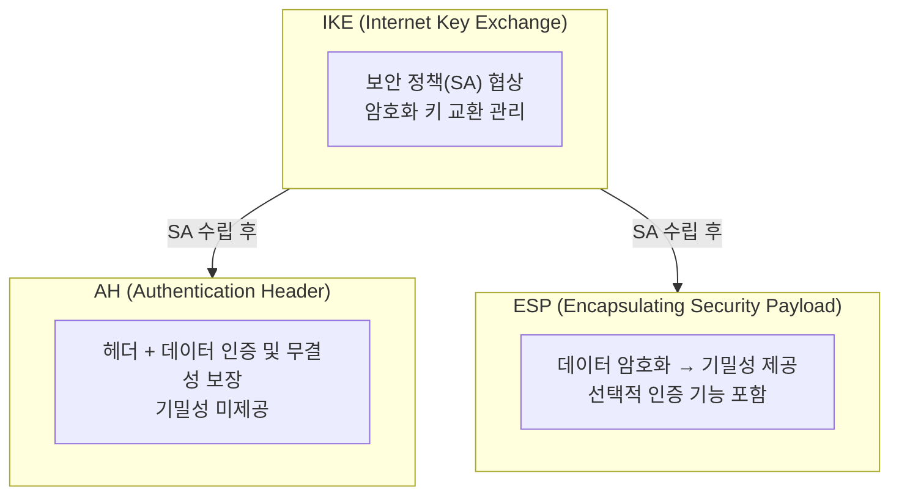
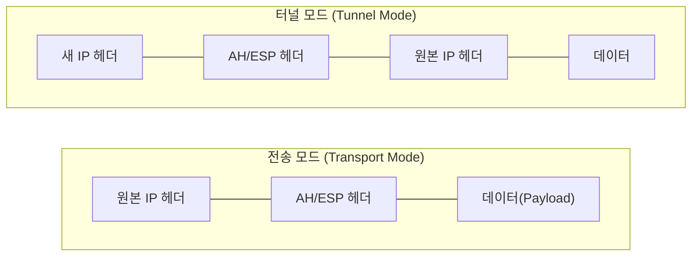
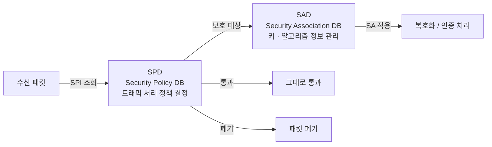

# 네트워크 계층의 수호자, IPSec

## I. 하이브리드 보안 서비스의 정수, IPSec의 정의

**개념:** IP 망을 통해 데이터를 전송할 때 통신 주체 간 암호화 및 인증을 통해 보안 채널을 구축하는 프로토콜 집합

**목표:** 기밀성(ESP 암호화), 무결성(AH/ESP 인증), 인증(IKE), 재전송 공격 방지(Sequence Number)

---

## II. IPSec의 핵심 구성 요소 및 동작 모드

### 가. IPSec 프로토콜 스택 구조

| 프로토콜 | 기능 | 기밀성 | 무결성 | 인증 |
|--------|------|:-----:|:-----:|:----:|
| AH | 헤더 + 데이터 인증 | ✕ | ✓ | ✓ |
| ESP | 데이터 암호화 + 선택적 인증 | ✓ | ✓ | ✓ |
| IKE | SA 협상 및 키 교환 | — | — | ✓ |

---

### 나. 전송 모드와 터널 모드의 비교

| 구분 | 전송 모드 (Transport Mode) | 터널 모드 (Tunnel Mode) |
|-----|--------------------------|----------------------|
| 보호 대상 | IP 패킷의 데이터(Payload) 영역 | IP 패킷 전체 (Header + Data) |
| 헤더 구성 | 원본 IP 헤더를 그대로 사용 | **새로운 IP 헤더(New Header)**를 추가 |
| 주요 용도 | 호스트 대 호스트 (End-to-End) 통신 | 지점 대 지점 (Site-to-Site VPN) |
| 특징 | 오버헤드가 적으나 원본 IP 노출 | 보안성이 높으며 사설 IP 통신 가능 |

---

## III. IPSec 보안 정책 관리: SPD 및 SAD

| 요소 | 상세 설명 | 비고 |
|-----|---------|------|
| SPD (Security Policy DB) | 어떤 트래픽을 보안 처리할지 결정하는 정책 DB | 보호 / 통과 / 폐기 결정 |
| SAD (Security Association DB) | 현재 연결된 SA의 암호 키, 알고리즘 정보를 관리 | 실행 중인 보안 정보 |
| SPI (Index) | 수신 패킷이 어떤 SA에 해당하는지 식별하는 색인값 | 패킷 헤더 내 포함 |

> **핵심:** IPSec은 네트워크 계층(L3)에서 동작하여 상위 애플리케이션 변경 없이 투명하게 보안을 적용할 수 있으며, VPN 구현의 핵심 기반 기술로 활용됨
