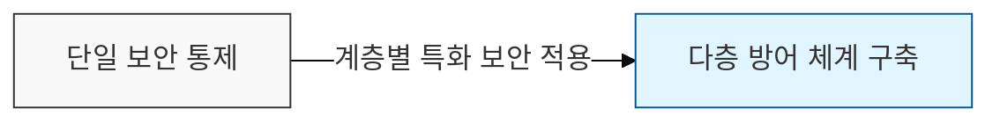

# OSI 7 Layer 계층별 보안

## I. 다층 방어 체계의 핵심, OSI 7 Layer 보안의 개요

**정의**: 국제표준화기구(ISO)가 정의한 네트워크 7계층별로 특화된 보안 위협을 분석하고, 이에 대응하는 보안 기술 및 솔루션을 적용하는 체계

**핵심 가치**:  
 (**중첩 보안**) 특정 계층이 무력화되더라도 다른 계층에서 위협을 차단하는 다층 방어 체계 구현  
 (**가시성 확보**) 각 계층별 프로토콜 분석을 통해 네트워크 트래픽에 대한 세밀한 통제력 제공  
 (**책임 추적성**) 장애나 보안 사고 발생 시 정확한 발생 지점 파악 및 빠른 대응 가능  

---

## II. 계층별 주요 보안 위협 및 대응 기술

### 가. OSI 7 Layer 보안 아키텍처

- **하위 계층**(물리 / 데이터링크): 물리적 연결과 인접 노드 간 보안을 담당
- **상위 계층**(전송 / 응용): 종단 간 암호화와 데이터 가시성을 제어

### 나. 계층별 보안 활동 및 핵심 프로토콜

| 계층 (Layer) | 주요 보안 위협 | 대응 기술 및 프로토콜 | 보안 장비 / 솔루션 |
|:---:|--------------|--------------------|-----------------|
| **7. Application** | SQL Injection, XSS, HTTP Flooding | S-HTTP, PGP / S-MIME, DNSSEC | WAF, Anti-Spam |
| **6. Presentation** | 데이터 변조, 복호화 공격 | Format 확인, 암호화 / 압축 | - |
| **5. Session** | Session Hijacking | SSH, RPC 보안 | - |
| **4. Transport** | Port Scanning, SYN Flooding | SSL / TLS, WTLS | FW, Load Balancer |
| **3. Network** | IP Spoofing, ICMP Flooding | IPSec (AH, ESP), VPN | Router ACL, IPS |
| **2. Data Link** | MAC Flooding, ARP Spoofing | 802.1x, MAC 필터링 | L2 / L3 보안 스위치 |
| **1. Physical** | 도청(Tapping), 물리적 파괴 | 물리적 차폐, 포트 잠금 | CCTV, 지문인식 |

---

## III. 계층별 보안 적용 시 고려사항 및 동향

### 가. 상위 계층(L4-L7) 중심의 보안 강화
과거 L3 / L4 중심의 단순 차단에서 애플리케이션 페이로드를 분석하는 **DPI**(Deep Packet Inspection) 기반의 지능형 보안으로 진화하고 있습니다.

### 나. 암호화 트래픽 가시성 확보
**SSL** / **TLS** 사용 급증에 따라 암호화된 트래픽 내 악성코드를 탐지하기 위한 **SSL 가시성 솔루션**(SSL Inspection) 병행이 필수적입니다.

### 다. 제로 트러스트(Zero Trust)와의 연계
계층별 개별 대응을 넘어, 모든 계층의 접속 요청에 대해 "**결코 신뢰하지 않고 항상 검증**"하는 통합 보안 아키텍처로의 전환이 요구됩니다.
