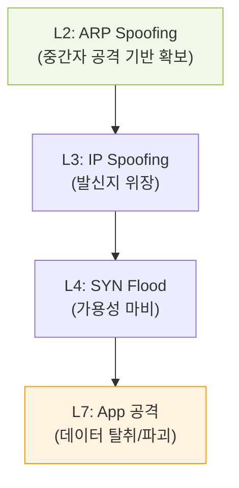

# 계층별 방어의 기초, OSI 7계층 관점의 보안 위협과 대응

## I. 가시성 확보와 심층 방어의 출발점, OSI 계층별 보안의 개요

**정의** : 네트워크 통신 과정을 7개 계층으로 구분한 **OSI 7 Layer** 표준 모델의 각 계층에서 발생 가능한 고유한 보안 취약점과 이에 대응하는 기술적 방어 체계  

**핵심 특징 및 분석 가치** :  
( **체계적 위협 식별** ) 공격자가 표적으로 삼는 통신 프로토콜의 위치를 명확히 파악하여 정교한 대응 전략 수립 가능  
( **심층 방어 구현** ) 하위 물리 계층부터 상위 애플리케이션 계층까지 단계별 방어벽을 구축하여 단일 장애점( **SPOF** ) 해소  
( **책임 추적성** ) 보안 사고 발생 시 해당 위협이 발생한 계층을 신속히 특정하여 사고 대응( **IR** ) 시간 단축  
( **가시성 최적화** ) 각 계층의 트래픽 특성을 분석함으로써 변칙적인 공격 패턴에 대한 탐지 정확도 향상  

---

## II. OSI 7계층별 주요 보안 위협 및 대응 기술

### 가. 계층별 대표 공격 및 보안 솔루션 매핑

| 계층 (Layer) | 주요 보안 위협 (Threats) | 대응 기술 및 솔루션 (Defense) |
|:---:|------------------------|-----------------------------|
| **L7. Application** | **HTTP Flood**, **SQL Injection**, **XSS** | **WAF**, **IPS**, 시큐어 코딩, **API Gateway** |
| **L6. Presentation** | 데이터 암호화 해제, 포맷 변조 공격 | **SSL/TLS** 암호화, 데이터 무결성 검증 |
| **L5. Session** | **Session Hijacking**, **RPC** 공격 | 강력한 인증, 세션 타임아웃, **SSH** |
| **L4. Transport** | **TCP SYN Flood**, **UDP Flood**, 포트 스캐닝 | 방화벽( **ACL** ), **IDS/IPS**, 커널 파라미터 튜닝 |
| **L3. Network** | **IP Spoofing**, **ICMP Flood**, **DDoS** | **IPsec**, 라우터 필터링, **Bogon** 필터링 |
| **L2. Data Link** | **ARP Spoofing**, **MAC Flooding**, **VLAN Hop** | **Port Security**, **DHCP Snooping**, **DAI** |
| **L1. Physical** | 케이블 도청( **Tapping** ), 장비 파괴, 전력 차단 | 물리적 출입 통제, 폐쇄회로( **CCTV** ), 쉴딩 케이블 |

### 나. 계층 간 연계 공격 시나리오

---

## III. OSI 계층별 보안 관리의 핵심 전략

### 가. 상위 계층(L4-L7) vs 하위 계층(L1-L3) 보안 비교

| 비교 항목 | 하위 계층 보안 (L1-L3) | 상위 계층 보안 (L4-L7) |
|:---:|----------------------|----------------------|
| **중점 대상** | 패킷 전송, 경로 제어, 물리적 연결 | 데이터 처리, 서비스 로직, 사용자 인증 |
| **보안 목표** | 네트워크 인프라 가용성 및 무결성 | 데이터 기밀성 및 비즈니스 로직 보호 |
| **분석 단위** | 패킷 헤더, **MAC/IP** 주소 | 페이로드( **Payload** ), 메시지 본문, 세션 |
| **주요 장비** | 라우터, L3 스위치, **VPN** | **WAF**, 차세대 방화벽( **NGFW** ), **IPS** |

### 나. 실무적 보안 고도화 제언
- **전 계층 통합 모니터링**: **SIEM** 또는 **SOAR**를 활용하여 각 계층에서 발생하는 로그를 상관 분석함으로써 복합 공격 탐지
- **제로 트러스트 모델 적용**: 계층에 관계없이 "결코 신뢰하지 말고 항상 검증하라"는 원칙하에 마이크로 세그멘테이션( **Micro-segmentation** ) 수행
- **암호화 가시성 확보**: **L6/L7** 수준의 암호화 트래픽 내부에 숨겨진 악성 코드를 탐지하기 위해 **SSL Inspection** 기술 도입 검토

> **핵심** : 현대의 공격은 특정 계층에 머물지 않고 전 계층을 넘나들며 진화하므로, **OSI 7계층** 전반을 아우르는 **다층 방어 체계** 구축이 사이버 회복력( **Resilience** ) 확보의 근간임
