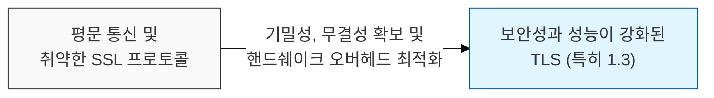
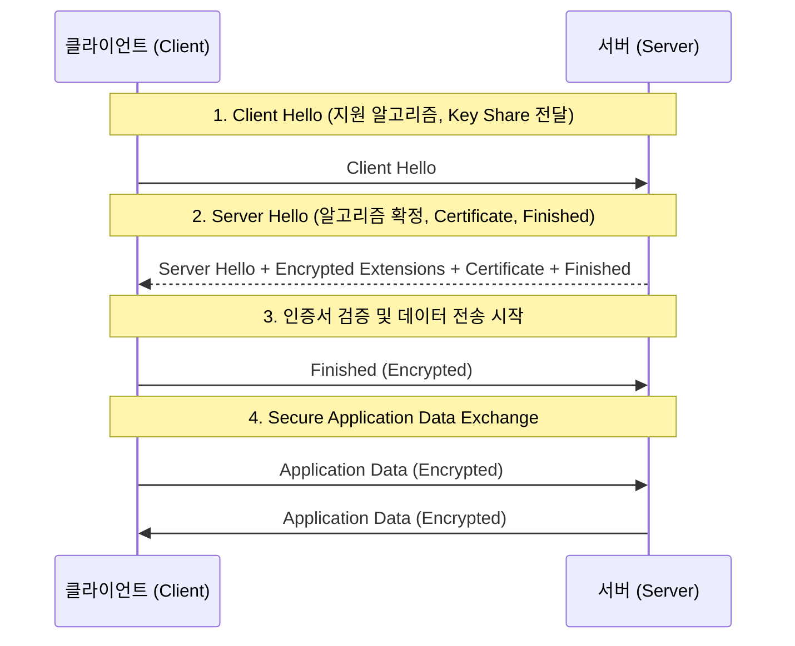

# 웹 보안 통신의 표준, TLS (Transport Layer Security)

## I. 안전한 종단 간 암호화 통신, TLS의 개요

**정의** : 인터넷상의 통신에서 데이터의 기밀성, 무결성, 인증을 보장하기 위해 클라이언트와 서버 간에 암호화 채널을 설정하는 전송 계층 보안 프로토콜 (RFC 8446)  

**핵심 특징 및 가치** :  
( **하이브리드 암호 체계** ) 공개키 암호화( **Asymmetric** )를 통해 대칭키를 안전하게 교환하고, 실제 데이터는 속도가 빠른 대칭키 암호화( **Symmetric** )로 전송  
( **무결성 보장** ) 메시지 인증 코드( **MAC** ) 또는 **HMAC**을 사용하여 전송 중 데이터의 위변조 여부를 실시간 검증  
( **강력한 인증** ) 디지털 인증서( **X.509** ) 및 **PKI** 체계를 활용하여 통신 대상의 신원을 확인하고 중간자 공격( **MITM** ) 방지  
( **성능 최적화** ) 최신 **TLS 1.3** 버전에서는 핸드쉐이크 단계를 단축( **1-RTT**, **0-RTT** )하여 보안과 속도를 동시에 확보  

---

## II. TLS의 작동 원리 및 핸드쉐이크 프로세스

### 가. TLS 1.3 핸드쉐이크 흐름도 (1-RTT)

### 나. TLS를 구성하는 4대 하위 프로토콜

| 프로토콜 | 상세 설명 | 주요 역할 |
|:---:|----------|----------|
| **Handshake** | 암호화 알고리즘( **Cipher Suite** ) 협상 및 세션 키 생성 | 상호 인증 및 보안 파라미터 합의 |
| **Change Cipher Spec** | 이후 전송되는 메시지는 협상된 암호 사양으로 전송됨을 통보 | 암호화 모드 전환 알림 |
| **Alert** | 통신 과정에서 발생하는 오류나 위험 상황을 상대방에게 전달 | 에러 처리 및 세션 종료 통제 |
| **Record** | 실제 데이터를 분할, 압축, 암호화하여 전송하는 기본 단위 | 데이터 캡슐화 및 무결성 보호 |

---

## III. TLS 1.2 vs. TLS 1.3 비교 및 보안 강화 포인트

### 가. 버전별 주요 차이점 비교

| 비교 항목 | TLS 1.2 | TLS 1.3 |
|:---:|---------|---------|
| **핸드쉐이크 속도** | **2-RTT** (왕복 2회 필요) | **1-RTT** / **0-RTT** (속도 대폭 향상) |
| **암호화 알고리즘** | **RSA**, **Static DH** 포함 (취약점 존재) | **PFS** 지원 알고리즘( **ECDHE** 등)만 허용 |
| **보안성** | 핸드쉐이크 일부가 평문 노출 | 핸드쉐이크 시작 직후부터 대부분 암호화 |
| **Cipher Suite** | 수십 개의 다양한 조합 (관리 복잡) | 안전한 5개 조합으로 간소화 |

### 나. TLS 보안 고도화 및 최신 동향
- **PFS (Perfect Forward Secrecy)** : 향후 서버의 개인키가 유출되더라도 과거의 통신 내용을 복호화할 수 없도록 일회성 세션 키를 사용하는 구조 필수 적용
- **HSTS (HTTP Strict Transport Security)** : 브라우저가 강제로 **HTTPS** 연결만 사용하도록 강제하여 프로토콜 다운그레이드 공격 방어
- **SNI 암호화 (ESNI / ECH)** : 서버 이름 표시( **SNI** )가 평문으로 노출되어 접속 대상이 파악되는 문제를 해결하기 위한 암호화 기술 도입

> **핵심** : **TLS**는 현대 웹 보안의 근간이며, 특히 **TLS 1.3** 도입을 통해 보안 취약 요소를 제거하고 통신 성능을 극대화하는 것이 필수적인 보안 전략임
