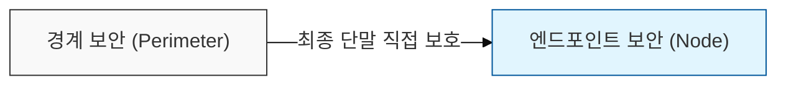
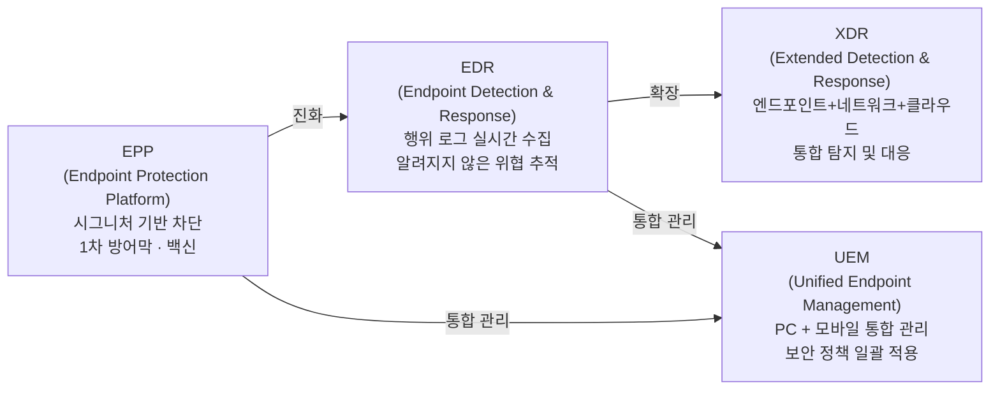
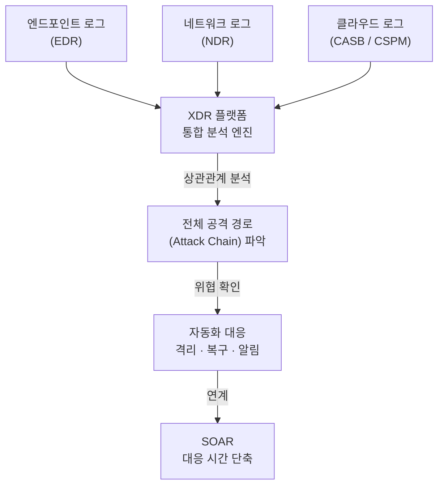

# 위협의 최전선, 엔드포인트 보안

## I. 경계 보안의 한계를 극복하는 엔드포인트 보안의 개요

**정의**: 네트워크 내부로 침투한 위협이 최종 사용자 기기에 도달했을 때 이를 탐지, 차단 및 대응하는 호스트 기반의 보안 전략  

**도입 필요성**:  
( **경계 붕괴** ) 클라우드 전환 및 원격 근무 확산으로 인해 전통적인 네트워크 경계 보안 모델 무력화  
( **BYOD 확산** ) 개인 기기의 업무 활용( **BYOD** ) 증가에 따른 비인가 기기 및 단말 취약성 노출  
( **위협 고도화** ) 지능형 지속 위협( **APT** ) 및 랜섬웨어가 최종 사용자 단말을 주요 공격 거점으로 활용  

---

## II. 엔드포인트 보안의 핵심 기술 및 메커니즘

### 가. 보안 솔루션의 진화 단계와 가시성 확보

---

### 나. 주요 보안 기능별 상세 비교

| 구분 | 주요 기술 | 상세 설명 | 보안적 가치 |
|-----|---------|---------|-----------|
| 차단 | NGAV (Next-Gen Antivirus) | AI/머신러닝 기반 이상 행위 탐지 | 비시그니처 기반 공격 방어 |
| 탐지 | Behavioral Analysis | 파일 실행, 레지스트리 수정 등 행위 추적 | 제로데이(Zero-day) 공격 탐지 |
| 통제 | DLP (Data Loss Prevention) | 매체 제어, 화면 캡처 방지, 파일 유출 차단 | 내부 정보 유출 방지 |
| 관리 | Patch Management | OS 및 애플리케이션 보안 업데이트 자동화 | 취약점(Vulnerability) 제거 |

---

## III. 엔드포인트 보안의 새로운 패러다임: XDR

| 요소 | 상세 설명 | 비고 |
|-----|---------|------|
| 데이터 통합 | 엔드포인트, 네트워크, 클라우드 로그를 하나로 통합 | 가시성(Visibility) 확장 |
| 상관관계 분석 | 각 계층의 파편화된 이벤트를 연계하여 전체 공격 경로 파악 | 교차 분석 (Correlation) |
| 자동화 대응 | 위협 탐지 시 자동으로 격리 및 복구 프로세스 실행 | SOAR 연계 및 대응 시간 단축 |

> **핵심:** XDR은 EDR(엔드포인트)의 가시성을 네트워크·클라우드까지 확장한 차세대 통합 보안 플랫폼으로, 파편화된 보안 솔루션의 한계를 극복하고 전체 킬 체인을 단일 뷰로 추적함
