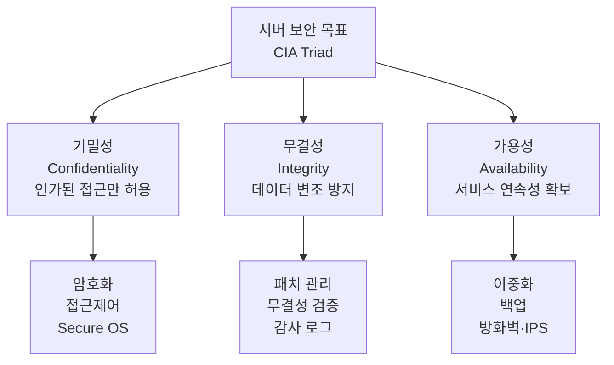
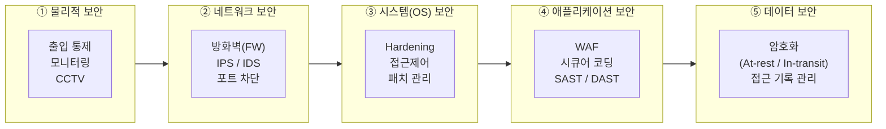
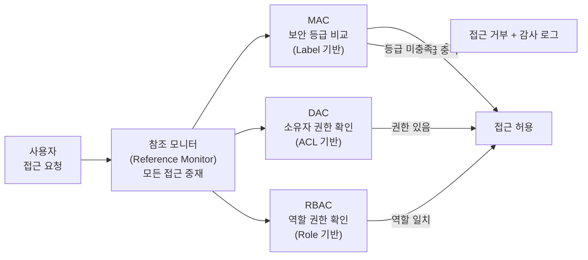

# 서버 보안의 체계적 방어 전략

## I. 서버 보안의 정의 및 목표

**정의:** 운영체제(OS), 애플리케이션, 데이터베이스 등 서버 구성 요소의 취약점을 제거하고 비인가된 접근을 차단하는 보안 활동

**목표:** 서비스의 가용성 확보, 데이터의 기밀성 유지, 정보의 무결성 보장 (CIA Triad)

---

## II. 서버 보안의 주요 계층 및 기술 요소

| 구분 | 주요 보안 기술 및 활동 | 상세 설명 |
|-----|------------------|---------|
| 물리적 보안 | 출입 통제, 모니터링 | 데이터 센터 및 서버실의 물리적 접근 제한 |
| 네트워크 보안 | 방화벽(FW), IPS/IDS | 불필요한 포트 차단, 네트워크 기반 침입 탐지 및 차단 |
| 시스템(OS) 보안 | Hardening, 접근제어 | 불필요한 서비스/계정 제거, 커널 및 OS 취약점 패치 |
| 애플리케이션 보안 | WAF, 시큐어 코딩 | 웹 취약점(SQLi, XSS) 방어 및 안전한 소스코드 개발 |
| 데이터 보안 | 암호화, 접근 기록 관리 | 저장 데이터(At-rest) 및 전송 데이터(In-transit) 암호화 |

---

## III. 서버 호스트 보안 모델: Secure OS

### 가. 접근제어 모델 비교

| 모델명 | 주요 특징 | 메커니즘 |
|------|---------|---------|
| 강제적 접근제어 (MAC) | 관리자가 설정한 보안 등급에 따라 접근 허용 | 보안 커널, Rule-based |
| 자율적 접근제어 (DAC) | 자원 소유자가 권한을 부여 | ID-based, 권한 부여(Grant) |
| 역할기반 접근제어 (RBAC) | 사용자의 직무/역할에 따라 권한 할당 | 조직 내 직무 중심(Role-based) |

### 나. Secure OS 접근제어 적용 흐름

> **핵심:** Secure OS의 참조 모니터(Reference Monitor)는 모든 자원 접근 요청을 중재하며, MAC·DAC·RBAC을 계층적으로 적용하여 최소 권한 원칙을 실현함
