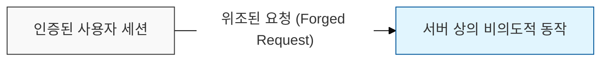
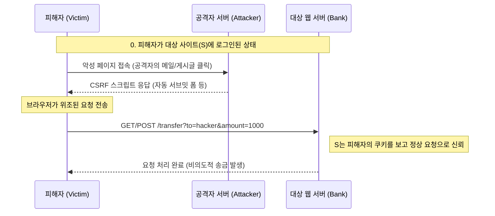

# 사용자의 권한을 훔치는 위조 요청, CSRF (Cross-Site Request Forgery)

## I. 신뢰를 악용하는 변조된 요청, CSRF의 개요

**정의**: 사용자가 자신의 의지와는 무관하게 공격자가 의도한 행위(수정, 삭제, 등록 등)를 특정 웹사이트에 요청하게 만드는 공격 기법  

**핵심 특징 및 성립 요건**:  
( **세션 신뢰 기반** ) 사용자가 대상 사이트에 이미 로그인되어 있어 브라우저에 유효한 세션 쿠키가 존재해야 함  
( **사용자 개입 필요** ) 공격자가 만든 악성 링크를 클릭하거나, 스크립트가 실행되는 페이지를 방문해야 함  
( **예측 가능한 파라미터** ) 서버의 요청 파라미터 구조를 공격자가 미리 알고 위조할 수 있어야 함  

---

## II. CSRF의 공격 메커니즘 및 주요 유형

### 가. CSRF 공격 시나리오 프로세스

### 나. CSRF와 XSS의 핵심 비교

| 비교 항목 | XSS (Cross-Site Scripting) | CSRF (Cross-Site Request Forgery) |
|:---:|---------------------------|----------------------------------|
| **공격 대상** | 클라이언트 (사용자 브라우저) | 서버 (웹 애플리케이션 서비스) |
| **공격 원리** | 악성 스크립트 실행 | 사용자 권한 도용 (위조된 요청 전송) |
| **핵심 목적** | 정보 탈취 (쿠키, 세션 등) | 상태 변경 (정보 수정, 삭제, 송금 등) |
| **동작 지점** | 사용자 브라우저 내 데이터 처리 | 서버 측 비즈니스 로직 수행 |

---

## III. CSRF 대응 전략 및 보안 대책

### 가. 기술적 방어 대책 (시큐어 코딩)

- **CSRF Token 사용:** 모든 쓰기 작업( **POST**, **PUT**, **DELETE** 등) 시 서버에서 발급한 일회성 토큰을 대조하여 위조 여부 검증  
- **SameSite Cookie 설정:** 쿠키 속성에 `SameSite=Lax` 또는 `Strict`를 적용하여 타사 사이트에서의 자동 쿠키 전송 차단  
- **Double Submit Cookie:** 클라이언트의 쿠키값과 요청 파라미터의 토큰값을 서버에서 비교하는 방식 (세션 관리가 어려운 환경에서 활용)  

### 나. 추가 보안 제어 방안

| 대책 영역 | 세부 방안 | 보안 효과 |
|----------|----------|----------|
| **인증 강화** | 중요 기능 실행 시 비밀번호 재입력 또는 **OTP** 요구 | 위조된 요청이 서버에 도달해도 최종 승인 차단 |
| **Referer 체크** | **HTTP Referer** 헤더를 확인하여 허용된 도메인에서의 요청인지 검증 | 타사 사이트로부터의 비정상적 유입 탐지 |
| **HTTP Method** | 조회는 **GET**, 상태 변경은 **POST**만 사용하도록 설계 | **IMG** 태그 등을 이용한 단순 **GET** 기반 **CSRF** 방어 |

> **핵심**: **CSRF** 방어의 가장 강력한 수단은 **CSRF 토큰** 검증과 **SameSite** 쿠키 설정을 중첩하여 적용하는 다층 방어 체계임
