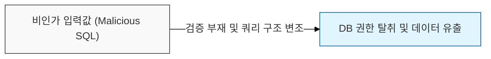
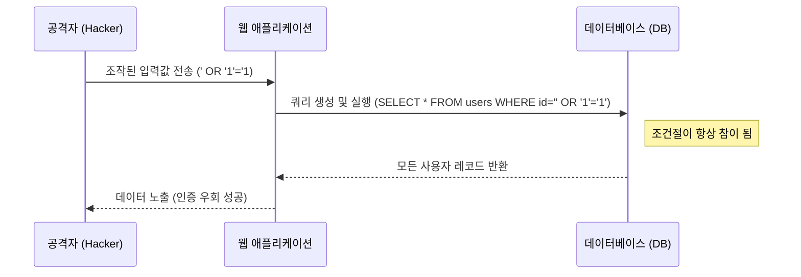

# 데이터베이스의 보이지 않는 침입자, SQL Injection

## I. 웹 애플리케이션 보안의 고전적 위협, SQL Injection의 개요

**정의**: 사용자 입력값이 데이터베이스 쿼리의 구조를 결정하는 인자( **Parameter** )로 처리될 때, 이를 조작하여 의도하지 않은 **SQL** 문을 실행하게 만드는 공격 기법  

**핵심 특징 및 위험성**:  
( **데이터 유출** ) 권한이 없는 사용자가 데이터베이스 내의 민감 정보를 조회하거나 탈취 가능  
( **인증 우회** ) 로그인 쿼리를 무력화하여 관리자 권한으로 시스템에 접속 시도  
( **무결성 파괴** ) 데이터베이스 내의 데이터를 임의로 수정, 삭제하거나 시스템 명령 실행( **xp_cmdshell** 등 )  

---

## II. SQL Injection의 공격 메커니즘 및 주요 유형

### 가. 공격 프로세스 및 원리

### 나. 데이터 획득 방식에 따른 주요 분류

| 분류 | 공격 기법 | 상세 설명 |
|:---:|----------|----------|
| **In-band** | Error-based | DB 에러 메시지를 통해 쿼리 구조 및 데이터를 추론 |
| **In-band** | Union-based | `UNION` 연산자를 활용하여 정상 쿼리 결과에 공격 데이터를 병합 |
| **Inferential** | Blind (Boolean) | 참/거짓 응답 차이를 통해 한 글자씩 데이터를 추출 |
| **Inferential** | Blind (Time) | `SLEEP` 등 시간 지연 함수를 이용하여 데이터 존재 여부 확인 |
| **Out-of-band** | OOB SQLi | **HTTP**, **DNS** 등 별도의 채널을 통해 결과를 전송받는 방식 |

---

## III. SQL Injection 방어 전략 및 보안 대책

### 가. 기술적 방어 대책 (시큐어 코딩)

- **매개변수화 쿼리 (Parameterized Query):** `PreparedStatement`를 사용하여 입력값을 쿼리의 구조가 아닌 단순 상수로 처리  
- **입력값 검증 (Input Validation):** 특수문자(`'`, `--`, `;` 등) 및 예약어에 대한 화이트리스트 기반 필터링  
- **저장 프로시저 (Stored Procedure):** 쿼리 구조가 사전에 컴파일되어 있어 동적 조작을 원천적으로 차단  

### 나. 관리적 및 인프라 보안 대책

| 대책 영역 | 세부 방안 | 보안 효과 |
|----------|----------|----------|
| **최소 권한 원칙** | DB 연결 계정의 권한을 최소화 ( **SELECT** / **INSERT** 만 허용 ) | 시스템 명령 실행 및 전체 삭제 방지 |
| **에러 처리** | 상세한 DB 에러 메시지 출력 금지 ( **Generic Error Page** ) | 서버 구조 및 쿼리 정보 노출 차단 |
| **인프라 보안** | 웹 방화벽( **WAF** ) 도입 및 탐지 규칙 상시 업데이트 | 알려진 패턴의 **SQLi** 공격 자동 차단 |

> **핵심**: **SQL Injection** 방어의 최우선 순위는 **매개변수화 쿼리**의 사용이며, 이를 중심으로 다층 방어 체계를 구축해야 함
