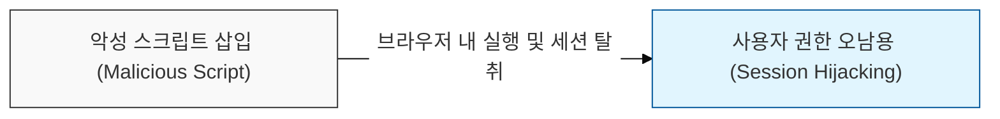
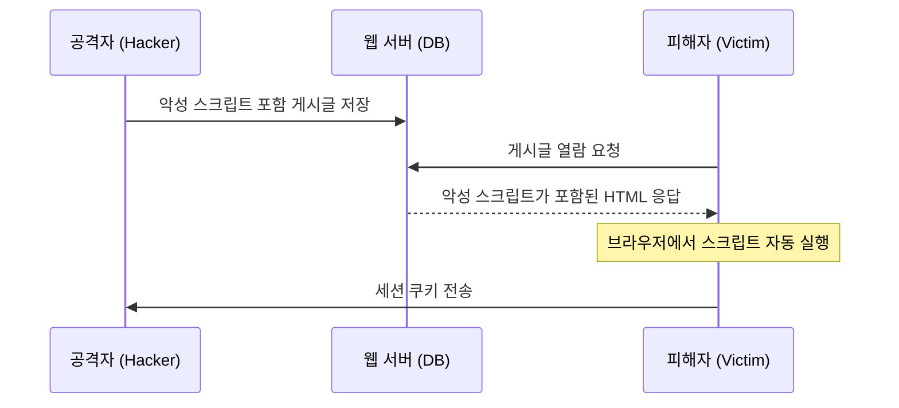

# 브라우저를 타겟팅하는 스크립트 위협, XSS (Cross-Site Scripting)

## I. 사용자 세션을 탈취하는 클라이언트 사이드 공격, XSS의 개요

**정의**: 공격자가 웹 애플리케이션에 악성 스크립트를 삽입하여, 이를 열람하는 사용자의 브라우저에서 해당 스크립트가 실행되게 만드는 보안 취약점  

**핵심 특징 및 위협**:  
( **세션 탈취** ) 사용자의 쿠키( **Cookie** )에 저장된 세션 토큰을 탈취하여 계정 탈취 및 대행 행위 수행  
( **개인정보 유출** ) 스크립트를 통해 페이지 내의 민감한 정보를 외부 서버로 전송하거나 피싱 사이트로 유도  
( **사용자 기만** ) 웹 페이지의 콘텐츠를 임의로 수정하거나 악성 소프트웨어를 배포하는 거점으로 활용  

---

## II. XSS의 공격 유형 및 메커니즘

### 가. 저장형 XSS (Stored XSS) 프로세스

### 나. 주요 공격 유형별 상세 비교

| 유형 | 공격 방식 | 스크립트 저장 위치 | 주요 공격 접점 |
|:---:|----------|:---------------:|--------------|
| **Stored XSS** | 게시판, 프로필 등에 스크립트를 영구 저장 | 서버 데이터베이스 ( **DB** ) | 게시판, 댓글, 방명록 |
| **Reflected XSS** | 검색어 등 입력값이 응답 페이지에 즉시 반사 | 응답 메시지 ( **Non-persistent** ) | 검색 결과, 에러 메시지, **URL** 파라미터 |
| **DOM-based XSS** | 클라이언트 측 스크립트가 **DOM** 데이터를 동적으로 처리 | 클라이언트 브라우저 ( **DOM** ) | **JavaScript** 내 `innerHTML`, `document.write` |

---

## III. XSS 대응 전략 및 보안 대책

### 가. 기술적 방어 대책 (시큐어 코딩)

- **출력값 엔티티 인코딩 (Output Encoding):** 사용자의 입력값을 **HTML** 출력 시 특수문자( `<`, `>`, `&`, `"` 등 )를 **HTML Entity**로 변환하여 실행 차단  
- **입력값 필터링 (Input Filtering):** `<script>`, `onerror`, `onload` 등 위험한 태그 및 이벤트 핸들러에 대한 화이트리스트 기반 검증  
- **보안 헤더 설정 (Security Headers):**  
  - **Content Security Policy** ( **CSP** ): 허용된 도메인의 스크립트만 실행하도록 브라우저 정책 강제  
  - **X-XSS-Protection**: 브라우저 내장 **XSS** 필터를 활성화하여 공격 차단 지원  

### 나. 브라우저 측 보안 대책

| 대책 항목 | 상세 내용 | 보안 효과 |
|----------|----------|----------|
| **HttpOnly Cookie** | **JavaScript**의 `document.cookie` 접근 차단 | **XSS**를 통한 세션 쿠키 탈취( **Session Hijacking** ) 원천 방어 |
| **Secure Cookie** | **HTTPS** 프로토콜을 통해서만 쿠키 전송 | 네트워크 구간의 쿠키 스니핑 방어 |
| **SameSite Cookie** | 타사 사이트의 쿠키 전송 방식을 제어 ( **Lax** / **Strict** ) | **CSRF** 공격 방어 및 일부 **XSS** 피해 완화 |

> **핵심**: **XSS** 방어의 근본은 "모든 사용자 입력은 신뢰할 수 없다"는 가정하에, 출력 단계에서의 철저한 **엔티티 인코딩**과 **CSP** 적용을 병행하는 것임
