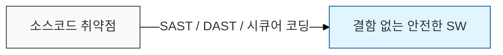
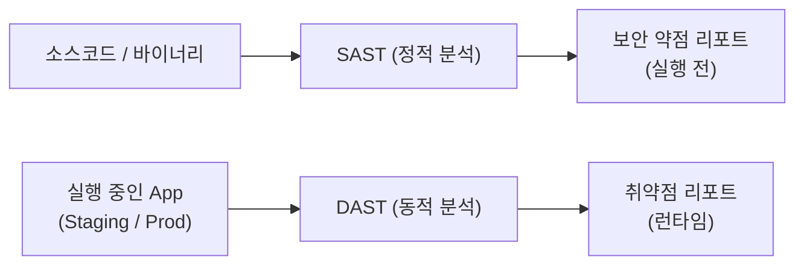

# 코드 보안 (SAST, DAST 및 시큐어 코딩)

## I. 소프트웨어 결함의 선제적 제거, 코드 보안의 개요

**정의**: SW 개발 과정에서 발생할 수 있는 보안 약점을 분석하고, 안전한 코딩 표준을 적용하여 취약점 없는 소프트웨어를 제작하는 활동

**필요성**:  
 (**비용 절감**) 개발 초기 단계의 보안 약점 제거를 통한 배포 후 수정 비용 최소화  
 (**선제적 방어**) OWASP Top 10 등 알려진 주요 취약점 및 공격 기법의 사전 차단  
 (**SW 신뢰성 확보**) 안전한 코딩 표준 준수를 통한 소프트웨어 자체의 보안 내재화  

---

## II. 정적 분석(SAST)과 동적 분석(DAST)의 상세 비교

### 가. SAST와 DAST의 분석 아키텍처

> **핵심**: 소스코드를 직접 분석하는 **화이트박스**(SAST) 방식과 실제 가동 중인 시스템에 공격을 시도하는 **블랙박스**(DAST) 방식으로 구분됨

---

### 나. SAST vs DAST 핵심 비교

| 비교 항목 | 정적 분석 (SAST) | 동적 분석 (DAST) |
|----------|----------------|----------------|
| 분석 대상 | 소스코드, 바이너리 (실행 전) | 실행 중인 애플리케이션 (실행 시) |
| 분석 방식 | 화이트박스 (White-box) | 블랙박스 (Black-box) |
| 수행 시점 | 개발(Implementation) 단계 | 테스팅/운영(Staging/Prod) 단계 |
| 검출 내용 | 구문 오류, 시큐어 코딩 위반, 로직 오류 | 런타임 취약점, 인증 오류, 세션 관리 |
| 장점 | 초기 발견(Shift-Left), 근본 원인 파악 | 실제 공격 환경 검증, 낮은 오탐율 |
| 단점 | 높은 오탐율(False Positive), 빌드 필요 | 소스코드 내 위치 파악 불가, 사후 조치 |

---

## III. 시큐어 코딩 가이드라인 (행안부 7대 자가진단 항목)

행정안전부에서 고시한 소프트웨어 보안약점 진단 가이드는 다음과 같은 7대 영역을 중심으로 구성됩니다.

| 영역 | 주요 점검 내용 | 대응 방안 (예시) |
|:---:|--------------|-----------------|
| 1. **입력 데이터 검증 및 표현** | SQL 인젝션, XSS, 경로 조작 | Prepared Statement 사용, 입력값 필터링 |
| 2. **보안 기능** | 인증/인가 취약성, 취약한 암호화 | 다중 인증(2FA), 강력한 해시 알고리즘(SHA-256+) |
| 3. **시간 및 상태** | 경쟁 조건(Race Condition), 종료되지 않는 루프 | 공유 자원 동기화, 적절한 자원 해제 |
| 4. **에러 처리** | 시스템 정보 노출, 부적절한 예외 처리 | Custom Error Page 적용, 상세 로그 은닉 |
| 5. **코드 오류** | 널 포인터 역참조, 부적절한 자원 해제 | Null 체크 로직 추가, Finally 블록 내 Close |
| 6. **캡슐화** | 제거되지 않는 디버그 코드, 정보 노출 | 시스템 정보 노출 방지, public 필드 지양 |
| 7. **API 오용** | 취약한 API 호출, 보안되지 않은 함수 | 권장되는 표준 라이브러리 및 API 사용 |
