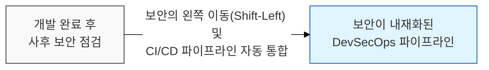
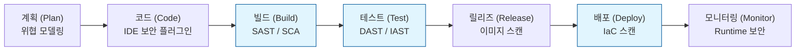

# 보안이 내재화된 자동화 흐름, DevSecOps 파이프라인 (DevSecOps Pipeline)

## I. 개발 전 주기에 걸친 보안 자동화, DevSecOps 파이프라인의 개요

**정의** : 소프트웨어 개발 생명주기( **SDLC** ) 전 과정에 보안 활동을 자동화하여 통합한 **CI/CD** 파이프라인으로, 속도와 보안성을 동시에 확보하는 현대적 개발 체계  

**핵심 특징 및 가치** :  
( **보안의 왼쪽 이동** ) 개발 초기 단계( **Shift-Left** )부터 보안을 적용하여 취약점 조치 비용을 절감하고 품질 향상  
( **지속적 보안 검증** ) 빌드, 테스트, 배포의 모든 단계에서 자동화된 보안 도구를 통해 실시간으로 위협 식별 및 차단  
( **협업 문화 조성** ) 개발( **Dev** ), 보안( **Sec** ), 운영( **Ops** ) 팀 간의 공유 책임( **Shared Responsibility** ) 모델 구축  
( **컴플라이언스 자동화** ) 보안 정책 준수 여부를 코드 기반( **Policy as Code** )으로 자동 검증하여 규제 대응 효율화  

---

## II. DevSecOps 파이프라인의 단계별 보안 활동 및 도구

### 가. 파이프라인 단계별 보안 통합 아키텍처

### 나. 단계별 핵심 보안 기술 및 주요 도구 (Toolchain)

| 파이프라인 단계 | 핵심 보안 활동 | 주요 도구 예시 |
|:---:|--------------|--------------|
| **Plan / Design** | 위협 모델링, 보안 요구사항 정의 | **OWASP Threat Dragon**, **Microsoft TMT** |
| **Commit / Code** | **IDE** 실시간 검사, 시크릿 탐지 | **Snyk**, **GitLeaks**, **Pre-commit hooks** |
| **Build / CI** | 정적 분석( **SAST** ), 오픈소스 분석( **SCA** ) | **SonarQube**, **Checkmarx**, **OWASP Dependency-Check** |
| **Test** | 동적 분석( **DAST** ), 대화형 분석( **IAST** ) | **OWASP ZAP**, **Burp Suite Enterprise**, **Contrast Security** |
| **Deploy / CD** | **IaC** 보안 스캔, 컨테이너 이미지 스캔 | **Terraform Compliance**, **Trivy**, **Clair** |
| **Operate / Monitor** | 런타임 보안, 가시성 확보, 사고 대응 | **Falco**, **ELK Stack**, **WAF**, **RASP** |

---

## III. 성공적인 DevSecOps 파이프라인 구축 전략

### 가. 주요 분석 기술 비교: SAST vs. DAST vs. SCA

| 비교 항목 | SAST (Static) | DAST (Dynamic) | SCA (Software Composition) |
|:---:|--------------|---------------|---------------------------|
| **분석 대상** | 소스 코드, 바이너리 (내부) | 실행 중인 앱 (외부) | 오픈소스 라이브러리, 종속성 |
| **수행 시점** | 빌드 단계 (초기) | 테스트/스테이징 단계 (후반) | 빌드 및 배포 단계 전체 |
| **주요 목적** | 코드 내 로직 결함 발견 | 런타임 취약점 및 설정 오류 | 취약한 라이브러리 및 라이선스 관리 |
| **정확도** | 오탐( **FP** ) 발생 가능성 높음 | 실제 공격 경로 확인으로 정확함 | 기 구축된 DB 기반으로 정확함 |

### 나. 실무적 구축 가이드라인
- **점진적 통합**: 모든 보안 도구를 한꺼번에 적용하기보다, 영향도가 높은 **SAST**와 **SCA**부터 단계적으로 통합
- **실패 기준 정의 (Build Fail)**: 특정 위험도( **Critical** ) 이상의 취약점이 발견될 경우 파이프라인을 자동으로 중단시키는 기준 수립
- **개발자 친화적 피드백**: 보안 진단 결과를 개발 도구( **Jira**, **Slack** 등)와 연계하여 개발자가 즉시 인지하고 수정할 수 있도록 구성

> **핵심** : **DevSecOps** 파이프라인의 성공은 단순한 도구 도입이 아니라, 보안이 개발의 '장애물'이 아닌 '품질의 일부'로 인식되는 **문화적 전환**과 **자동화**의 결합에 있음
