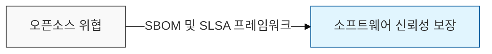

# 공급망 보안 (SBOM 및 SLSA)

## I. 소프트웨어 투명성과 무결성의 확보, 공급망 보안의 개요

**정의**: 소프트웨어가 생산되어 사용자에게 전달되기까지의 전 과정(설계, 개발, 빌드, 배포)에서 보안 위협을 관리하고 신뢰성을 보장하는 활동

**필요성**:  
 (**위협 급증 대응**) Log4j, SolarWinds 사태와 같은 공급망 공격에 대한 선제적 방어 체계 필요  
 (**투명성 확보**) 소프트웨어 구성 요소(SBOM)의 가시성을 확보하여 취약점 발생 시 신속 대응  
 (**신뢰성 보장**) 개발부터 배포까지 전 과정의 무결성을 검증하여 변조된 SW 유통 방지  

---

## II. SBOM 표준 및 SLSA의 프레임워크

### 가. SBOM(Software Bill of Materials)의 주요 표준 비교

소프트웨어 구성 요소의 명세서인 SBOM은 산업계 표준인 SPDX와 보안 특화인 CycloneDX가 주로 사용됩니다.

| 구분 | SPDX (ISO/IEC 5962) | CycloneDX |
|------|---------------------|-----------|
| 주도 기관 | Linux Foundation | OWASP Foundation |
| 주요 목적 | 라이선스 준수 및 유통 관리 중심 | 보안 분석 및 취약점 관리 최적화 |
| 데이터 모델 | 복잡하고 상세한 문서화 가능 | 가볍고 자동화 도구 연동 용이 |
| 표현 형식 | Tag/Value, JSON, YAML, RDF | JSON, XML, Protobuf |

### 나. 소프트웨어 공급망 보안 가이드라인, SLSA(Salsa)

**정의**: 구글에서 제안한 공급망 보안 프레임워크로, 빌드 프로세스의 무결성을 보장하기 위한 4단계 레벨 정의

**주요 요건**:
- **소스**(Source): 코드 변경 이력 관리 및 2인 검토(Two-person review)
- **빌드**(Build): 격리된 환경에서의 빌드 및 빌드 증명(Provenance) 생성
- **공통**(Common): 지속적인 보안 감사 및 취약점 스캐닝

---

## III. 공급망 보안 강화를 위한 단계별 대응 방안

| 단계 | 대응 전략 | 핵심 기술 및 도구 |
|:---:|----------|-----------------|
| 개발 단계 | 오픈소스 라이브러리 검증 및 선정 | SCA (BlackDuck, Snyk), 허용 목록 관리 |
| 빌드 단계 | 빌드 과정의 무결성 증명 및 SBOM 발행 | Sigstore (전자서명), Syft/Grype |
| 배포 단계 | 배포 이미지 검증 및 승인된 이미지만 사용 | Admission Controller, 이미지 서명 확인 |
| 운영 단계 | 런타임 취약점 모니터링 및 긴급 패치 체계 | VEX (취약점 실행 가능성 정보) 연계 |
