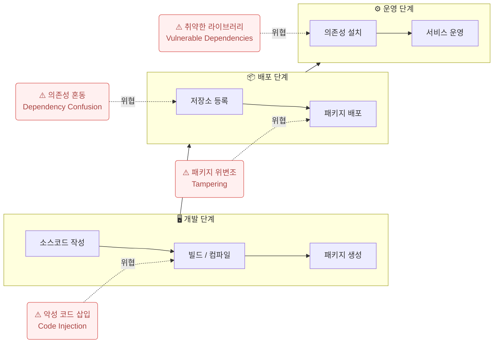

# 소프트웨어 공급망 보안 (Software Supply Chain Security)

## I. 소프트웨어 생애주기 전반의 안전 확보, 공급망 보안의 개요

**정의:** SW 기획, 개발, 배포, 운영에 이르는 전 과정(Supply Chain)에서 발생하는 보안 위협을 방지하기 위한 체계

**필요성:** Log4j 취약점, SolarWinds 공격 등 오픈소스 및 서드파티 라이브러리 대상 공격 증가

---

## II. 소프트웨어 공급망 보안의 아키텍처 및 핵심 기술

### 가. 공급망 보안의 개념도 및 위협 지점

> **핵심:** 개발 단계부터 배포까지 각 접점에 대한 **무결성 검증** 및 **추적성 확보**가 핵심

---

### 나. 주요 보안 기술 및 대응 방안

| 구분 | 주요 기술/방안 | 상세 설명 |
|------|--------------|----------|
| 가시성 확보 | SBOM (SW Bill of Materials) | SW 구성 요소, 버전, 라이선스 정보를 명시한 명세서 (SPDX, CycloneDX) |
| 무결성 검증 | Code Signing, Hash | 개발 단계의 소스코드와 배포 파일의 위변조 여부 확인 |
| 프레임워크 | SLSA (Salsa), SSDF | 공급망 보안 수준을 측정하고 강화하기 위한 단계별 표준 가이드라인 |

---

## III. 공급망 보안 강화를 위한 향후 과제

- **SBOM 표준화 및 자동화:** 다양한 벤더 간의 상호운용성을 위한 표준 포맷(SPDX, CycloneDX) 적용 확대
- **Zero Trust 연계:** '아무것도 신뢰하지 않는다'는 원칙하에 지속적인 인증 및 검증 체계 구축
