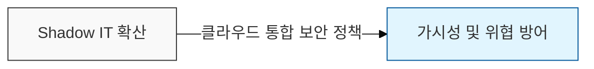

# CASB (Cloud Access Security Broker)

## I. 클라우드 서비스의 안전한 통로, CASB의 개요

**정의**: 기업의 온프레미스 인프라와 클라우드 서비스 사이에 배치되어 보안 정책을 통합적으로 적용하고 가시성을 제공하는 보안 솔루션 또는 서비스

**필요성**:  
 (**섀도우 IT 통제**) 기업 통제 밖의 비인가 클라우드 서비스 이용 현황 식별 및 위험 관리  
 (**데이터 유출 방지**) 클라우드 환경에 최적화된 DLP 기능을 통해 민감 정보의 외부 유출 차단  
 (**계정 보호**) 비정상적인 로그인 탐지 및 접근 제어를 통해 클라우드 계정 탈취 공격에 대응  

---

## II. CASB의 4대 핵심 기능 및 구현 방식

### 가. CASB의 4대 보안 핵심 기능 (Pillar)

- **가시성**(Visibility): 기업 내 사용 중인 모든 클라우드 서비스 식별 및 위험도 평가 (Shadow IT 탐지)
- **데이터 보안**(Data Security): 클라우드 저장 데이터에 대한 DLP(데이터 유출 방지), 암호화 및 접근 제어
- **컴플라이언스**(Compliance): 개인정보 보호법, PCI-DSS 등 규제 준수 여부 상시 점검
- **위협 방어**(Threat Protection): 비정상적인 로그인(Anomaly Detection), 악성코드 확산 방지 및 사용자 행위 분석(UEBA)

### 나. CASB의 주요 구현 방식(Deployment) 비교

| 구분 | **API 방식** (Out-of-Band) | **Proxy 방식** (In-Line) |
|------|---------------------------|--------------------------|
| **작동 원리** | 클라우드 서비스의 API를 직접 호출 | 트래픽 경로상에 위치하여 실시간 감시 |
| **성능 영향** | 네트워크 지연(Latency) 없음 | 트래픽 경유로 인한 성능 영향 발생 가능 |
| **관리 대상** | 관리형 클라우드(Managed Cloud) 위주 | Shadow IT 및 비관리형 앱 통제 가능 |
| **구현 시점** | 데이터가 저장된 후 분석 가능 | 데이터 전송 단계에서 실시간 차단 가능 |
| **특징** | 설치가 간편하고 우회 불가능 | Forward/Reverse Proxy 형태로 구성 |

---

## III. CASB와 기존 보안 솔루션(DLP, Proxy) 비교

| 비교 항목 | 기존 DLP / Proxy 솔루션 | CASB (Cloud Native) |
|----------|-----------------------|---------------------|
| **보안 대상** | 사내 네트워크 및 엔드포인트 | SaaS, PaaS 등 외부 클라우드 서비스 |
| **식별 단위** | IP, URL 주소 중심 | 사용자 계정, 앱 기능(공유/삭제 등) 단위 |
| **접근 제어** | 단순 허용 / 차단 (Allow / Deny) | 행위 기반의 세밀한 통제 (Context-aware) |
| **가시성 범위** | 사내망 내부 트래픽 한정 | 모바일, 재택 근무 등 외부 접속 트래픽 포함 |
