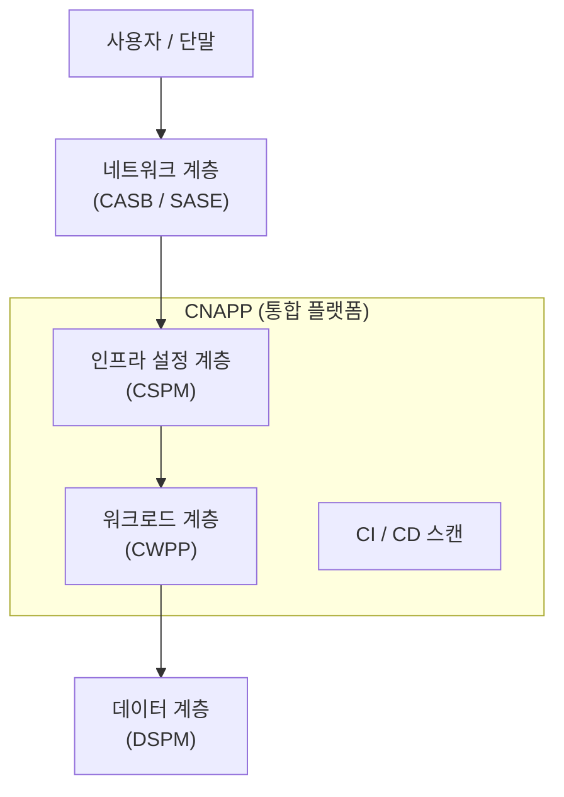

# 클라우드 네이티브 보안 통합 아키텍처

## I. 계층적 방어 체계, 클라우드 통합 보안의 개요

**정의**: 클라우드 서비스의 설정(Control Plane)부터 실제 데이터 처리(Data Plane) 및 사용자 접속 접점까지 전 영역을 아우르는 다층 방어(Defense in Depth) 체계

**핵심 가치**:  
 (**통합 가시성**) 파편화된 보안 솔루션들을 단일 아키텍처로 결합하여 클라우드 전 영역의 가시성 확보  
 (**데이터 중심 보안**) 인프라나 네트워크가 아닌 보호해야 할 '데이터 자체'에 집중한 리스크 관리 체계  
 (**자동화된 대응**) 정책 기반의 실시간 모니터링과 자동 조치를 통해 보안 운영의 효율성 및 속도 극대화  

---

## II. 클라우드 보안 솔루션별 배치 구조 및 역할

### 가. 클라우드 통합 보안 아키텍처 개념도

### 나. 계층별 핵심 솔루션 및 역할

| 보안 계층 | 핵심 솔루션 | 주요 역할 및 배치 지점 |
|:---:|:---:|-----------|
| User & Access | **CASB** / **SASE** | 사용자와 클라우드 사이(In-line / API)에서 SaaS 이용 통제 및 가시성 확보 |
| Control Plane | **CSPM** | 클라우드 인프라 설정(IAM, S3, Network) 오류 탐지 및 거버넌스 준수 |
| Data Layer | **DSPM** | 클라우드 내 정형 / 비정형 데이터 탐지, 민감도 분류 및 데이터 리스크 관리 |
| Workload Layer | **CWPP** | VM, 컨테이너, 서버리스 내부의 악성코드 탐지 및 실행 중인 프로세스 보호 |
| Full Lifecycle | **CNAPP** | 상기 솔루션들을 하나로 통합하여 개발(Build)부터 운영(Run)까지 보호 |

---

## III. 솔루션 간 상호작용 및 데이터 흐름

- **Context** 연계: **CSPM**이 찾아낸 '**인터넷에 개방된 설정**'과 **CWPP**가 찾아낸 '**취약점**'을 결합하여 실제 공격 가능성이 높은 자산을 우선순위화함
- **Data-Centric** 연결: **DSPM**이 식별한 '**민감 데이터**'가 있는 리소스를 **CSPM**과 **CWPP**가 집중적으로 모니터링하는 Risk-based 보안 구현
- **Shift-Left** 통합: CI / CD 파이프라인 내에서 스캔된 결과가 운영 단계의 보안 정책(**CNAPP**)으로 자동 반영되는 피드백 루프 형성

---

## IV. 통합 아키텍처 기반의 보안 강화 방안

| 구분 | 주요 대응 전략 | 핵심 기대 효과 |
|:---:|--------------|--------------|
| 가시성 통합 | 단일 대시보드(Single Pane of Glass) 구축 | 보안 사각지대 제거 및 Alert Fatigue(경보 피로) 감소 |
| 자동 조치 | 설정 오류 발생 시 정책 기반 자동 수정(Remediation) | 사고 대응 시간(MTTR) 단축 및 인적 실수 최소화 |
| 제로 트러스트 | 모든 접속에 대한 지속적 인증 및 최소 권한 원칙 적용 | 계정 탈취 및 내부 측면 이동(Lateral Movement) 방지 |
