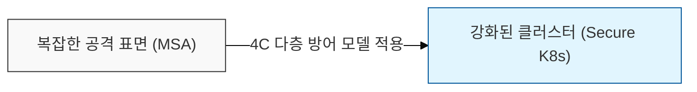
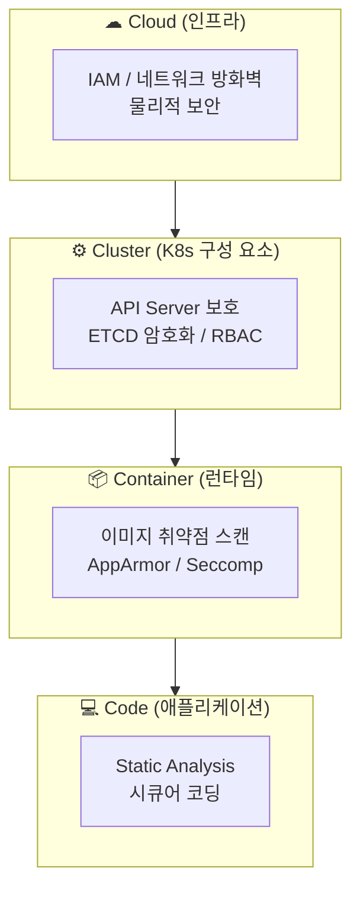
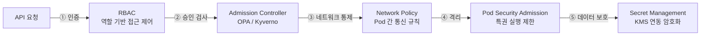
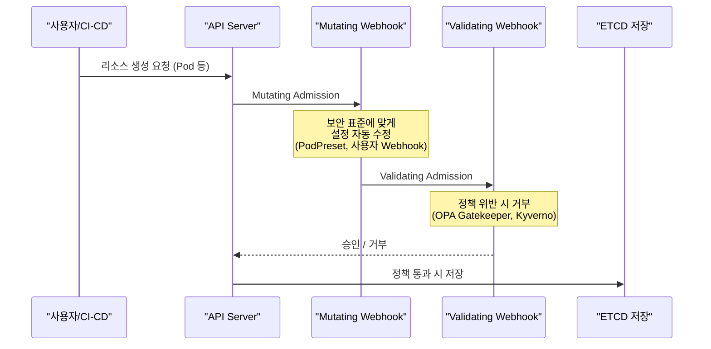
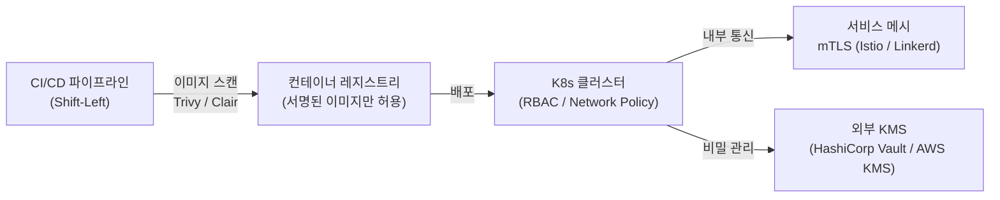

# 클라우드 네이티브 환경의 중추, 쿠버네티스 보안

## I. 다층 방어 체계, 쿠버네티스 보안의 개요

**정의**: 컨테이너 오케스트레이션 환경에서 클러스터 구성 요소( **Control Plane** )와 워크로드( **Worker Node** )를 외부 위협 및 내부 설정 오류로부터 보호하기 위한 다각적 보안 메커니즘  

**도입 필요성**:  
( **공격 표면 증가** ) 마이크로서비스 아키텍처( **MSA** ) 확산으로 인한 복잡한 통신 경로 및 노출 지점 증대  
( **횡적 이동 방어** ) 컨테이너 침투 시 인접 컨테이너나 호스트로 확산되는 횡적 이동( **Lateral Movement** ) 차단 필요  
( **구성 오류 방지** ) 선언적 설정( **YAML** )의 보안 미흡으로 인한 권한 남용 및 데이터 유출 사고 예방  

---

## II. 쿠버네티스 보안의 핵심 기술 및 메커니즘

### 가. 4C 보안 계층 모델 및 위협 요소

> **핵심:** 4C 모델은 바깥 계층(Cloud)이 안쪽 계층(Code)의 보안 기반이 되는 종속 구조로, 내부 계층만 강화해도 외부 계층이 취약하면 전체 보안이 무너짐

---

### 나. 쿠버네티스 보안 강화 5대 핵심 기술

| 구분 | 주요 기술 | 상세 설명 | 보안적 가치 |
|-----|---------|---------|-----------|
| 인증/인가 | RBAC (Role-Based Access Control) | 역할에 따라 API 접근 권한 차등 부여 | 최소 권한의 원칙 구현 |
| 네트워크 | Network Policy | Pod 간 통신 허용/차단 규칙 설정 | L3/L4 마이크로 세그멘테이션 |
| 컴플라이언스 | Admission Controller | 생성되는 리소스의 정책 준수 여부 검증 | 보안 설정 강제화 (OPA 등) |
| 격리 | Pod Security Admission | 특권 권한 실행 제한 및 격리 수준 정의 | 컨테이너 탈옥(Escape) 방지 |
| 데이터 보호 | Secret Management | API 키, 인증서 등 민감 정보 암호화 저장 | 자격 증명 유출 방지 (KMS 연동) |

---

## III. 공급망 보안을 위한 Admission Control 흐름

| 단계 | 역할 | 주요 도구 |
|-----|------|---------|
| Mutating | 요청된 리소스 설정을 보안 표준에 맞게 자동 수정 | PodPreset, 사용자 정의 Webhook |
| Validating | 보안 정책(비루트 계정 사용 등) 위반 시 생성 거부 | OPA Gatekeeper, Kyverno |

---

## IV. 실무 적용 시 핵심 고려사항

**Secret의 한계와 외부 연동:** K8s 기본 Secret은 Base64 인코딩으로 저장되어 보안에 취약하므로, 실무에서는 HashiCorp Vault나 AWS/Azure의 KMS와 연동하여 관리해야 함

**Shift-Left Security:** 운영 단계의 탐지도 중요하지만, CI/CD 파이프라인에서 이미지 취약점 스캔(Trivy, Clair)과 IaC(Terraform, YAML) 보안 진단을 먼저 수행하는 Shift-Left 전략이 필수적

**제로 트러스트 네트워크:** 클러스터 내부 통신은 기본적으로 모두 허용(Allow-all) 상태이므로, 서비스 메시(Istio, Linkerd)를 활용한 mTLS(Mutual TLS) 기반의 상호 인증과 세밀한 트래픽 제어가 수반되어야 함

