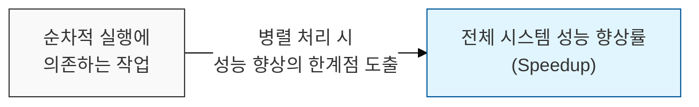
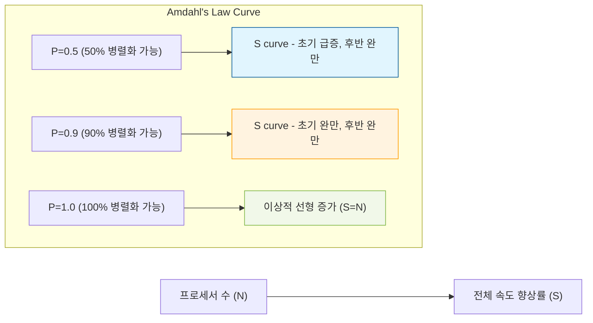

# 성능 향상의 한계를 규정하는 아키텍처 원리, 암달의 법칙 (Amdahl's Law)

## I. 병렬 처리의 이론적 최대 성능 향상률, 암달의 법칙 개요



**정의** : 특정 작업의 병렬 처리를 통해 얻을 수 있는 최대 성능 향상률은 해당 작업에서 순차적으로 실행될 수밖에 없는 부분의 비율에 의해 제한된다는 원칙  

**핵심 특징 및 시사점** :  
( **순차 처리의 병목** ) 아무리 많은 프로세서를 투입하더라도, 시스템의 순차적( **Serial** )으로 실행되어야 하는 부분은 병렬 처리의 이점을 얻을 수 없음  
( **성능 향상의 상한선** ) 병렬 처리에 참여할 수 없는 부분의 비율이 높을수록, 전체 시스템의 속도 향상 폭은 점점 줄어듦  
( **아키텍처 설계의 중요성** ) 병렬 처리에 유리한 아키텍처( **MSA**, 분산 시스템)를 설계하는 것이 성능 확장의 핵심임을 시사  
( **진 래리 암달의 제안** ) 1967년 진 래리 암달( **Gene Amdahl** )이 제안했으며, 병렬 컴퓨팅 성능 예측의 근간이 되는 이론  

---

## II. 암달의 법칙 공식 및 성능 향상 메커니즘

### 가. 암달의 법칙 공식 (Amdahl's Law Formula)

```
Speedup(S) = 1 / ((1 - P) + P/N)
```

- `S`: 전체 시스템의 최대 성능 향상률 (Speedup)
- `P`: 전체 작업 중 병렬 처리가 가능한 부분의 비율 (Proportion of parallelizable work)
- `N`: 사용 가능한 프로세서 수 (Number of processors)
- `(1-P)`: 전체 작업 중 순차적으로 실행되어야 하는 부분의 비율 (Proportion of serial work)

### 나. 프로세서 수 증가에 따른 성능 향상 곡선



---

## III. 암달의 법칙의 실무적 적용 및 보안 고려사항

### 가. 병렬 컴퓨팅 환경에서의 암달의 법칙 적용

| 적용 분야 | 상세 설명 | 보안 및 성능 시사점 |
|:---:|----------|------------------|
| **대규모 데이터 처리** | 빅데이터 분석, 머신러닝 모델 학습 등 | 순차 처리 로직(전처리, 결과 집계)의 최적화 중요 |
| **분산 시스템** | **MSA** 환경에서의 서비스 간 통신 | 네트워크 지연( **Latency** )이 순차 처리 시간으로 작용 |
| **병렬 공격/방어** | 분산 **DDoS** 공격, 다중 스레드 취약점 스캔 | 공격/방어 효율이 병렬 처리 자원에 비례하지 않음 |

### 나. 암달의 법칙을 극복하기 위한 전략
- **병렬화 가능한 부분 극대화** : 전체 시스템에서 순차 부분이 차지하는 비율(1-P)을 최소화하도록 아키텍처 설계
- **효율적인 통신 채널** : 노드 간 통신 오버헤드를 줄여 P 값(병렬화 비율)을 최대한 높임 ( **gRPC**, **RDMA** 등)
- **작은 단위의 병렬 처리** : 전체 작업을 거대한 단위 대신 작고 독립적인 단위로 분할하여 병렬 처리 효율 증대

> **핵심** : **암달의 법칙**은 병렬 컴퓨팅의 환상을 깨고, **아키텍처 설계**의 중요성을 강조하며, 시스템의 **순차적 병목 지점**을 끊임없이 관리하는 것이 성능 최적화의 열쇠임을 보여줌
