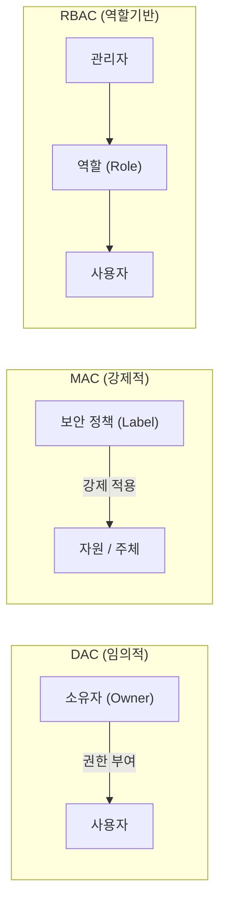

# MAC / DAC / RBAC 접근 제어 모델 비교

## I. 보안 정책 결정의 기준, 접근 제어 모델의 개요

**정의**: 시스템 내 자원에 대한 비인가 접근을 차단하기 위해 주체의 신분, 등급, 역할에 따라 접근 권한을 제한하는 정책적 프레임워크

**메커니즘**: 참조 모니터(Reference Monitor)가 보안 정책 DB를 확인하여 접근 허용 여부를 결정함

---

## II. MAC, DAC, RBAC의 상세 비교

### 가. 접근 제어 모델별 아키텍처 비교

> **설명**: **DAC**는 소유자가 권한을 부여하고, **MAC**은 시스템이 라벨(Label)로 강제하며, **RBAC**은 중간에 '**역할**(Role)'이라는 계층을 두어 관리함

---

### 나. 기술적 특성 비교표

| 항목 | 임의적 접근제어 (DAC) | 강제적 접근제어 (MAC) | 역할기반 접근제어 (RBAC) |
|------|--------------------|--------------------|----------------------|
| 영문 명칭 | Discretionary Access Control | Mandatory Access Control | Role-Based Access Control |
| **판단 기준** | 주체의 신분 (Identity) | 보안 등급 (Label / Clearance) | 사용자의 역할 (Role) |
| **권한 부여** | 자원 소유자가 임의 결정 | 시스템 / 관리자가 일괄 강제 | 중앙 관리자가 역할 할당 |
| **보안성** | 낮음 (권한 오남용 가능) | 매우 높음 (우회 불가) | 보통 ~ 높음 (직무 분리 가능) |
| **유연성** | 매우 높음 (사용자 중심) | 낮음 (변경 시 관리 부하) | 높음 (조직 변경 대응 용이) |
| **주요 사례** | Windows / Linux 파일 권한 | 국방, 정부기관 (다중 보안) | 일반 기업 (ERP), 금융권 |

---

## III. 각 모델의 핵심 보안 위협 및 보완 방안

| 모델 | 주요 보안 위협 | 보완 및 대응 방안 |
|:---:|--------------|-----------------|
| **DAC** | 트로이 목마, 권한 전파 (Trojan) | 보안 감사 (Logging) 및 ACL 강화 |
| **MAC** | 가용성 저하, 관리 복잡도 | 보안 커널 (Security Kernel) 성능 최적화 |
| **RBAC** | 역할 폭발 (Role Explosion) | 상속 (Hierarchy) 및 제약 조건 (Constraint) 활용 |
