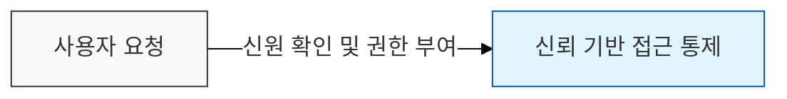
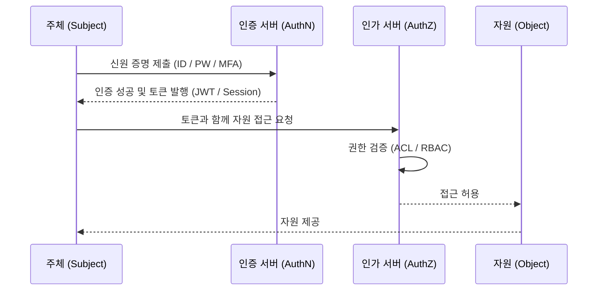

# 인증 (Authentication) vs 인가 (Authorization)

## I. 신뢰 확인과 권한 부여, 인증과 인가의 정의

**핵심 가치**:  
 (**신원 검증**) 주체가 주장하는 신원의 진위 여부를 확인하여 시스템 진입점의 신뢰성 확보(**인증**)  
 (**권한 제어**) 인증된 사용자의 행위 범위를 정의하고 최소 권한 원칙에 따라 자원 접근 허용(**인가**)  
 (**보안 가시성**) 인증과 인가 기록(Log)을 통해 주체의 활동을 추적하고 사고 발생 시 책임 추적성 제공  

---

## II. 인증과 인가의 상세 비교 및 메커니즘

### 가. 인증과 인가의 관계 구조도

> **설명**: 주체가 접근 요청을 하면 먼저 인증을 통해 신원을 검증하고, 그 결과물(Token / Session)을 바탕으로 인가 서버가 접근 가능 여부를 판단함

---

### 나. 인증과 인가의 핵심 항목 비교

| 비교 항목 | 인증 (Authentication) | 인가 (Authorization) |
|----------|----------------------|-------------------|
| **핵심 질문** | "당신은 누구인가?" | "당신은 무엇을 할 수 있는가?" |
| **선행 관계** | 인가의 선행 요건 (먼저 수행) | 인증 완료 후 후속 수행 |
| **구현 기술** | ID / PW, MFA, FIDO, 생체인증 | ACL, RBAC, OAuth 2.0, IAM 정책 |
| **전달 매체** | 자격 증명 (Credentials) | 권한 증명 (Access Token, Scope) |
| **실패 시 결과** | 401 Unauthorized (신원 미확인) | 403 Forbidden (권한 부족) |

---

## III. 인증 및 인가의 주요 기술적 동향

### 가. 인증 기술의 진화: 패스키(Passkey)와 MFA

- **MFA**(Multi-Factor Authentication): 지식(PW), 소지(OTP), 존재(생체) 중 2가지 이상 조합
- **FIDO2** / **Passkey**: 비밀번호 없는(Passwordless) 환경 구현으로 피싱 공격 원천 차단

### 나. 인가 기술의 진화: OAuth 2.0과 ABAC

- **OAuth 2.0**: 제3자 애플리케이션에 사용자 비밀번호를 노출하지 않고 자원 접근 권한만 위임
- **ABAC**(Attribute-based): 사용자 직급뿐만 아니라 접속 시간, 위치, 기기 보안 상태 등 '속성' 기반 동적 인가
