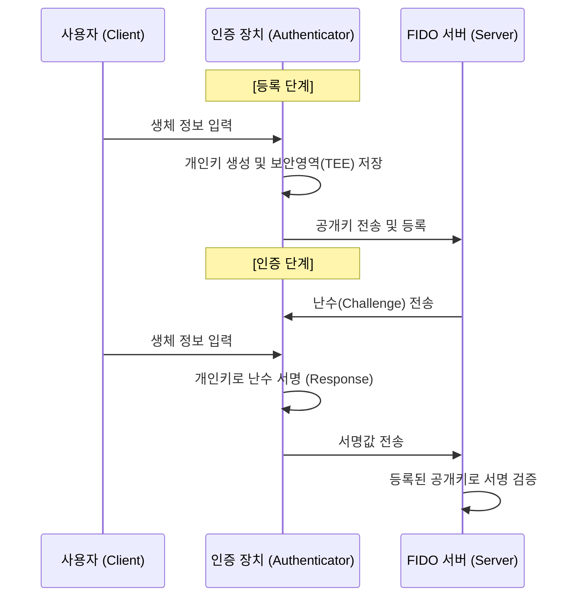

# 비밀번호 없는 안전한 인증, FIDO (Fast IDentity Online)

## I. 편리하고 강력한 인증 체계, FIDO의 정의

- "**아이디** / **비밀번호**" 방식 대신 지문, 홍채, 안면인식 등 사용자의 생체 정보나 소지형 보안 키를 이용하는 인증 표준
- 사용자 인증(Local)과 서버 인증(Remote)을 분리하여 생체 정보 유출 위험을 원천 차단하는 것이 핵심

---

## II. FIDO의 동작 메커니즘 및 주요 기술

### 가. FIDO 인증 프로세스 (Registration & Authentication)

**상세 단계**:
- **등록**: 단말기에서 생체 인증 후 생성된 공개키를 서버에 등록 (개인키는 단말기 내 보안영역(TEE)에 보관)
- **인증**: 서버가 보낸 난수(Challenge)를 단말기 내 개인키로 서명하여 응답(Response)
- **검증**: 서버는 등록된 공개키로 서명을 검증하여 최종 인증 성공 판정

### 나. FIDO 표준 버전별 주요 특징

| 구분 | FIDO 1.0 (UAF / U2F) | FIDO 2.0 (WebAuthn) |
|:---:|---------------------|--------------------|
| **주요 대상** | 주로 모바일 앱 환경 | 웹 브라우저 및 PC 환경 |
| **UAF** | 생체 인증만으로 로그인 (**Passwordless**) | - |
| **U2F** | ID / PW 외에 별도 보안키 추가 (**2nd Factor**) | - |
| **핵심 기술** | 전용 클라이언트 App 필요 | **WebAuthn** (W3C 표준 API), **CTAP** |
| **확장성** | 특정 OS / 기기에 종속적 | 브라우저 기반 범용적 인증 가능 |

---

## III. FIDO의 보안 강점 및 최근 동향 (Passkey)

| 구분 | 상세 내용 | 기대 효과 |
|:---:|----------|----------|
| **생체 정보 보호** | 생체 정보가 서버로 전송되지 않고 단말 내 보관 | 서버 해킹 시에도 생체 정보 유출 불가 |
| **피싱 방지** | 도메인 바인딩 기술로 가짜 사이트 인증 차단 | 중간자 공격(MitM) 및 피싱 원천 차단 |
| **패스키** (Passkey) | 멀티 디바이스 간 FIDO 자격증명 동기화 | 기기 변경 시에도 끊김 없는 인증 경험 제공 |
