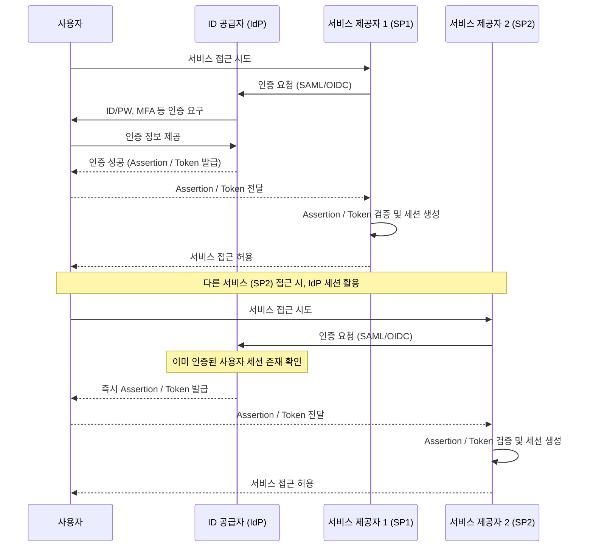

# 신뢰할 수 있는 신원 인증의 중추, IdP (Identity Provider)

## I. 분산된 서비스 환경의 중앙 인증 기관, IdP의 개요

**정의:** 사용자 인증 정보를 관리하고, 성공적으로 인증된 사용자에게 서비스 제공자( **SP** )가 신뢰할 수 있는 보안 토큰( **Assertion** / **Token** )을 발급하는 신뢰 기관  

**핵심 특징 및 역할**:  
( **중앙 인증** ) 사용자는 **IdP**에서 한번만 인증하면 연계된 다수의 **SP**에 접근 가능 ( **SSO** 구현의 핵심)  
( **신원 정보 제공** ) **SP**에게 사용자의 신원 정보(이름, 이메일 등)를 안전하게 전달하여 계정 생성 및 로그인 처리  
( **보안 표준 준수** ) **SAML**, **OpenID Connect** 등 표준 프로토콜을 사용하여 **SP**와의 안전하고 호환성 있는 통신 보장  
( **SSO 생태계 구축** ) 여러 서비스 간의 사용자 인증을 통합하여 사용자 경험을 개선하고 보안 관리 효율화  

---

## II. IdP의 작동 원리 및 연계 방식

### 가. 페더레이션(Federated Identity) 인증 흐름

### 나. 주요 SSO 프로토콜 및 IdP 역할

| 프로토콜 | IdP의 역할 | SP의 역할 |
|:---:|----------|----------|
| **SAML** | **SAML Assertion** 생성 및 발급 | **SAML Assertion** 수신 및 검증 |
| **OpenID Connect** | **ID Token** 및 **Access Token** 발급 | **ID Token** / **Access Token** 수신 및 검증 |
| **OAuth 2.0** | **Access Token** 발급 (인가 서버 역할) | **Access Token** 수신 및 리소스 접근 권한 확인 |

---

## III. IdP 보안 고려사항 및 강화 방안

### 가. IdP 보안의 중요성 및 잠재적 위협

- **단일 실패 지점 (Single Point of Failure):** **IdP** 장애 시 모든 연계 서비스 이용 불가
- **중앙 집중식 공격 목표:** **IdP** 계정 탈취 시 연계된 모든 서비스에 대한 접근 권한 획득 가능 (Credential Stuffing, Phishing 등)
- **토큰/Assertion 취약점:** 잘못된 검증 로직, 탈취된 토큰 사용 등으로 인한 세션 하이재킹 위험

### 나. IdP 보안 강화 모범 사례

- **강력한 인증 메커니즘:** **MFA**(Multi-Factor Authentication), 비밀번호 정책, **SSO** 세션 타임아웃 설정 적용
- **프로토콜 보안:** **HTTPS** 필수 사용, SAML/OIDC Assertion/Token의 서명( **Signature** ) 및 암호화( **Encryption** ) 검증 철저
- **접근 제어 및 로깅:** **IdP** 관리 콘솔 접근 권한 최소화, 상세한 감사 로그 기록 및 모니터링
- **정기적인 취약점 점검:** **IdP** 솔루션의 최신 보안 패치 적용 및 정기적인 보안 감사 수행

> **핵심:** **IdP**는 조직의 신원 관리 허브이므로, **IdP** 자체의 강력한 보안 유지와 연계된 **SP**들의 안전한 설정 관리가 통합 보안의 핵심임
