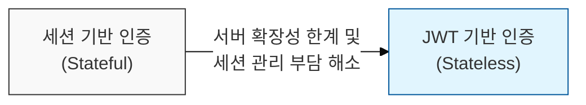
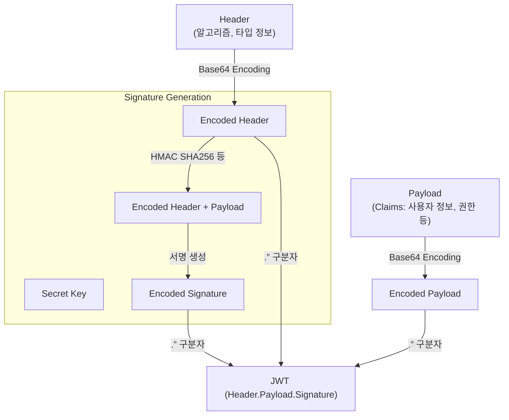

# 상태 없는 인증의 표준, JWT (JSON Web Token)

## I. stateless 인증의 핵심, JWT의 개요

**정의:** 디지털 서명 또는 암호화를 통해 정보를 안전하게 표현하는 **JSON** 기반의 개방형 표준(RFC 7519)으로, 주로 웹 환경에서 **SSO**(Single Sign-On) 및 인증 정보 교환에 사용됨  

**핵심 특징 및 장점**:  
( **상태 없는(Stateless) 인증** ) 서버는 클라이언트의 상태를 저장할 필요 없이 JWT 자체만으로 사용자 인증 및 정보 검증 가능  
( **간결한 구조** ) **JSON** 형식의 경량 데이터로, HTTP 헤더 등을 통해 전송하기 용이하여 웹 환경에 최적화  
( **확장성** ) 표준화된 구조( **Header**, **Payload**, **Signature** )를 따르며, 다양한 Claim(정보)을 포함하여 유연하게 사용 가능  
( **보안성** ) 디지털 서명을 통해 발급 주체( **Issuer** )의 인증 및 토큰 내용의 위변조 방지  

---

## II. JWT의 구조 및 작동 방식

### 가. JWT의 세 부분: Header, Payload, Signature

- **Header:** 토큰의 타입(**JWT**)과 서명에 사용된 알고리즘(**alg**: HS256, RS256 등) 정보를 포함
- **Payload:** 토큰의 실제 내용으로, 사용자 식별 정보( **sub** ), 발급자( **iss** ), 만료 시간( **exp** ), 권한( **scope** ) 등 **Claim**(정보)들을 포함
- **Signature:** **Header**와 **Payload**를 **Secret Key** 또는 **Private Key**로 암호화하여 생성. **Header**의 알고리즘과 **Secret Key**를 이용해 **Payload**의 무결성을 검증

### 나. JWT 발급 및 검증 과정

1.  **로그인 요청:** 사용자가 ID/PW를 이용하여 로그인 요청
2.  **JWT 발급:** 서버는 사용자 정보를 기반으로 **Header**, **Payload**를 생성하고, **Secret Key**로 **Signature** 생성 후 JWT 발급
3.  **클라이언트 저장:** 클라이언트는 발급받은 JWT를 로컬 스토리지( **localStorage** ) 또는 쿠키( **Cookie** )에 저장
4.  **API 요청 시:** 클라이언트는 저장된 JWT를 HTTP 헤더(**Authorization: Bearer \<token\>**)에 포함하여 서버로 전송
5.  **서버 검증:** 서버는 수신된 JWT의 **Signature**를 **Secret Key**를 이용해 검증하고, **Payload**의 정보(만료 시간, 권한 등)를 확인 후 요청 처리

---

## III. JWT 보안 고려사항 및 모범 사례

### 가. JWT 관련 보안 취약점

- **Secret Key 노출:** **HMAC** 알고리즘 사용 시 Secret Key가 노출되면 모든 토큰 위변조 가능
- **알고리즘 비정상 사용:** `alg:none` 사용 또는 서명 검증 우회 취약점 악용
- **Payload 정보 노출:** JWT는 Base64 인코딩만 되어 있어 디코딩 시 내용 확인 가능 (민감 정보 저장 주의)
- **만료 시간 미검증:** 토큰 만료 시간( **exp** )을 확인하지 않아 탈취된 토큰 악용 가능
- **취약한 저장소:** 클라이언트 측( **localStorage** )에 JWT 저장 시 **XSS** 공격에 취약

### 나. JWT 보안 강화 방안

- **강력한 Secret Key 관리:** **HS256** 사용 시 키를 안전하게 저장하고 주기적으로 변경, **RS256**(Public/Private Key) 사용 권장
- **알고리즘 검증:** **JWT** 수신 시 서명 알고리즘( **alg** )이 예상된 알고리즘인지, `none` 알고리즘이 아닌지 검증
- **Payload 민감 정보 미포함:** **JWT**에는 민감한 개인정보나 비밀번호 등은 저장하지 않음 (필요 시 암호화)
- **유효 기간(exp) 및 발급 시각(iat) 검증:** 토큰의 만료 여부와 발급 시각을 항상 확인
- **안전한 저장소 사용:** **HttpOnly** 쿠키 사용을 권장하여 **JavaScript** 접근 차단, **localStorage** 사용 시 **XSS** 방어책 필수

> **핵심:** JWT는 **Stateless** 인증에 강력한 도구지만, **Secret Key** 관리, **Signature** 검증, 안전한 저장소 사용 등 보안 원칙을 철저히 준수해야 함
