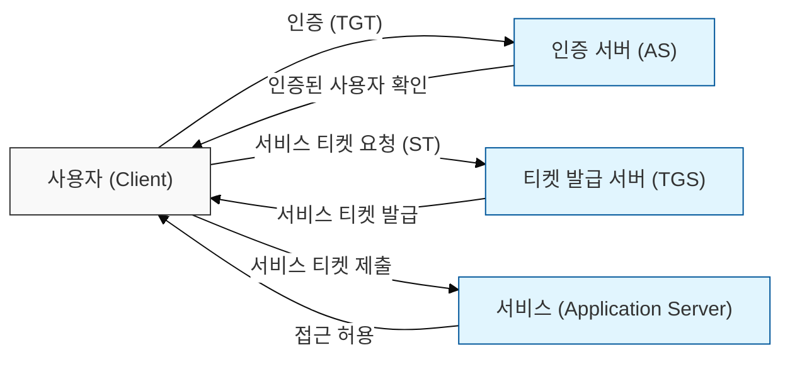
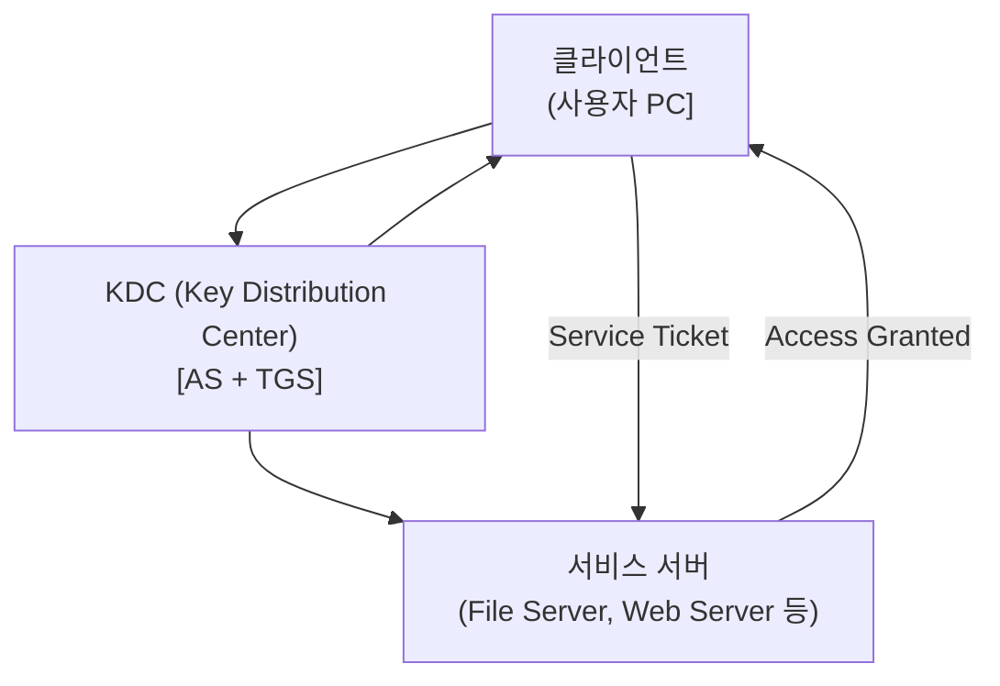

# 안전한 네트워크 인증 프로토콜, Kerberos

## I. 네트워크상의 신뢰 구축, Kerberos 인증의 개요

**정의:** MIT에서 개발한 네트워크 인증 프로토콜로, **암호학적 티켓**(Ticket)을 이용하여 상호 신뢰하는 환경에서 사용자(클라이언트)와 서비스(서버) 간의 신원을 안전하게 확인하는 방식  

**핵심 특징 및 보안적 가치**:  
( **암호화 기반 인증** ) 티켓( **TGT**, **ST** )을 암호화하여 통신 중 사용자 정보 및 세션 키의 노출 방지  
( **단일 로그인 (SSO)** ) 한번의 인증으로 여러 서비스에 반복적인 로그인 없이 접근 가능하게 하여 사용자 편의성 증대  
( **신뢰 위임** ) **KDC**(Key Distribution Center)라는 신뢰된 제3자를 통해 사용자 및 서비스 상호 간의 신뢰 관계 구축  
( **보안 강화** ) **Kerberos**는 **Active Directory**의 기본 인증 방식으로, 네트워크 환경의 보안 수준을 높이는 데 기여  

---

## II. Kerberos 인증의 핵심 구성 요소 및 티켓 교환 과정

### 가. Kerberos 프로토콜의 주요 구성 요소

- **클라이언트 (Client):** 인증을 요청하는 사용자 또는 서비스 (예: 사용자가 로그인하는 PC)
- **KDC (Key Distribution Center):** Kerberos 인증의 핵심 서버로, **AS**와 **TGS**로 구성
  - **AS (Authentication Server):** 사용자의 최초 인증을 담당하고 **TGT**(Ticket Granting Ticket) 발급
  - **TGS (Ticket Granting Server):** 사용자의 **TGT**를 검증하고 특정 서비스 접근을 위한 **ST**(Service Ticket) 발급
- **서비스 서버 (Application Server):** 사용자의 **ST**를 검증하여 서비스 접근 허가

### 나. 티켓 교환 기반 인증 과정

1.  **사용자 인증 (AS):** 사용자가 **KDC**의 **AS**에 ID/PW 제시 → **AS**는 사용자 비밀키로 암호화된 **TGT**와 세션 키 발급
2.  **서비스 티켓 요청 (TGS):** 사용자는 **TGT**와 접근하려는 서비스 정보를 **KDC**의 **TGS**에 전달 → **TGS**는 **TGT** 검증 후 서비스 비밀 키로 암호화된 **ST**와 서비스 세션 키 발급
3.  **서비스 접근 (AP):** 사용자는 **ST**와 서비스 세션 키를 이용하여 대상 서비스 서버에 접근 → 서버는 **ST** 검증 후 서비스 제공

---

## III. Kerberos 인증의 보안 특징 및 취약점

### 가. Kerberos의 장점

- **암호학적 강점:** 티켓 암호화를 통해 통신 내용 및 사용자 정보 보호
- **SSO 구현:** 한번의 인증으로 다수 서비스 접근 가능
- **안정성:** **Active Directory** 환경에서 널리 사용되며 검증된 프로토콜

### 나. Kerberos의 취약점 및 공격 기법

- **비밀번호 크리덴셜 공격:**
    *   **Kerberoasting:** **SPN**(Service Principal Name)이 등록된 서비스 계정의 **TGS** 티켓을 탈취하여 오프라인에서 비밀번호 크래킹 시도
    *   **Pass-the-Hash / Pass-the-Ticket:** **NTLM** 해시나 Kerberos 티켓을 탈취하여 재사용하는 공격
- **KDC 취약점:** **KDC** 서버 자체의 보안이 취약할 경우 발생 가능한 문제 (예: **Golden Ticket** 공격)
- **시간 동기화 의존성:** **NTP** 기반의 시간 동기화가 필수적이므로, 시간 동기화 오류 발생 시 인증 실패

> **핵심:** Kerberos는 강력한 인증 프로토콜이지만, **Active Directory** 환경에서의 **KDC** 보안, 티켓 관리, 비밀번호 정책 등 전반적인 **AD** 보안 상태에 따라 취약점이 노출될 수 있음
