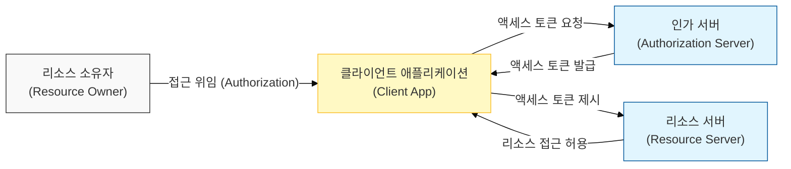

# 위임된 접근 권한의 표준, OAuth 2.0

## I. 위임된 접근 권한 부여 방식, OAuth 2.0의 개요

**정의:** 사용자가 자신의 자원(데이터, 기능 등)에 대한 접근 권한을 제3자 애플리케이션(클라이언트)에게 안전하게 위임할 수 있도록 하는 **개방형 권한 부여 프레임워크**  

**핵심 특징 및 목적**:  
( **위임된 권한 부여** ) 사용자의 ID/PW를 직접 공유하지 않고도 클라이언트가 안전하게 리소스 접근 권한 획득 가능  
( **간편한 연동** ) **RESTful API** 기반으로 설계되어 다양한 애플리케이션 간의 손쉬운 통합 지원  
( **다양한 플로우** ) 웹, 모바일, 데스크톱 등 다양한 클라이언트 환경에 맞춰 여러 권한 부여 방식( **Grant Type** ) 지원  
( **보안 표준** ) **IETF**에서 표준화되었으며, **OpenID Connect**(OIDC)의 기반 프로토콜로 활용되어 인증 기능까지 확장  

---

## II. OAuth 2.0의 작동 흐름 및 주요 구성 요소

### 가. OAuth 2.0 권한 부여 흐름 (Authorization Code Flow)

1.  **클라이언트 요청:** 사용자가 클라이언트 앱에서 특정 리소스 접근 권한 요청
2.  **인가 서버 리디렉션:** 클라이언트는 사용자를 인가 서버( **Authorization Server** )로 리디렉션 ( **Client ID**, **Redirect URI** 등 포함)
3.  **사용자 동의:** 사용자는 인가 서버에서 클라이언트에게 자신의 리소스 접근 권한 위임 동의
4.  **인가 코드 발급:** 인가 서버는 사용자 동의 후 클라이언트에게 **Authorization Code** 발급 ( **Redirect URI** 로 전달)
5.  **액세스 토큰 교환:** 클라이언트는 **Authorization Code**를 인가 서버에 제시하여 **Access Token**과 **Refresh Token** 획득
6.  **리소스 접근:** 클라이언트는 획득한 **Access Token**을 사용하여 리소스 서버( **Resource Server** )의 API 접근

### 나. OAuth 2.0의 주요 역할 (Roles)

| 역할 | 설명 | 책임 |
|:---:|----------|----------|
| **Resource Owner** | 보호되는 자원의 소유자 (대부분 최종 사용자) | 클라이언트에게 자신의 리소스 접근 권한 위임 |
| **Client** | 보호되는 리소스 접근을 요청하는 애플리케이션 | 사용자의 동의를 얻어 **Access Token** 획득 및 사용 |
| **Authorization Server** | 사용자를 인증하고 클라이언트에게 **Access Token** 발급 | **Resource Owner**의 동의 획득 및 토큰 발급/거부 |
| **Resource Server** | 보호되는 리소스(API)를 호스팅하는 서버 | **Access Token** 검증 후 클라이언트에게 리소스 제공 |

---

## III. OAuth 2.0 보안 고려사항 및 모범 사례

### 가. OAuth 2.0 관련 보안 위협

- **인가 코드 탈취:** **Redirect URI** 조작 또는 클라이언트 취약점을 통해 인가 코드 탈취 시 토큰 발급 가능
- **액세스 토큰 탈취:** 클라이언트 앱 또는 전송 구간에서의 토큰 유출 시 리소스에 대한 무단 접근
- **Redirect URI 위변조:** 공격자가 클라이언트 등록 정보 탈취 후 리디렉션 주소를 악성 사이트로 변경
- **취약한 인가 서버:** **IdP** 자체의 보안 취약점 존재 시 연계된 모든 클라이언트 및 리소스 위험

### 나. OAuth 2.0 보안 강화 방안

- **Redirect URI 검증:** 인가 서버는 등록된 **Redirect URI**와 일치하는 경우에만 콜백 처리
- **State 파라미터 사용:** CSRF 공격 방지를 위해 인가 요청 시 **State** 값 전달 및 콜백 시 검증
- **PKCE (Proof Key for Code Exchange):** 코드 탈취 시 토큰 발급을 방지하는 기법 (주로 공개 클라이언트, 모바일 앱에 적용)
- **Access Token 만료 시간 설정:** 토큰의 유효 기간을 짧게 설정하여 탈취 시 피해 범위 최소화
- **HTTPS 사용:** 모든 통신 구간에 **HTTPS** 적용하여 전송 데이터 암호화

> **핵심:** OAuth 2.0은 권한 위임 표준으로, **Access Token**의 안전한 발급, 전달, 검증 및 **IdP**의 강력한 보안 관리가 필수적임
