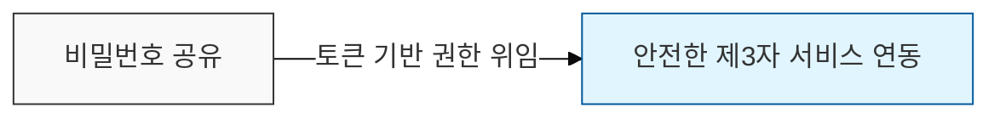

# 위임과 인증의 표준, OAuth 2.0 및 OIDC

## I. 권한 위임의 표준, OAuth 2.0의 개요

**정의**: 제3자 애플리케이션이 사용자의 비밀번호 노출 없이 자원에 접근할 수 있도록 권한을 위임(Delegation)하는 오픈 표준 프로토콜

**핵심 가치**:  
 (**비밀번호 보호**) 제3자 앱에 사용자 비밀번호를 노출하지 않고 안전한 자원 접근 권한만 위임  
 (**세밀한 인가**) 범위(Scope) 기반의 권한 제어를 통해 필요한 최소한의 데이터만 접근 허용  
 (**표준화된 인증**) OIDC를 통한 통합 신원 확인 체계를 구축하여 서비스 간 사용자 인증의 호환성 확보  

---

## II. OAuth 2.0의 4대 주체 및 동작 메커니즘

### 가. 주요 구성 주체 (Roles)

- **Resource Owner**: 자원의 소유자 (사용자)
- **Client**: 자원 접근을 요청하는 애플리케이션
- **Resource Server**: 자원(데이터)을 보유한 서버
- **Authorization Server**: 권한을 검증하고 토큰을 발급하는 서버

### 나. OpenID Connect (OIDC)의 등장

**개념**: OAuth 2.0 레이어 위에 구축된 신원 확인(Identity) 계층으로, "인증(Authentication)" 기능을 보완함

**핵심 요소**: **ID Token** (JWT) 제공을 통해 사용자의 프로필 정보를 안전하게 전달

---

## III. OAuth 2.0과 OIDC 상세 비교

| 비교 항목 | OAuth 2.0 | OpenID Connect (OIDC) |
|----------|-----------|----------------------|
| **주요 목적** | **인가** (Authorization / Delegation) | **인증** (Authentication / Identity) |
| **핵심 질문** | "이 앱이 내 데이터에 접근해도 되는가?" | "이 사용자는 누구인가?" |
| **발행 토큰** | **Access Token**, Refresh Token | **ID Token**, Access Token |
| **토큰 형식** | 불투명(Opaque) 또는 JWT | 반드시 **JWT** (JSON Web Token) |
| **엔드포인트** | Token Endpoint, Auth Endpoint | + **UserInfo Endpoint** 추가 |

---

## IV. OAuth 2.0의 주요 승인 방식 (Grant Types)

| 승인 방식 | 설명 | 주요 사례 |
|:---:|----|----------|
| **Authorization Code** | 보안을 위해 코드를 먼저 받고 서버 간 통신으로 토큰 교환 | 일반적인 웹 애플리케이션 (가장 안전) |
| **Implicit** | 브라우저에서 즉시 토큰 발급 (보안 취약으로 폐지 추세) | 단일 페이지 앱 (SPA) |
| **Client Credentials** | 사용자 개입 없이 클라이언트 자격만으로 토큰 발급 | 서버 간 통신 (M2M) |
| **Refresh Token** | 만료된 Access Token을 재발급받기 위한 매커니즘 | 세션 유지 및 UX 향상 |
