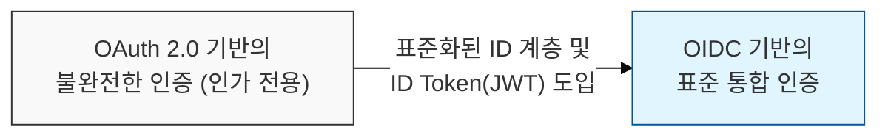
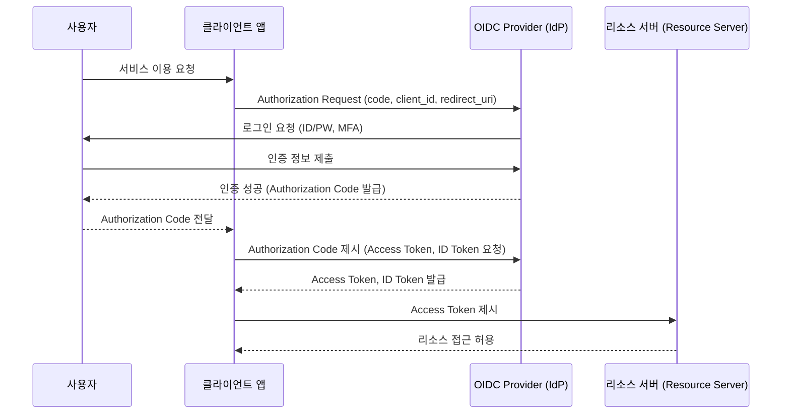

# OAuth 2.0 위에 구축된 ID 계층, OpenID Connect (OIDC)

## I. 분산된 서비스 환경의 통합 인증, OIDC의 개요

**정의:** **OAuth 2.0**을 기반으로 사용자의 인증 정보를 상호 신뢰하는 서비스( **SP** )와 안전하게 공유하기 위한 **OpenID** 기반의 인증 프로토콜  

**핵심 특징 및 목적**:  
( **SSO 간소화** ) 사용자에게 여러 서비스에 대한 통합 로그인 경험 제공 및 IT 관리자의 계정 관리 부담 경감  
( **표준화된 신원 정보** ) **JWT**(JSON Web Token) 형태의 **ID Token**을 통해 일관된 사용자 프로필 정보(이름, 이메일, 프로필 사진 등) 획득 가능  
( **호환성** ) **OAuth 2.0** 기반으로 웹, 모바일, 데스크톱 등 다양한 클라이언트 환경에서 쉽게 적용 가능  
( **인증 및 권한 부여** ) **OAuth 2.0**은 권한 부여에 초점, OIDC는 여기에 인증 기능을 더하여 사용자 식별 및 SSO를 지원  

---

## II. OIDC의 작동 원리 및 주요 구성 요소

### 가. OIDC 인증 흐름 (Authorization Code Flow)

### 나. OIDC의 핵심 구성 요소

| 구성 요소 | 설명 | 역할 |
|:---:|----------|----------|
| **End-User** | 서비스를 이용하려는 최종 사용자 | 자신의 신원 정보 제공 및 접근 동의 |
| **Client** | 사용자 대신 리소스 접근을 요청하는 애플리케이션 | **Authorization Code** / **ID Token** / **Access Token** 획득 및 사용 |
| **Authorization Server (IdP)** | 사용자 인증 및 **Access Token**, **ID Token** 발급 | **End-User** 인증 및 권한 부여 처리 |
| **Resource Server** | 보호되는 리소스(API)를 호스팅하는 서버 | **Access Token** 검증 후 클라이언트에게 리소스 제공 |
| **ID Token** | 사용자의 인증 정보를 담은 **JWT** (JSON Web Token) | 사용자의 신원 확인 및 기본 프로필 정보 제공 |

---

## III. OIDC 보안 고려사항 및 모범 사례

### 가. OIDC 보안 취약점

- **ID Token/Access Token 탈취:** 클라이언트 앱 취약점, **HTTPS** 미사용 등으로 인한 토큰 유출 시 계정 탈취 위험
- **Redirect URI 검증 미흡:** 등록된 **Redirect URI**를 벗어난 콜백 처리 시 공격에 노출
- **State 파라미터 미사용:** CSRF 공격에 취약해져 악의적인 리디렉션 발생 가능
- **IdP 자체 보안 취약점:** **IdP**의 보안이 취약할 경우, 연계된 모든 서비스가 위험해짐

### 나. OIDC 보안 강화 방안

- **HTTPS 강제:** 모든 통신 구간에서 **HTTPS**를 사용하여 전송 데이터 암호화
- **Redirect URI 화이트리스트:** **IdP**에 등록된 **Redirect URI**만 허용하여 콜백 주소 위변조 방지
- **State 파라미터 활용:** 인증 요청 시 고유 **State** 값 생성 및 콜백 시 검증하여 CSRF 공격 방어
- **PKCE (Proof Key for Code Exchange):** 코드 탈취 시 토큰 발급을 방지 (특히 공개 클라이언트, 모바일 앱에서 중요)
- **ID Token 검증:** **JWT** 서명( **Signature** ) 검증, 만료 시간( **exp** ), 발행자( **iss** ), 대상( **aud** ) 등 필수 클레임( **Claim** ) 확인

> **핵심:** OIDC는 **OAuth 2.0**을 확장하여 사용자 인증까지 제공하므로, **ID Token**의 안전한 발급, 전달, 검증과 **IdP**의 강력한 보안 관리가 필수적임
