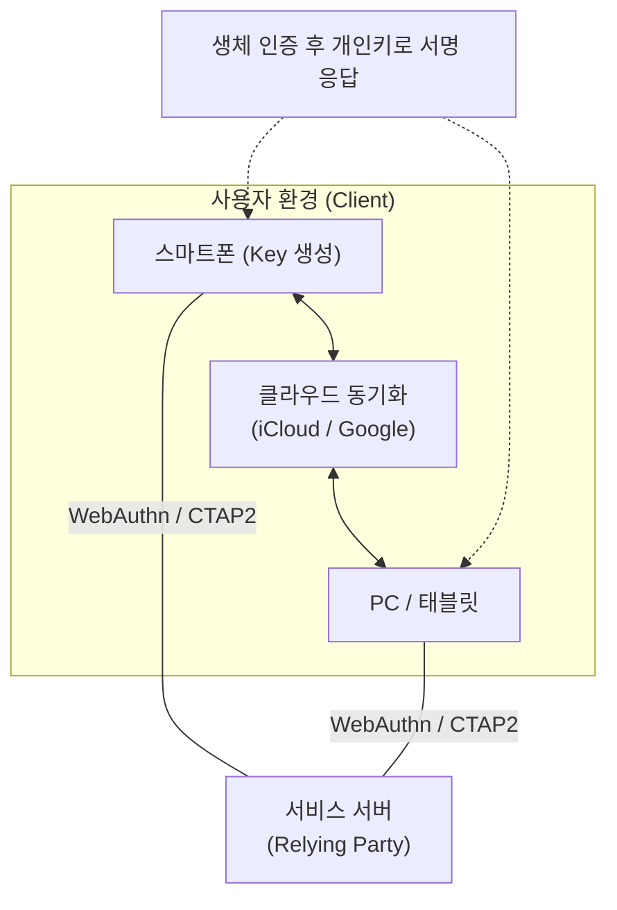

# Passwordless의 완성, 패스키 (Passkey)

## I. 비밀번호 없는 시대의 서막, 패스키의 정의

**핵심 가치**:  
 (**Passwordless 구현**) 기억하기 어렵고 탈취되기 쉬운 비밀번호를 없애 인증 과정의 근본적 보안 강화  
 (**멀티 디바이스 동기화**) 클라우드를 통한 자격 증명 동기화로 기기 변경 시에도 재등록 없는 연속성 제공  
 (**피싱 원천 차단**) 도메인 바인딩 기술을 통해 가짜 사이트에서의 인증 요청을 기술적으로 자동 거부  

---

## II. 패스키의 메커니즘 및 주요 특징

### 가. 패스키의 인증 구조 및 동기화 프로세스

- **동기화**(Sync): 생성된 패스키는 iCloud, Google Password Manager 등을 통해 동일 계정의 다른 기기로 자동 복사됨
- **인증**(Auth): 서버의 챌린지에 대해 기기 내 개인키로 서명하여 응답하며, 이 과정에서 실제 생체 정보나 비밀번호는 서버로 전송되지 않음

### 나. 패스키의 핵심 기술 요소

| 기술 요소 | 상세 내용 | 비고 |
|:---:|----------|----------|
| **WebAuthn** | 웹 브라우저에서 FIDO 인증을 수행하기 위한 표준 API | W3C 표준 |
| **CTAP2** | 외부 인증 장치(스마트폰 등)와 플랫폼 간 통신 프로토콜 | 기기 간 연동 |
| **End-to-End Encryption** | 클라우드 동기화 시 자격 증명을 암호화하여 보호 | 클라우드 사업자도 열람 불가 |
| **Multi-device FIDO** | 한 기기에서 만든 자격 증명을 다른 기기에서도 사용 가능 | 패스키의 핵심 차별점 |

---

## III. 패스키와 기존 인증 방식 (Password, FIDO 1.0) 비교

| 비교 항목 | 비밀번호 (Password) | 기존 FIDO (Single Device) | 패스키 (Passkey) |
|----------|-------------------|--------------------------|-----------------|
| **사용자 경험** | 기억 및 입력 필요 | 기기마다 등록 필요 | 한 번 등록으로 전 기기 사용 |
| **보안성** | 피싱, 브루트포스에 취약 | 매우 높음 | 매우 높음 (피싱 원천 차단) |
| **기기 분실 시** | 재설정 가능 | 자격 증명 재발급 필요 | 클라우드 복구 가능 |
| **주요 철학** | Knowledge-based | Possession-based | Syncable Credential |
