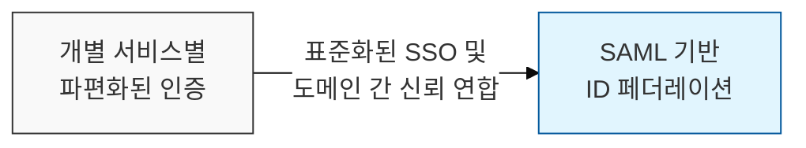
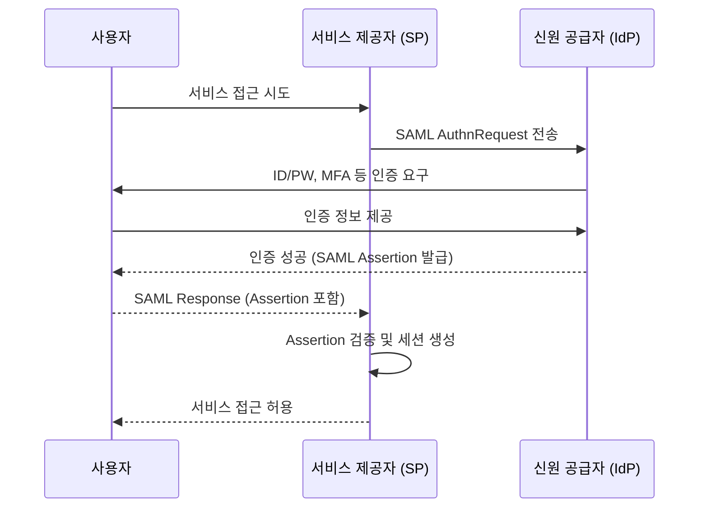

# 웹 기반 SSO의 표준 언어, SAML (Security Assertion Markup Language)

## I. 분산된 서비스 간 상호 인증의 표준, SAML의 개요

**정의:** 웹 기반 분산 환경에서 사용자 인증 정보를 안전하게 교환하기 위한 **XML** 기반의 개방형 표준 프로토콜  

**핵심 특징 및 표준화**:  
( **XML 기반** ) 사용자의 신원 정보, 속성, 권한 등을 **XML** 형식의 어설션( **Assertion** )으로 표현하여 교환  
( **웹 SSO 표준** ) **SAML 2.0**은 웹 브라우저 환경에서의 **SSO**(Single Sign-On) 구현을 위한 사실상 표준으로 자리 잡음  
( **연합 ID (Federated Identity)** ) 서로 다른 보안 도메인에 속한 **IdP**와 **SP** 간의 신뢰 관계를 설정하여 사용자 인증 정보 공유  
( **산업 표준** ) **OASIS**(Organization for the Advancement of Structured Information Standards)에서 표준화 주도  

---

## II. SAML 인증 흐름 및 주요 구성 요소

### 가. SAML 2.0 기반 SSO 작동 흐름 (SP-initiated)

### 나. SAML 메시지 구성 요소

| 구성 요소 | 설명 | 보안적 가치 |
|----------|----------|----------|
| **SAML Assertion** | 사용자의 신원, 속성, 권한 등 인증 정보를 담은 **XML** 문서 | 사용자 인증 정보 교환의 핵심 |
| **SAML Authority** | **IdP** (인증 기관) 또는 **SP** (서비스 제공자) | 인증 및 권한 부여 역할 수행 |
| **SAML Binding** | **HTTP POST**, **HTTP Redirect** 등 **SAML** 메시지 전송 방식 | 메시지 전달 채널 정의 |
| **SAML Metadata** | **IdP** 와 **SP** 간의 신뢰 설정을 위한 메타 정보 교환 | 상호 운용성 및 보안 구성 지원 |

---

## III. SAML 보안 고려사항 및 모범 사례

### 가. SAML 보안 취약점

- **Assertion 위조 / 재사용:** **SAML Assertion**의 서명 검증 미흡 시 위조된 정보로 접근 시도 가능
- **클라이언트 측 공격:** **XSS** 등을 통해 사용자의 SAML 요청/응답 탈취 및 재사용 ( **Session Hijacking** )
- **IdP/SP 설정 오류:** 잘못된 메타데이터 교환, 잘못된 서명 알고리즘 사용 등 설정 실수 악용

### 나. SAML 보안 강화 방안

- **강력한 서명 및 암호화:** **SAML Assertion** 및 **Metadata**의 서명( **Signature** ) 및 암호화( **Encryption** )를 사용하여 무결성 및 기밀성 보장
- **IDP/SP 간 메타데이터 보안:** **Metadata** 교환 시 **HTTPS**를 사용하고, 주기적으로 신뢰성 검증
- **시간 동기화:** **NTP**를 사용하여 **IdP** 및 **SP** 간 시간 동기화를 정확히 유지 (재전송 공격 방지)
- **최소 권한 원칙:** **SP**에서 **SAML Assertion** 검증 시, 필요한 속성( **Attribute** )만 추출하여 사용

> **핵심:** **SAML**은 **XML** 기반의 복잡한 구조를 가지므로, 표준 구현 라이브러리를 사용하고 **IdP**와 **SP** 간의 철저한 신뢰 설정 및 메타데이터 검증이 중요함
