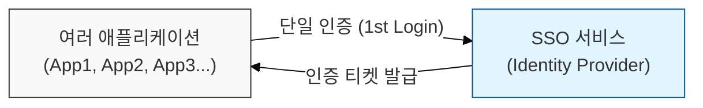
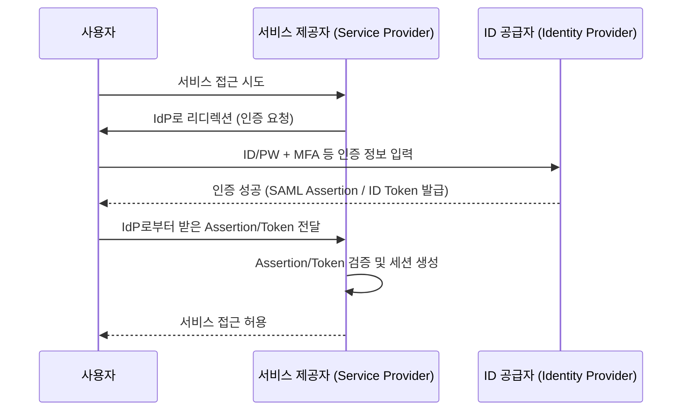

# 단 한 번의 인증으로 모든 곳에 접근, SSO (Single Sign-On)

## I. 사용자 편의성과 보안 강화를 동시에, SSO의 개요

**정의:** 사용자가 하나의 **ID**와 비밀번호로 여러 애플리케이션 및 서비스에 로그인할 수 있도록 하는 인증 방식  

**핵심 특징 및 도입 효과**:  
( **사용자 편의성 증대** ) 반복적인 로그인 절차를 생략하여 사용자 경험을 크게 개선하고 업무 효율성 증진  
( **보안 강화** ) 복잡한 비밀번호 관리에 대한 부담을 줄이고, 강력한 중앙 집중식 인증( **MFA** 등) 적용 용이  
( **관리 효율성** ) 계정 생성 및 삭제, 권한 관리 등 전반적인 사용자 관리 업무를 중앙에서 일괄 처리하여 IT 관리 부담 경감  
( **접근성 향상** ) 모바일 기기, 다양한 디바이스 환경에서도 일관된 사용자 경험 제공  

---

## II. SSO의 작동 원리 및 주요 프로토콜

### 가. SSO 인증 흐름 (Federated Identity)

### 나. SSO 구현에 사용되는 주요 프로토콜

| 프로토콜 | 주요 특징 | 작동 방식 |
|:---:|----------|----------|
| **SAML (Security Assertion Markup Language)** | **XML** 기반의 표준. 주로 웹 기반 서비스 연동에 사용 | 사용자가 **SP** 접근 시 **IdP**로 리디렉션 → **IdP** 인증 후 **SAML Assertion** 발급 → **SP**는 Assertion 검증 후 접근 허용 |
| **OAuth 2.0** | 인가(Authorization) 프로토콜. 리소스 접근 권한 위임에 사용 | 사용자가 **SP**의 리소스 접근 권한을 **IdP**에게 위임 → **IdP**는 **Access Token** 발급 → **SP**는 Token 검증 후 리소스 접근 허용 |
| **OpenID Connect (OIDC)** | **OAuth 2.0** 위에 구축된 ID 계층. 사용자 인증 정보(ID Token) 제공 | **OAuth 2.0** Flow 기반으로 **ID Token**(사용자 정보) 추가 제공 → **SP**는 ID Token 검증 후 사용자 식별 |

---

## III. SSO 도입 시 보안 고려사항 및 모범 사례

### 가. SSO 시스템의 잠재적 취약점

- **중앙 집중화된 단일 실패 지점 (Single Point of Failure):** **IdP** 장애 시 모든 연계 서비스 접근 불가
- **IdP 계정 탈취:** **IdP** 계정 정보가 유출될 경우, 연계된 모든 서비스 계정이 위험에 노출
- **세션 하이재킹:** **SSO** 세션 토큰이 탈취될 경우, 무단으로 서비스 접근 가능

### 나. SSO 보안 강화 방안

- **강력한 IdP 인증:** **MFA**(Multi-Factor Authentication) 적용, 복잡한 비밀번호 정책, **SSO** 세션 타임아웃 설정
- **프로토콜 보안:** **HTTPS** 사용 필수, **SAML/OIDC** Assertion/Token의 서명( **Signature** ) 및 암호화( **Encryption** ) 검증
- **세션 관리 강화:** **HttpOnly**, **Secure** 속성 설정, **CSRF Token** 사용 등 웹 보안 대책 적용
- **주기적인 감사 및 모니터링:** **IdP** 및 연계 서비스 접근 로그 분석, 비정상 행위 탐지

> **핵심:** **SSO**는 사용자 편의성을 높이지만, **IdP** 자체가 공격의 중심이 될 수 있으므로 **IdP**의 보안 강화 및 연계된 서비스들의 철저한 관리가 필수적임
