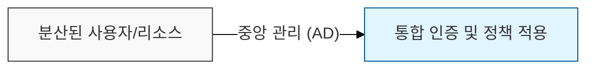
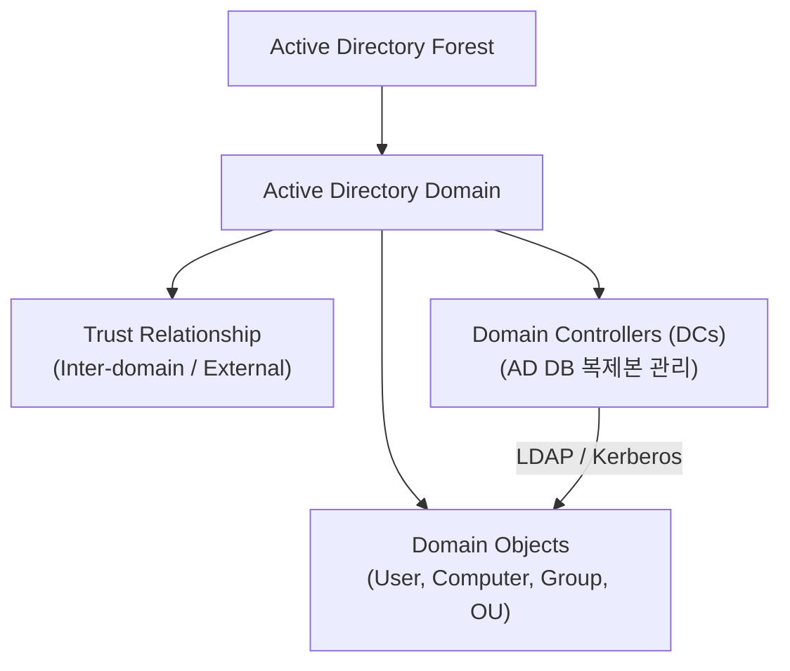

# 통합 인증 및 접근 관리의 핵심, Active Directory (AD)

## I. 중앙 집중식 ID 관리의 표준, Active Directory의 개요

**정의:** Microsoft에서 개발한 디렉터리 서비스로, 네트워크상의 사용자, 컴퓨터, 그룹, 리소스 등에 대한 정보를 중앙 집중식으로 관리하고 인증 및 접근 권한을 제어하는 핵심 인프라  

**핵심 특징 및 중요성**:  
( **중앙 집중식 관리** ) 사용자 계정, 암호 정책, 컴퓨터 설정 등 IT 자원에 대한 통합 관리 환경 제공  
( **싱글 사인온 (SSO)** ) 한번의 인증으로 여러 애플리케이션 및 리소스에 접근 가능하게 하여 사용자 편의성 및 보안 증대  
( **접근 제어** ) 리소스별 세분화된 권한 설정을 통해 **RBAC**(Role-Based Access Control) 기반의 보안 정책 적용  
( **인증 프로토콜** ) **Kerberos** 기반의 강력한 인증 메커니즘을 활용하여 보안 통신 보장  

---

## II. Active Directory의 핵심 구성 요소 및 작동 원리

### 가. AD의 주요 구성 요소

- **도메인 (Domain):** AD의 기본 관리 단위로, 동일한 보안 정책 및 신뢰 관계를 공유하는 컴퓨터 및 사용자 집합
- **포리스트 (Forest):** 하나 이상의 도메인을 포함하는 AD의 최상위 논리 구조. 각 도메인은 자체 보안 경계 유지
- **트리 (Tree):** 연속적인 **DNS** 네임스페이스를 공유하는 도메인들의 집합
- **도메인 컨트롤러 (DC):** AD 데이터베이스( **NTDS.DIT** )의 복제본을 유지하며 인증 및 권한 부여 요청 처리
- **도메인 개체 (Object):** 사용자 계정, 컴퓨터 계정, 그룹, 조직 단위( **OU** ) 등 AD 데이터베이스 내의 개별 정보

### 나. 인증 및 권한 부여 메커니즘 (Kerberos)

1.  **사용자 인증:** 사용자가 **KDC**(Key Distribution Center)로부터 **TGT**(Ticket Granting Ticket) 발급 ( **AS** - Authentication Service)
2.  **서비스 티켓 요청:** TGT를 사용하여 특정 서비스(예: 파일 서버)에 접근하기 위한 **ST**(Service Ticket) 요청 ( **TGS** - Ticket Granting Service)
3.  **서비스 접근:** ST를 대상 서버에 제시하여 인증 및 접근 권한 획득 ( **AP** - Application Server)

---

## III. Active Directory 보안 강화 방안

### 가. AD 보안 취약점 및 공격 유형

- **AD 권한 탈취:** **Kerberoasting**, **Pass-the-Hash**, **Golden Ticket** 공격 등을 통한 관리자 권한 획득
- **내부자 위협:** 계정 정보 유출, 권한 오남용, 설정 오류 악용
- **악성코드 감염:** **AD** 환경을 대상으로 하는 멀웨어 확산 및 데이터 유출

### 나. 필수적인 보안 강화 조치

- **최소 권한 원칙:** **RBAC** 기반의 역할 분담 및 **OU**별 **GPO**(Group Policy Object)를 통한 세밀한 권한 관리
- **강력한 인증:** **MFA**(Multi-Factor Authentication) 도입, **Kerberos** 티켓 제한 시간 설정, **LAPS**(Local Administrator Password Solution) 적용
- **지속적인 모니터링:** **AD** 감사 로그 분석, **SIEM** 연동, 비정상 접근 패턴 탐지 및 대응 체계 구축
- **보안 패치 및 업데이트:** **DC** 및 **AD CS**(Certificate Services) 등 관련 구성 요소의 최신 보안 업데이트 적용

> **핵심:** **Active Directory**는 조직 IT 인프라의 근간이므로, 철저한 보안 설정과 지속적인 모니터링을 통해 **AD** 환경을 안전하게 관리하는 것이 필수적임
