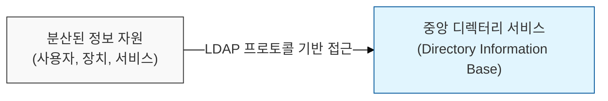
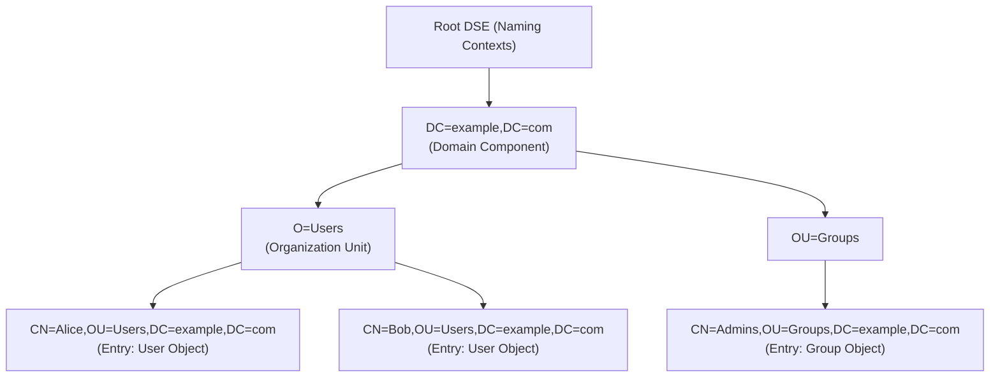

# 분산 디렉터리 서비스의 표준 프로토콜, LDAP (Lightweight Directory Access Protocol)

## I. 정보 자원의 중앙 집중식 관리, LDAP의 개요

**정의:** 디렉터리 서비스에 접근하기 위한 표준 통신 프로토콜로, 네트워크상의 리소스(사용자, 장치, 서비스 등) 정보를 계층적으로 저장하고 검색하는 데 사용됨  

**핵심 특징 및 중요성**:  
( **표준 프로토콜** ) **X.500** 표준을 기반으로 하면서도 간결화하여 다양한 디렉터리 서비스 구현에 널리 사용됨  
( **계층적 구조** ) **DN**(Distinguished Name)을 사용하여 정보를 트리 구조로 구성, 효율적인 검색 및 관리 가능  
( **데이터 조회 최적화** ) 읽기(Read) 작업에 최적화되어 사용자 인증, 주소록 조회 등 정보 검색에 효과적  
( **확장성** ) 스키마(Schema) 확장을 통해 다양한 유형의 정보 저장 및 관리 가능 ( **LDAP**v3 지원)  

---

## II. LDAP의 주요 개념 및 작동 방식

### 가. LDAP 디렉터리 구조

- **DN (Distinguished Name):** 디렉터리 내 각 항목(Entry)을 고유하게 식별하는 경로 (예: `CN=Alice,OU=Users,DC=example,DC=com`)
- **RDN (Relative Distinguished Name):** DN의 마지막 부분으로, 바로 상위 항목 내에서 항목을 고유하게 식별 (예: `CN=Alice`)
- **Attribute (속성):** 각 항목(Entry)이 가지는 정보 (예: `cn=Alice`, `uid=alice`, `mail=alice@example.com`)
- **Schema (스키마):** 디렉터리에 저장될 수 있는 객체 클래스(Object Class)와 속성(Attribute)의 종류 및 규칙 정의

### 나. LDAP 작동 프로토콜 (LDAPv3)

- **바인딩 (Binding):** 클라이언트가 디렉터리 서버에 인증 (익명 또는 단순/SASL 인증)
- **검색 (Search):** 특정 기준(Filter)에 맞는 항목(Entry)들을 조회 (Base DN, Scope, Filter, Attributes 지정)
- **추가/수정/삭제 (Add/Modify/Delete):** 디렉터리 항목에 대한 정보 변경
- **언바인딩 (Unbind):** 클라이언트 연결 종료

---

## III. LDAP 보안 고려사항 및 강화 방안

### 가. LDAP 보안 위협

- **인증 정보 탈취:** 평문 전송(LDAP) 또는 취약한 인증 방식 사용 시 자격 증명 유출
- **정보 열람:** 익명 바인딩 허용 시 민감한 디렉터리 정보 노출
- **서비스 거부 (DoS):** 비효율적인 쿼리나 과도한 연결 요청으로 인한 서버 자원 고갈
- **LDAP Injection:** SQL Injection과 유사하게 LDAP 쿼리를 조작하여 비정상적인 접근 시도

### 나. 보안 강화 조치

- **LDAPS/StartTLS 사용:** **SSL/TLS**를 통해 LDAP 통신을 암호화하여 전송 중 데이터 보호
- **익명 바인딩 비활성화:** 불필요한 익명 접근을 차단하고, 바인딩 시 강력한 인증( **SASL** / Simple Bind with Credentials) 사용
- **최소 권한 원칙:** 접근 제어 목록( **ACL** )을 사용하여 사용자/그룹별 디렉터리 읽기/쓰기 권한 제한
- **쿼리 최적화 및 필터링:** 비효율적이거나 과도한 검색 범위를 제한하고, 악의적인 필터 문자열 탐지
- **정기적인 감사 및 모니터링:** 비정상적인 접근 시도나 변경 이력을 주기적으로 확인

> **핵심:** LDAP은 인증 및 접근 제어의 핵심 인프라이므로, **LDAPS/StartTLS** 적용, **ACL** 기반 권한 관리, **SASL** 인증 등 보안 설정을 철저히 해야 함
